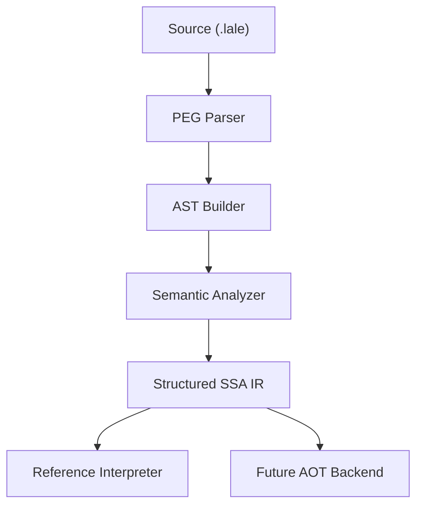

# Lale Language and Compiler

**A natural, expressive systems language for reliable software.**

Lale is designed to be **easy to learn, easy to read, and easy to maintain**. Its syntax lets you express ideas naturally, from everyday program logic to complex technical calculations, while providing the performance, safety, and control you expect from a systems language.

Lale is for anyone who wants to write reliable software without unnecessary language complexity.

[Website](https://lale-lang.dev) | [User Guide](doc/lale.md) | [Architecture](doc/ARCHITECTURE.md)

---

## 🎯 Overview

Lale makes reliable software easier to write and easier to understand.

It takes inspiration from languages such as Python, Julia, and Rust, combining
approachable syntax with systems-level performance, safety, and control.

What makes Lale different is how closely the language can express technical
ideas. Mathematical notation, physical units, Unicode identifiers, and familiar
programming constructs are part of the language itself.

### Why Lale?

- **Readable Syntax:** No forced semicolons, indentation rules, or brace
  clutter. Code stays close to the way you express an idea.

- **Physical Unit Safety:** Units are part of the type system. The compiler
  prevents incompatible quantities from being combined accidentally.

```text
  5 <m> + 10 <s>    // compile-time error
```

- **Mathematical Notation:** Native support for Greek letters (`α`, `Δ`),
  subscript digits (`x₁`, `y₂`), and superscript powers (`Δt²`) lets you use
  familiar notation from mathematics and technical documentation.

- **1-Based Indexing:** Arrays start at 1, matching common
  mathematical and engineering conventions.

- **Explicit Safety:** No hidden type coercions, no silent narrowing

- **Pragmatic Memory Safety:** A per-function escape rule catches the most
  common dangling-pointer bug — a `pointer to <local>` leaving its function —
  plus compiler-managed `str`. Not full memory safety: raw pointers and FFI
  stay the programmer's responsibility.

- **Unicode by Design:** Unicode isn't an add-on in Lale. It is built into
  the language from the grammar through to the compiler, making
  Unicode identifiers, text, and source code first-class citizens.

- **No Reserved Keywords:** Lale does not reserve words such as `var` or `loop`, so they can also be used as identifiers.

- **Built-in, Not Bolted-On:** Error stacks, optional types (`T?`), and
  tiered I/O are language constructs, reducing boilerplate and making program
  behavior easier to understand and audit.

Lale is useful anywhere reliable, maintainable software matters, with particular advantages for engineering, science, and mathematics.

---

## 📖 Lale at a Glance

Here's a small example of what Lale looks like in practice:

```text
/// Calculate kinetic energy with physical units
fn kinetic_energy(m as f64 in <kg>, v as f64 in <m/s>) returns f64 in <kg⋅m²/s²>
  return 0.5 ⋅ m ⋅ v²
end fn

var mass as f64 in <kg> = 10.5
var velocity as f64 in <m/s> = 2.0

loop
  var E_k = kinetic_energy(mass, velocity)
  write "Kinetic Energy: {E_k} {#unit of E_k}"  // Kinetic Energy: 21 kg⋅m²/s²
  mass += 10 <kg>
end loop when mass > 30
```

The example combines several of Lale's ideas: readable syntax, mathematical
notation, and compiler-checked physical units.

---

## 📚 Documentation

- [Lale User Guide](doc/lale.md): The comprehensive manual covering syntax,
  units, and language features. **Start here.**

- [Standard Library Reference](doc/stdlib.md): Documentation for built-in
  functions and system modules.

- [Technical Architecture](doc/ARCHITECTURE.md): A deeper look at the
  compiler internals, Intermediate Representation, and safety model.

---

## 🚀 Getting Started

**Project status:** Lale is currently under active development. The language,
compiler, and standard library are evolving, and syntax and APIs may change
before the first stable release.

### Prerequisites

- [Rust 1.70+](https://www.rust-lang.org/tools/install)

### Installation & Build

1. **Clone the repository**

   ```bash
   git clone https://github.com/lale-lang/lale.git
   cd lale
   ```

2. **Build**

   ```bash
   cargo build --release --workspace
   ```

3. **Run your first program**

   ```bash
   echo 'write "Hello, Lale!"' > hello.lale
   ./target/release/lale run hello.lale
   ```

---

## 🏗️ Under the Hood

Lale's compiler is designed around a clear pipeline that separates parsing,
semantic analysis, and execution. This makes the compiler easier to test,
understand, and extend.



---

## 🤝 Contributing

Lale is a language built for clarity. Contributions are welcome to the compiler,
standard library, and documentation.

1. Review the **[Architecture Guide](doc/ARCHITECTURE.md)**.
2. Check the **[TODO List](doc/TODO.md)** for current priorities and roadmap
   items.
3. Open a Pull Request with a clear description of your changes.

---

## 📄 License

Distributed under the GPLv3 License. See `LICENSE` for more information.
