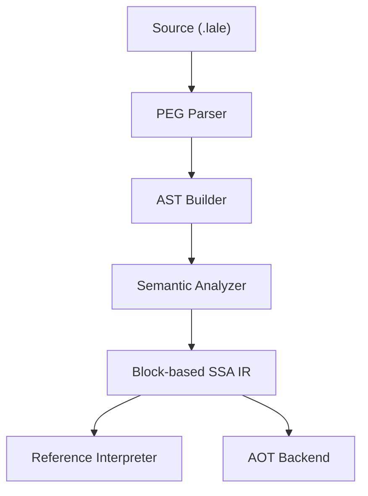

# Lale Language and Compiler

**A natural, expressive systems language for technical and reliable software.**

Lale is an open-source programming language designed for people who build things.

It aims to make software **easy to learn, easy to read, and easy to maintain** — without giving up the performance, safety, and control expected from a systems language.

Lale is especially designed for **engineering, science, mathematics, and other software where the code itself should express the ideas behind the program.**

[Website](https://lale-lang.dev) | [Try the Demo](https://demo.lale-lang.dev) | [User Guide](doc/lale.md) | [Architecture](doc/ARCHITECTURE.md)

---

## Why Lale?

Technical software is often written in languages that were designed for very different purposes.

Systems languages provide performance and control, but can make even simple technical ideas unnecessarily difficult to express. Higher-level languages are often easier to use, but may give up control over execution, memory, or deployment.

Lale explores a different approach:

> **A systems language that speaks the language of the people who use it.**

Technical concepts should be visible in the source code rather than hidden behind layers of boilerplate.

Mathematical notation, physical units, Unicode identifiers, explicit safety, and familiar programming constructs are therefore not libraries or conventions layered on top of Lale. They are part of the language itself.

### What makes Lale different?

- **Readable Syntax:** No forced semicolons, indentation rules, or brace clutter. A new line and a semicolon mean exactly the same thing — semicolons are optional but always valid, with none of JavaScript's ambiguity. Code stays close to the way you express an idea.

- **Physical Unit Safety:** Units are part of the type system. The compiler prevents incompatible quantities from being combined accidentally.

```text
  5 <m> + 10 <s>    // compile-time error
```

- **Mathematical Notation:** Native support for Greek letters (`α`, `Δ`), subscript digits (`x₁`, `y₂`), and superscript powers (`Δt²`) lets source code resemble the notation used in mathematics and technical documentation.

- **1-Based Indexing:** Arrays start at 1, matching common mathematical and engineering conventions.

- **Explicit Safety:** No hidden type coercions and no silent narrowing.

- **Pragmatic Memory Safety:** A per-function escape rule catches the most common dangling-pointer bug — a `pointer to <local>` leaving its function — together with compiler-managed `text`. Lale does not attempt to make all memory access safe: raw pointers and FFI remain the programmer's responsibility.

- **Unicode by Design:** Unicode is not an add-on in Lale. It is built into the language from the grammar through to the compiler, making Unicode identifiers, text, and source code first-class citizens.

- **No Reserved Keywords:** Lale does not reserve words such as `var` or `loop`, so they can also be used as identifiers.

- **Built-in, Not Bolted-On:** Error stacks, optional types (`T?`), and tiered I/O are language constructs, reducing boilerplate and making program behavior easier to understand and audit.

Lale is not intended to replace every programming language. It explores what a programming language can look like when **technical communication and software engineering are treated as equally important design goals.**

This goal also shapes how Lale is documented. Lale follows an **educational documentation philosophy**: advanced concepts are introduced step by step, and specialist terminology is explained the first time it is needed. The aim is that a technically capable reader — an engineer, scientist, technician, or curious student — can follow the language _and_ its compiler without already being a programming-language expert.

---

## 📖 Lale at a Glance

Here's a small example of what Lale looks like in practice:

```text
/// Calculate kinetic energy with physical units
fn kinetic_energy(m as f64 in <kg>, v as f64 in <m/s>) returns f64 in <kg⋅m²/s²>
  return 0.5 ⋅ m ⋅ v²
end fn

var mass as f64 in <kg> = 10.5
var velocity as f64 in <m/s> = 2.0

loop
  var E_k = kinetic_energy(mass, velocity)
  write "Kinetic Energy: {E_k} {#unit of E_k}"  // Kinetic Energy: 21 kg⋅m²/s²
  mass += 10 <kg>
end loop when mass > 30
```

The example combines several of Lale's ideas: readable syntax, mathematical notation, and compiler-checked physical units.

The goal is not merely to make code shorter.

**The goal is to make the meaning of the code easier to see.**

---

## 🧭 Where Lale Is Going

Lale is being developed as an open-source language and compiler toolchain.

The long-term goal is a complete environment for building reliable technical software:

```text
                    Lale source
                         │
                       Parser
                         │
                  Semantic Analysis
                         │
                  Block-based IR
                    /           \
                   /             \
          Interpreter          AOT Compiler
              │                    │
              └──────────┬─────────┘
                         │
                  Technical Software
```

The compiler architecture already separates language processing from execution through a common intermediate representation. This allows the reference interpreter and the planned native compiler to share the same language semantics and compiler infrastructure.

Over time, the toolchain will grow around this foundation with a richer standard library, development tooling, native compilation, and additional platforms.

---

## 🚧 Project Status

**Lale is currently under active development and approaching its first external beta.**

The language and reference interpreter are already functional. The compiler uses a shared intermediate representation designed to support both interpretation and native compilation.

Current development focuses on:

- completing and stabilizing the language core
- expanding the standard library
- improving the language server and developer tooling
- developing the AOT compiler
- expanding tests and platform support
- preparing Lale for external users and contributors

Lale is **not yet a stable 1.0.0 language**. Syntax, APIs, compiler behavior, and standard-library interfaces may still change.

If you are interested in programming-language development, compilers, technical computing, or simply exploring a different approach to systems programming, **this is a good time to get involved.**

---

## 🚀 Getting Started

### Prerequisites

- [Rust 1.85+](https://www.rust-lang.org/tools/install)

### Installation & Build

1. **Clone the repository**

   ```bash
   git clone https://github.com/kkayal/lale.git
   cd lale
   ```

2. **Build**

   ```bash
   cargo build --release --workspace
   ```

3. **Run your first program**

   ```bash
   echo 'write "Hello, Lale!"' > hello.lale
   ./target/release/lale run hello.lale
   ```

### Install (optional)

To install Lale to a directory of your choice and put it on your `PATH`, run:

```bash
./scripts/install.sh
```

It builds the release binaries, copies the compiler (`lale`), language server
(`lale-lsp`), validator (`lale-validate`), and standard library to `~/.lale` (or
a directory you pick), and updates your shell configuration so `lale` is on your
`PATH` via the `LALE_HOME` environment variable.

### Building the optional extras

The compiler itself only needs Rust. The repository also ships three optional
extras — a browser playground and editor extensions for Zed and VS Code — that
you can build only if you want them:

```bash
cargo make build-all
```

This one command builds the compiler workspace plus all three extras. It
requires [cargo-make](https://github.com/sagiegurari/cargo-make):

```bash
cargo install cargo-make
```

The extras have additional requirements on top of Rust:

| Extra                                             | Additional tools                                                                                          |
| ------------------------------------------------- | --------------------------------------------------------------------------------------------------------- |
| `demo/` — the browser playground                  | Rust `wasm32-wasip1` target, a WASI C library (`wasi-libc`), a WebAssembly-capable `clang`, Node.js + npm |
| `zed-extension/` — the Zed editor extension       | Rust `wasm32-wasip2` target, Node.js + npm                                                                |
| `vs-code-extensions/lale` — the VS Code extension | Node.js + npm                                                                                             |

_WebAssembly (WASM)_ is the portable binary format these tools compile to;
_WASI_ is the system interface that lets that binary talk to the operating
system.

The build scripts detect your operating system and common tool locations
automatically. If your setup differs, point them at your tools with these
environment variables:

- `LALE_ZED_INSTALL_DIR` — where to install the Zed extension.
- `WASI_SYSROOT`, `WASI_INCLUDE`, `LALE_CC` — the playground's WASI library
  and C compiler.

`cargo make build-all` is only a convenience that runs everything at once. In
practice, build just the parts you use:

```bash
cargo make build                  # compiler + language server (the core)
cargo make build-demo             # browser playground
cargo make build-extensions       # both editor extensions (Zed + VS Code)
cargo make build-zed-extension    # Zed editor extension only
cargo make build-vscode-extension # VS Code extension only
```

For a guided introduction, see the **[Lale User Guide](doc/lale.md)**.

---

## 🧰 Tooling

Lale ships with a language server, a compiler validator, editor extensions, and a
browser playground:

| Tool                                              | What it is                                                                                                       | Run / build                                                                        |
| ------------------------------------------------- | ---------------------------------------------------------------------------------------------------------------- | ---------------------------------------------------------------------------------- |
| **Language server** (`lale-lsp`)                  | An LSP server providing diagnostics, completion, hover, go-to-definition, document symbols, and semantic tokens. | Built with the compiler via `cargo build --workspace`                              |
| **Validator** (`lale-validate`)                   | Checks grammar → AST → IR → interpreter coverage end-to-end.                                                     | `cargo run --bin lale-validate`                                                    |
| **Zed extension** (`zed-extension/`)              | Tree-sitter grammar + LSP adapter for the Zed editor.                                                            | `cargo make build-zed-extension`                                                   |
| **VS Code extension** (`vs-code-extensions/lale`) | TextMate grammar + LSP client for VS Code.                                                                       | `cargo make build-vscode-extension`                                                |
| **Browser playground** (`demo/`)                  | The full compiler + interpreter compiled to WebAssembly, running entirely client-side.                           | `cargo make build-demo` — live at [demo.lale-lang.dev](https://demo.lale-lang.dev) |

The language server and validator are built alongside the compiler. The editor
extensions and browser playground are optional extras — see
[Building the optional extras](#building-the-optional-extras) for their build
requirements.

---

## 🏗️ Under the Hood

Lale's compiler is designed around a clear pipeline that separates parsing, semantic analysis, and execution. This makes the compiler easier to test, understand, and extend.



The same intermediate representation is the foundation for both execution paths. This architecture is intended to allow language semantics, analysis, and tooling to evolve independently from the eventual native-code backend.

For more details, see the **[Technical Architecture](doc/ARCHITECTURE.md)**.

---

## 📚 Documentation

- **[Lale User Guide](doc/lale.md)** — The comprehensive guide to the language, syntax, units, and language features. **Start here.**

- **[Advanced Lale Programming](doc/advanced.md)** — Advanced techniques and idioms.

- **[Standard Library Reference](doc/stdlib.md)** — Documentation for built-in functions and system modules.

- **[Technical Architecture](doc/ARCHITECTURE.md)** — Compiler internals, intermediate representation, and safety model.

- **[ABI Specification](doc/ABI_SPECIFICATION.md)** — The runtime ABI and C FFI boundary.

- **[IR Format Specification](doc/IR_SPECIFICATION.md)** — The line-oriented IR serialization format.

- **[Roadmap](doc/roadmap.md)** — The versioned plan (1.0.0 → 6.0.0) and current status.

- **[TODO](doc/TODO.md)** — Detailed work items and design decisions.

---

## 🤝 Open Source & Contributing

Lale is open source and developed in the open. See the **[Contributing Guide](CONTRIBUTING.md)** to get started.

Contributions are welcome to the compiler, standard library, language server, documentation, examples, and development tooling.

One of Lale's aims is to remain an **accessible open-source project**: the architecture and documentation are written so that a new contributor can understand them without already being a compiler expert. **Accessible language → accessible documentation → accessible implementation → easier contributions.**

If you are interested in contributing:

1. Read the **[Architecture Guide](doc/ARCHITECTURE.md)**.
2. Explore the **[TODO List](doc/TODO.md)**.
3. Try Lale and report what works — and what doesn't.
4. Open an issue or Pull Request with a clear description of your change.

Early feedback is particularly valuable while the language and toolchain are still evolving.

---

## 🌱 Supporting Lale

Lale is an independent open-source project.

As the project grows, support from developers, users, and organizations will help make it possible to spend more time on compiler development, native compilation, tooling, and the standard library.

If you are interested in supporting the project, contributing to its development, or exploring Lale for technical or engineering software, please get in touch.

**Lale is being built in the open, and its future will be shaped by the people who use and contribute to it.**

Beyond the language itself, Lale is designed as a **learning resource**. Its documentation, examples, and compiler architecture are written so that an interested student, engineer, or scientist can follow them. Supporting Lale means supporting not only a language, but a path into technical computing for people who would otherwise be stopped by specialist jargon.

---

## 📄 License

Distributed under the GPLv3 License. See [`LICENSE.txt`](LICENSE.txt) for more information.
