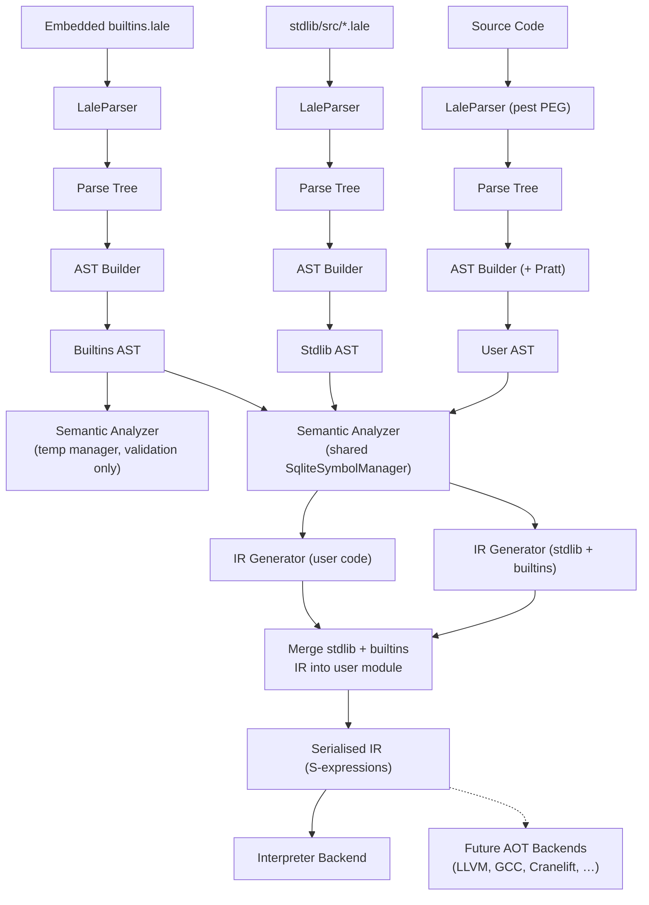

# Lale Compiler – Architecture

**Website**: [https://lale-lang.dev](https://lale-lang.dev)

This document describes the internal architecture of the Lale compiler for developers who want to understand, maintain, or extend the compiler. It also serves to onboard new contributors.

---

## Table of Contents

1. [Overview and Design Principles](#1-overview-and-design-principles)
2. [Execution Model and Backend Strategy](#2-execution-model-and-backend-strategy)
3. [Developer Setup and Installation](#3-developer-setup-and-installation)
4. [Compilation Pipeline](#4-compilation-pipeline)
   - 4.1 [Parser Generation](#41-parser-generation)
     - [Grammar Structure](#grammar-structure)
     - [Parse Tree Structure](#parse-tree-structure)
   - 4.2 [AST Construction and Pratt Parsing](#42-ast-construction-and-pratt-parsing)
     - [Pratt Parser Configuration](#pratt-parser-configuration)
   - 4.3 [AST Structure and Source Fidelity](#43-ast-structure-and-source-fidelity)
     - [Program Root](#program-root)
     - [Statement Types](#statement-types)
     - [Expression Types](#expression-types)
     - [Source Fidelity Design](#source-fidelity-design)
     - [Comment and Doc Attachment](#comment-and-doc-attachment)
   - 4.4 [Visitor Pattern](#44-visitor-pattern)
     - [`AstVisitor<T>` Trait](#astvisitort-trait)
     - [Implementations](#implementations)
   - 4.5 [Semantic Analysis](#45-semantic-analysis)
     - [4.5.1 Module Organisation](#451-module-organisation)
     - [4.5.2 Symbol Tables](#452-symbol-tables)
     - [4.5.3 Symbol Table Design Decisions](#453-symbol-table-design-decisions)
     - [4.5.4 Scope Management](#454-scope-management)
     - [4.5.5 Memory Safety](#455-memory-safety)
     - [4.5.6 Unit Analysis](#456-unit-analysis)
     - [4.5.7 Unused Symbol Detection](#457-unused-symbol-detection)
     - [4.5.7a Division-by-Zero Detection](#457a-division-by-zero-detection)
     - [4.5.7b Allocate-Release Pairing Check](#457b-allocate-release-pairing-check)
     - [4.5.7c Test Suite Validation](#457c-test-suite-validation)
     - [4.5.7d Definite Assignment Across Branches](#457d-definite-assignment-across-branches)
     - [4.5.8 SQLite‑Backed Symbol Table](#458-sqlitebacked-symbol-table)
     - [4.5.9 Database Infrastructure for Path Names](#459-database-infrastructure-for-path-names)
   - 4.6 [Module System](#46-module-system)
     - [`use` vs. `import`](#use-vs-import)
     - [Module Resolution](#module-resolution)
     - [Exports and Visibility](#exports-and-visibility)
     - [Module Execution Model](#module-execution-model)
     - [Circular Import Prevention](#circular-import-prevention)
     - [Built‑ins (`builtins.lale`)](#builtins-builtinslale)
     - [Standard Library Handling](#standard-library-handling)
     - [Conditional Compilation for Platform‑Specific Modules](#conditional-compilation-for-platformspecific-modules)
     - [Module Import Ambiguity Detection](#module-import-ambiguity-detection)
     - [Stdlib Design Principles](#stdlib-design-principles)
   - 4.7 [Intermediate Representation](#47-intermediate-representation)
     - [Design Goals](#design-goals)
     - [IR Types](#ir-types)
     - [Values (SSA)](#values-ssa)
     - [Module Structure](#module-structure)
     - [Instructions](#instructions)
     - [Stable Serialisation Format](#stable-serialisation-format)
     - [Validation Rules](#validation-rules)
     - [Interpretation Strategy](#interpretation-strategy)
     - [Backend Lowering Overview](#backend-lowering-overview)
     - [4.7.10 IR Semantics and Backend Independence](#4710-ir-semantics-and-backend-independence)
   - 4.8 [Interpreter Backend](#48-interpreter-backend)
     - [Design: Split Representation](#design-split-representation)
     - [Memory Layout: The Lale ABI](#memory-layout-the-lale-abi)
     - [Allocation and Leak Detection](#allocation-and-leak-detection)
     - [Stack Frame Reclamation](#stack-frame-reclamation)
     - [Bounds Checking](#bounds-checking)
     - [FFI](#ffi)
     - [Key Instructions](#key-instructions)
     - [Test Execution](#test-execution)
     - [Write System and String Handling](#write-system-and-string-handling)
     - [Runtime Hooks: Complete No‑Std Support](#runtime-hooks-complete-nostd-support)
     - [Error Function: Single User‑Replaceable Hook](#error-function-single-userreplaceable-hook)
     - [File I/O Architecture](#file-io-architecture)
     - [Semantic Conversions: Numeric‑to‑Character](#semantic-conversions-numerictocharacter)
   - 4.9 [Future AOT Backends](#49-future-aot-backends)
   - 4.10 [Validation Tool](#410-validation-tool)
     - [Validation Stages](#validation-stages)
5. [Language Design Decisions](#5-language-design-decisions)
   - 5.1 [UTF‑8 Everywhere](#51-utf8-everywhere)
   - 5.2 [Inferred Properties: No `const` or `mutability` Keywords (SSA-Based)](#52-inferred-properties-no-const-or-mutability-keywords-ssa-based)
   - 5.3 [No Type Aliases](#53-no-type-aliases)
   - 5.4 [Volatile Semantics via Import/Export](#54-volatile-semantics-via-importexport)
   - 5.5 [Explicit Type Conversions (Widening Only)](#55-explicit-type-conversions-widening-only)
   - 5.6 [Chained Type Conversions](#56-chained-type-conversions)
   - 5.7 [Pointer Conversions (Unsigned Only)](#57-pointer-conversions-unsigned-only)
   - 5.8 [Numeric Literal Range Validation](#58-numeric-literal-range-validation)
   - 5.9 [1‑Based Array Indexing](#59-1based-array-indexing)
   - 5.10 [Complete Array Initialization (No Partial Init)](#510-complete-array-initialization-no-partial-init)
   - 5.11 [No Exception Handling](#511-no-exception-handling)
   - 5.12 [Runtime Array Bounds Checking](#512-runtime-array-bounds-checking)
   - 5.13 [Unit Inference and No Unit Stripping](#513-unit-inference-and-no-unit-stripping)
   - 5.14 [Raw Pointers Only](#514-raw-pointers-only)
   - 5.14a [The `str` Type](#514a-the-str-type)
   - 5.14b [`str` Compiler-Managed Memory: A Deliberate Design Compromise](#514b-str-compiler-managed-memory-a-deliberate-design-compromise)
   - 5.14c [Fat String (`ptr` + `len`): Why Not Null‑Terminated?](#514c-fat-string-ptr-len-why-not-nullterminated)
   - 5.15 [Semantic Conversions: Numeric‑to‑Character](#515-semantic-conversions-numerictocharacter)
   - 5.16 [Read as String, Convert Explicitly](#516-read-as-string-convert-explicitly)
   - 5.17 [Optional Types](#517-optional-types)
   - 5.18 [Error Stack](#518-error-stack)
   - 5.19 [Alert Statement](#519-alert-statement)
   - 5.20 [Vector Types and Dot/Cross Product](#520-vector-types-and-dotcross-product)
   - 5.21 [`×` (U+00D7 MULTIPLICATION SIGN) Excluded from Grammar](#521-u00d7-multiplication-sign-excluded-from-grammar)
   - 5.22 [Superscript Digits as Power Operators](#522-superscript-digits-as-power-operators)
   - 5.23 [Field Encapsulation via `private`](#523-field-encapsulation-via-private)
   - 5.24 [`switch` — Value Comparison and Enum Matching](#524-switch-value-comparison-and-enum-matching)
   - 5.25 [Integer Overflow Traps by Default](#525-integer-overflow-traps-by-default)
6. [Error Catalog](#6-error-catalog)
7. [Appendices](#7-appendices)
   - [Adding a New Language Feature](#adding-a-new-language-feature)

---

## 1. Overview and Design Principles

The Lale compiler transforms source code through several stages:

```text
Source Code → Parser → Parse Tree → AST Builder → AST → Semantic Analysis → IR Generation → Interpreter
```

It is implemented in Rust as a bootstrapping language, with the long‑term goal of being written in Lale itself. The compiler is built around a single, stable, serialisable Intermediate Representation (IR) that decouples the frontend from all backends — today the interpreter, tomorrow ahead‑of‑time compilers.

### Core Design Principles

These principles guide every language and compiler decision. They are elaborated in [Chapter 5 – Language Design Decisions](#5-language-design-decisions).

**1. UTF‑8 Everywhere**
The entire pipeline treats UTF‑8 as a first‑class citizen. The grammar supports comprehensive Unicode ranges (Latin Extended, Greek, Cyrillic, CJK, Indic scripts, Arabic, Hebrew, combining marks, subscript digits). Identifiers accept Unicode letters and diacritics. Code generation preserves UTF‑8 identifiers into binaries. Error messages use mathematical symbols (Δ, α, β) for diagnostics. This reduces transcription errors in scientific computing and enables international collaboration.

**2. Explicit over Implicit**

- **No `const` or `mutability` keywords** – the SSA form of the IR captures immutability; the backends’ optimisation passes (mem2reg, DSE) make explicit annotations redundant.
- **No type aliases** — the `type` keyword always creates a genuinely new, distinct type. Renaming an existing type (e.g., `alias Meters = f64`) is intentionally unsupported and will never be added.
- **Explicit type conversions (widening only)** – the `as` operator is required; narrowing and incompatible conversions are rejected.
- **No chained conversions** – each conversion must be a separate, explicit step.
- **No implicit imports** – symbols must be explicitly listed; `*` is available but discouraged.
- **No hidden control flow** – exception handling is absent; all errors are explicit.
- **No hidden coercions** – Boolean conditions must be Boolean.

  **One documented exception:** `str` is the only type where the compiler manages heap memory automatically. String embedding (`"x = {x}"`), type-to-string conversions, and concatenation all allocate behind the scenes. The compiler tracks every `str` value and frees its data at the correct point — the user never writes `release` for a string. This is a deliberate compromise: the `str` type is part of the grammar and the compiler takes full responsibility. For raw pointer allocations, use `allocate` / `release`. See [§5.14a](#514a-the-str-type).

**3. Memory Safety without GC or Lifetime Annotations**
A simple, per‑function escape rule replaces lifetimes: “References to local variables must not escape the function.” Pointers to globals are safe because they outlive the current scope; pointers passed as parameters are _assumed_ to outlive the call, but this is not verified across a call boundary. This rule is enforced at compile time.

**4. Physical Unit Safety**
Units of measure are inferred from expressions and can be declared on variables. Unit mismatches are compile‑time errors. Units cannot be silently stripped; a value must be unitless from its origin to lose its unit. When static analysis cannot determine a unit, runtime assertions are emitted — these are active in **all builds**, not just debug.

**5. 1‑Based Array Indexing**
Following Fortran, Julia, MATLAB, R, Mathematica, and many other scientific languages, indexing starts at 1. This aligns with mathematical notation, reducing off‑by‑one errors. C FFI wrappers translate indices transparently.

**6. No Exception Handling**
Lale uses explicit error returns, `__lale_error` for unrecoverable errors, and optional types (`T?`, see §5.17) for recoverable errors. (Result types are intentionally excluded — the error stack handles diagnostics as a side channel, see §5.18.) Control flow stays visible and deterministic.

**7. Backend Independence and Self‑Hosting Readiness**
The Lale IR is the canonical executable semantic representation of the language. A single, stable, self‑contained IR (serialisable as S‑expressions) is the sole interface between the frontend and any execution engine. The interpreter is the reference implementation; future AOT backends (LLVM, GCC, Cranelift, and others) consume the exact same IR, eliminating the risk of semantic divergence. This design directly supports the long‑term goal of rewriting the compiler in Lale.

**8. No reserved keywords** — `var`, `fn`, `type`, `if`, `loop`, `return`, and all other statement keywords are valid identifiers. PEG ordered choice handles disambiguation at the grammar level, so `type()` is a function call while `type Point ... end type` is a type definition.

**9. Language over Library** — Features that require compiler awareness for safety guarantees or natural syntax are grammar‑level, not stdlib. Optional types (`T?`, `has value`, `value of`), the error stack (`add error`, `last error`, `warn error messages`), and tiered output (`write`/`warn`/`alert`/`debug`) are language constructs, not library APIs. This ensures compile‑time enforcement (e.g., future lints for unchecked `T?` values), eliminates import boilerplate, and provides syntax that reads as natural language (`if val has value`) rather than method‑call chains (`if val.is_some()`). The test for inclusion is: _does this feature require the compiler to know about it to provide safety or ergonomics that a library cannot?_ If yes, it belongs in the grammar. Pure data transformations (e.g., JSON parsing) belong in the stdlib.

---

## 2. Execution Model and Backend Strategy

### Current: Pure‑Rust Structured IR Interpreter

```bash
lale run program.lale
```

- **Backend**: A new interpreter that walks the structured SSA IR directly.
- **Behaviour**: Parses → analyses → generates IR → serialises → deserialises → executes.
- **Portability**: Any platform where Rust compiles. No external toolchain required.
- **Stdlib**: Compiled on‑demand from `stdlib/src/std.lale` (~50‑100ms startup overhead).
- **Caching**: Optional persistent cache via `--cache-dir`.

This interpreter is developed first and must reach full feature maturity before any AOT backend is added. It serves as the **golden reference** for Lale’s semantics.

### Future: Pluggable AOT Backends

The same serialised IR that the interpreter consumes can be fed to one or more ahead‑of‑time compilers. Because the IR is stable and self‑contained, each backend can be developed independently, in any language, and tested against the interpreter’s output.

| Backend             | API                        | Strengths                                                          | Planned Use             |
| ------------------- | -------------------------- | ------------------------------------------------------------------ | ----------------------- |
| **GCC (libgccjit)** | Stable C API, high‑level   | 45+ architectures, mature optimisations, self‑hosting‑friendly     | Primary AOT backend     |
| **LLVM**            | C API, low‑level           | Industry‑leading peak performance, broad platform support          | High‑performance AOT    |
| **Cranelift**       | Rust API, fast compilation | Memory‑safe, ~100× smaller than LLVM, no undefined behaviour in IR | Fast development builds |

All AOT backends are **future work**. They will be implemented against the stable IR once the interpreter is complete. The interpreter’s behaviour will be the compliance test suite for every backend.

---

## 3. Developer Setup and Installation

### Build and Test

```bash
cargo build --workspace       # compiler + LSP
cargo test --workspace        # full test suite
```

For the complete workflow (clippy, security checks, formatting, validation), see `AGENTS.md`.

### Directory Structure

```text
lale/
├── src/            # Compiler (grammar, AST, semantic analysis, IR, interpreter)
├── lale-lsp/       # Language server workspace member
├── stdlib/         # Lale standard library
├── examples/       # Example Lale programs
├── tests/          # Test suite
├── scripts/        # Build/helper scripts
├── doc/            # Documentation
└── Cargo.toml
```

### Required Environment

- Rust 1.70+
- Cargo (latest)
- No external toolchain is required for interpreter‑only operation.

---

## 4. Compilation Pipeline



The pipeline progresses through independent parsing of three input sources, AST construction, and semantic analysis. Builtins are analyzed **twice**:

1. **Builtins validation** — with a **temporary** `SqliteSymbolManager` that is immediately discarded. This is a fail‑fast validation pass: if `builtins.lale` itself contains errors, compilation stops immediately with a clear message, before any user or stdlib code is touched. Using a temporary manager avoids polluting the shared symbol table with builtins symbols that will be registered again later.
2. **During stdlib IR generation** — `builtins::BUILTINS_SOURCE` is parsed again, merged with stdlib source files, and analyzed with a **fresh internal** `SqliteSymbolManager`. This pass is the one that actually produces IR. It needs its own clean manager because stdlib functions reference builtins symbols and the symbol table must be self‑contained for IR lowering.

The two passes cannot be merged: builtins validation must not taint the shared manager (or stdlib's internal manager), and the internal manager must not share state with user code analysis. Since `builtins.lale` is under 500 lines, the runtime cost of parsing and analyzing it twice is negligible.

The interpreter reads the serialised IR; future AOT backends will do the same.

### 4.1 Parser Generation

The parser is generated from `grammar/lale.pest` at compile time:

```rust
use pest_derive::Parser;

#[derive(Parser)]
#[grammar = "grammar/lale.pest"]
pub struct LaleParser;
```

This generates:

- A `Rule` enum with one variant per grammar rule.
- Parsing logic implementing the `Parser` trait.

#### Grammar Structure

The grammar uses Pest's PEG syntax with modifiers:

- **Silent rules** (`_{ }`) – match but do not produce parse tree nodes.
- **Atomic rules** (`@{ }`) – parsed as a single token, no inner structure.

Example:

```pest
sd = _{ (os ~ (NEWLINE | ";") ) + ~ os }        // silent
single_identifier = @{ alpha ~ identifier_continue* }  // atomic — one name segment
link = { "->" }                                      // path separator
qualified_identifier = { single_identifier ~ (os_ln ~ link ~ os_ln ~ single_identifier)* }
                                                  // path name — segments joined by ->
```

#### Parse Tree Structure

The parse tree is a hierarchy of `Pair<Rule>` objects. Example:

```text
Pair<Rule::program>
├── Pair<Rule::var>
│   ├── Pair<Rule::var_symbol>
│   │   ├── Pair<Rule::single_identifier>: "x"
│   │   └── Pair<Rule::type_name>
│   └── Pair<Rule::expression>
│       └── Pair<Rule::float>
└── ...
```

_Note: The name `Pairs` is misleading – it is a generic container of `Pair` nodes, each holding metadata and children._

### 4.2 AST Construction and Pratt Parsing

The `ast/builder.rs` module converts the parse tree into a typed AST. Each grammar rule has a builder function:

```rust
pub fn build_program(pairs: Pairs<Rule>) -> Result<Program, String> { ... }
fn build_def(pair: Pair<Rule>) -> Result<Def, String> { ... }
fn build_fn_def(pair: Pair<Rule>) -> Result<FnDef, String> { ... }
fn build_expression(pair: Pair<Rule>) -> Result<Expr, String> { ... }
```

#### Pratt Parser Configuration

Expression parsing uses a top‑down operator precedence parser:

```rust
static PRATT_PARSER: LazyLock<PrattParser<Rule>> = LazyLock::new(|| {
    PrattParser::new()
        .op(Op::infix(Rule::logical_or, Assoc::Left))
        .op(Op::infix(Rule::logical_xor, Assoc::Left))
        .op(Op::infix(Rule::logical_and, Assoc::Left))
        .op(Op::infix(Rule::bitwise_or, Assoc::Left))
        .op(Op::infix(Rule::bitwise_xor, Assoc::Left))
        .op(Op::infix(Rule::bitwise_and, Assoc::Left))
        .op(Op::infix(Rule::equality, Assoc::Left))
        .op(Op::infix(Rule::comparison, Assoc::Left))
        .op(Op::infix(Rule::addition, Assoc::Left))
        .op(Op::infix(Rule::multiplication, Assoc::Left))
        .op(Op::infix(Rule::unsigned_left_shift, Assoc::Left))
        .op(Op::infix(Rule::unsigned_right_shift, Assoc::Left))
        .op(Op::infix(Rule::signed_left_shift, Assoc::Left))
        .op(Op::infix(Rule::signed_right_shift, Assoc::Left))
        .op(Op::infix(Rule::power, Assoc::Right))   // Right‑associative!
        .op(Op::infix(Rule::append, Assoc::Left))
        .op(Op::prefix(Rule::unary))
        .op(Op::postfix(Rule::member_access))
        .op(Op::postfix(Rule::conversion))
});
```

### 4.3 AST Structure and Source Fidelity

The AST is defined in `ast/definitions.rs` as Rust structs and enums. Every node includes a `SourceLocation`:

```rust
pub struct SourceLocation {
    pub line: usize,
    pub col: usize,
    pub start_pos: usize,
    pub end_pos: usize,
}
```

#### Program Root

```rust
pub struct Program {
    pub statements: Vec<Stmt>,
    pub location: SourceLocation,
}
```

There is no separate "AST" struct; the grammar's top‑level rule is `program`.

#### Statement Types

```rust
pub enum Stmt {
    // Definitions
    VarDef(VarDefStmt), TypeDef(TypeDefStmt), EnumDef(EnumDefStmt),
    FnDef(FnDefStmt), FnSignature(FnSignatureStmt), UnsafeDecl(UnsafeDeclStmt),
    Use(UseStmt),
    // Control flow
    If(IfStmt), When(WhenStmt), Match(MatchStmt), Switch(SwitchStmt),
    Loop(LoopStmt), Return(ReturnStmt), Assert(AssertStmt),
    ExitProgram(ExitProgramStmt), ExitLoop(ExitLoopStmt), Rewind(RewindStmt),
    MoveOn(MoveOnStmt), MissingCode(MissingCodeStmt),
    // Assignments
    Assign(AssignStmt), CompoundAssign(CompoundAssignStmt),
    ValueAtAssign(ValueAtAssignStmt),
    // I/O
    Stdout(StdoutStmt), Stderr(StderrStmt), Stdin(StdinStmt), Debug(DebugStmt),
    // Error stack
    AddError(AddErrorStmt), WriteErrors(WriteErrorsStmt),
    WarnErrors(WarnErrorsStmt), AlertErrors(AlertErrorsStmt), Alert(AlertStmt),
    // Function calls as statements
    FnCall(FnCall),
    // Compile-time
    CtIf(CtIfStmt), CtFail(CtFailStmt), CtWarn(CtWarnStmt),
    // Comments
    Doc(DocStmt), Comment(CommentStmt),
    // Test suites (top-level only)
    TestSuite(TestSuiteStmt),
}
```

##### Conditional Matching Statements

```rust
pub struct WhenStmt {
    pub condition: Condition,
    pub body: Vec<Stmt>,
    pub location: SourceLocation,
    pub comments: AttachedComments,
}

pub struct MatchStmt {
    pub arms: Vec<MatchArm>,
    pub else_arm: Vec<Stmt>,
    pub location: SourceLocation,
    pub comments: AttachedComments,
}

pub struct MatchArm {
    pub guard: Condition,
    pub body: Vec<Stmt>,
    pub location: SourceLocation,
}
```

##### Value Comparison Statement

```rust
pub struct SwitchStmt {
    pub value: Expr,
    pub cases: Vec<SwitchCase>,
    pub default_case: Vec<Stmt>,
    pub location: SourceLocation,
    pub comments: AttachedComments,
}

pub struct SwitchCase {
    pub pattern: SwitchPattern,
    pub body: Vec<Stmt>,
    pub location: SourceLocation,
}

pub enum SwitchPattern {
    Enum { variant_name: IdentifierExpr, fields: Vec<SwitchPatternField> },
    Literal { value: Expr },
}
```

##### Flow Control Placeholders

```rust
pub struct MoveOnStmt {
    pub location: SourceLocation,
    pub comments: AttachedComments,
}

pub struct MissingCodeStmt {
    pub location: SourceLocation,
    pub comments: AttachedComments,
}
```

#### Test Suite Statements

Test suites and test cases are top-level-only statements. Their names are
**identifiers** (not string literals); underscores are allowed. Comment/doc
attachment follows the **same rules as every other statement**: comment lines
directly above a case (no blank line) become that case's `comments.leading`; a
comment separated by a blank line — or one before `end test suite` — is a
standalone `TestSuiteItem` node preserved in source order.

```rust
pub enum TestSuiteItem {
    Case(TestCaseStmt),
    // Suite-level `var`/`fn` declaration, shared by all cases of the suite and
    // invisible outside it. Boxed to keep the enum small (Stmt is large).
    Declaration(Box<Stmt>),
    Comment(CommentStmt),
    Doc(DocStmt),
}

pub struct TestSuiteStmt {
    pub name: String,          // suite name (identifier)
    pub items: Vec<TestSuiteItem>, // ordered: declarations/cases interleaved with standalone comments/docs
    pub location: SourceLocation,
    pub comments: AttachedComments,
}

pub struct TestCaseStmt {
    pub name: String,          // case name (identifier)
    pub body: Vec<Stmt>,
    pub location: SourceLocation,
    pub comments: AttachedComments,
}
```

`TestSuiteStmt::declarations()` iterates just the suite-level `var`/`fn`
statements (`TestSuiteItem::Declaration`), mirroring `cases()`.

Grammar (`lale.pest`) — the `statement_comments` rule collects comment lines
preceding an item as its leading comments and tolerates the indentation of the
item keyword. The suite body is a list of `test_case | var | fn_def | info`
elements (`suite_item`), so any comment separated from the next item by a blank
line (or before `end test suite`) is a standalone `info` node of the suite:

```text
statement_comments = _{ (info ~ NEWLINE)* ~ os }
suite_item = _{ test_case | var | fn_def | info }
test_case  = { statement_comments ~ "test case" ~ single_identifier ~ stmt_block? ~ "end test case" }
test_suite = { statement_comments ~ "test suite" ~ single_identifier ~ (ms_ln ~ suite_item ~ (sd ~ suite_item)*) ~ "end test suite" }
```

Semantic analysis enforces that suite-level declarations appear before the first
test case. Validation and IR lowering are described in §4.5.7c and §4.8.

#### Expression Types

```rust
pub enum Expr {
    Binary(BinaryExpr), Unary(UnaryExpr), Conversion(ConversionExpr),
    Identifier(IdentifierExpr),
    IntLiteral(IntLiteral), UintLiteral(UintLiteral), FloatLiteral(FloatLiteral),
    HexLiteral(HexLiteral), CharLiteral(CharLiteral), BoolLiteral(BoolLiteral),
    StringLiteral(StringLiteral), ArrayLiteral(ArrayLiteral),
    FnCallExpr(FnCall), MemberAccess(MemberAccess), ArrayIndex(ArrayIndex),
    CompilerConst(CompilerConst), Grouped(Box<Expr>),
    // Optional type operators
    HasValue(HasValueExpr), HasNoValue(HasNoValueExpr),
    // Error stack expressions
    NothingExpr, HasErrors(HasErrorsExpr), LastError(LastErrorExpr),
}
```

#### Source Fidelity Design

The AST deliberately preserves syntactic information to enable exact source reconstruction and reformatting.

- **`Comment` / `DocComment`**: All comment text and placement preserved. Statements carry `AttachedComments`.
- **`Grouped(Box<Expr>)`**: Preserves parenthesized expressions. At IR generation, `Grouped` unwraps; no runtime overhead.

Example:

```rust
// Source: var x as i32 = ((a + b))
// AST: Stmt::Def(DefStmt { value: Expr::Grouped(Box::new( Expr::Grouped(...) )) })
```

A source reconstructor can recreate the exact parentheses or choose a different formatting.

Design trade‑offs:

- ✅ Perfect source reconstruction, future transcription tools.
- ❌ AST slightly larger (non‑semantic nodes present).

#### Comment and Doc Attachment

Every statement follows the same comment/doc attachment rules:

- A comment or `///` doc **directly above** a statement (no blank line in
  between) is stored as that statement's `comments.leading`.
- An **inline** comment after a statement is stored as `comments.trailing`.
- A comment **separated by a blank line** from the next statement is a
  standalone `Stmt::Comment` / `Stmt::Doc` node in the enclosing statement list
  (preserved in source order).

This is encoded uniformly by the silent `statement_comments` grammar rule
(`(info ~ NEWLINE)* ~ os`) at the start of every statement: the `(info ~ NEWLINE)*`
collects directly-attached comment lines, and the trailing `os` tolerates the
indentation of nested statements (function, loop, and test-case bodies). A
comment separated by a blank line is not consumed there and falls through to the
standalone `info` alternative in the `statement` rule. Test suites use the same
rule per case, and keep standalone comments/docs as `TestSuiteItem` nodes
between cases for source fidelity.

### 4.4 Visitor Pattern

Visitors traverse the AST without modifying it, enabling multiple analysis passes.

#### `AstVisitor<T>` Trait

```rust
pub trait AstVisitor<T> {
    fn visit_program(&mut self, program: &Program) -> T;
    fn visit_statement(&mut self, stmt: &Stmt) -> T;
    fn visit_expression(&mut self, expr: &Expr) -> T;
    // Statement visitors
    fn visit_def(&mut self, def: &Def) -> T;
    fn visit_fn_def(&mut self, fn_def: &FnDef) -> T;
    fn visit_if_stmt(&mut self, if_stmt: &IfStmt) -> T;
    // ... etc
    // Expression visitors
    fn visit_binary(&mut self, binary: &BinaryExpr) -> T;
    fn visit_unary(&mut self, unary: &UnaryExpr) -> T;
    fn visit_identifier(&mut self, ident: &IdentifierExpr) -> T;
    // ... etc
}
```

#### Implementations

| Visitor            | Purpose               | Return Type |
| ------------------ | --------------------- | ----------- |
| `AstPrinter`       | Debug pretty‑printing | `()`        |
| `SemanticAnalyzer` | Semantic analysis     | `()`        |
| `IRGenerator`      | IR construction       | `Module`    |

Example: `AstPrinter::visit_def` pretty‑prints a definition with indentation.

### 4.5 Semantic Analysis

The `SemanticAnalyzer` performs static analysis to enforce type safety, physical unit constraints, and escape prevention (pointer-to-local must not leave function scope). ⚠️ Compile-time `allocate`/`release` pairing analysis is not yet implemented (runtime leak prevention is handled by IR generation and the interpreter). It populates symbol tables attached directly to AST nodes (`Program` and `FnDef`) via `RefCell<Option<SymbolTable>>`, allowing IR generation to query symbol information without re‑running analysis.

#### 4.5.1 Module Organisation

```text
src/semantic_analysis/
├── mod.rs               # Module exports and public API
├── analyzer.rs          # Core SemanticAnalyzer implementing AstVisitor
├── symbol_management.rs # Scope and symbol table operations
├── type_system.rs       # Type inference and compatibility checking
├── expression_analysis.rs # Expression utilities and pointer detection
├── error_types.rs       # Error types and reporting infrastructure
```

Physical unit computation is handled by the separate `unit_analysis` module.

#### 4.5.2 Symbol Tables

Symbol types are defined in `ast/definitions.rs` and re‑exported. A unified `Symbol` type stores both variables and functions.

```rust
pub enum Linkage { Internal, Import, Export }
pub enum Visibility { Public, Private }
pub enum StorageClass { Default, ThreadLocal }
pub enum SymbolKind { Variable, Parameter, Function }

pub struct Symbol {
    pub source_location: SourceLocation,
    pub data_type: String,
    pub physical_unit: Option<String>,
    pub kind: SymbolKind,
    pub linkage: Linkage,
    pub visibility: Visibility,
    pub storage_class: StorageClass,
    pub is_definition: bool,
    pub is_initialized: bool,
}

type SymbolTable = HashMap<String, Symbol>;
```

##### AST‑Symbol Table Linkage

Global and function‑local symbol tables are linked directly to their AST nodes, populated during semantic analysis:

```rust
pub struct Program {
    pub statements: Vec<Stmt>,
    pub location: SourceLocation,
    pub global_symbol_table: RefCell<Option<SymbolTable>>,
}

pub struct FnDefStmt {
    pub name: String,
    pub parameters: Vec<Parameter>,
    pub body: Vec<Stmt>,
    // ...
    pub symbol_table: RefCell<Option<SymbolTable>>,
}
```

IR generation accesses symbols directly from the AST:

```rust
let globals = program.global_symbol_table.borrow().as_ref().unwrap();
let locals = fn_def.symbol_table.borrow().as_ref().unwrap();
```

##### Interior Mutability with RefCell<Option<>>

`RefCell<Option<>>` allows mutable borrowing of the symbol table through an immutable AST reference. The `Option` starts as `None` and is replaced during analysis.

##### Population During Analysis

After analyzing a scope, the analyzer stores the final symbol table in the corresponding AST node:

```rust
*program.global_symbol_table.borrow_mut() = Some(global_table.clone());
*fn_def.symbol_table.borrow_mut() = Some(fn_table.clone());
```

This architecture decouples analysis from code generation: the IR generator receives a fully analysed AST with pre‑computed symbol tables.

#### 4.5.3 Symbol Table Design Decisions

##### Implemented Fields

| Field            | Purpose                                 | Notes                                                                   |
| ---------------- | --------------------------------------- | ----------------------------------------------------------------------- |
| `linkage`        | Cross‑compilation‑unit visibility       | `Internal` (default), `Import`, `Export`                                |
| `visibility`     | Access control within source            | `Public` or `Private` (controlled via `private` keyword on type fields) |
| `storage_class`  | Memory storage location                 | Always `Default` (single‑threaded; `ThreadLocal` reserved for future)   |
| `is_definition`  | Distinguish declaration from definition | `true` for `var` and `fn`, enables forward declarations                 |
| `is_initialized` | Track initialization state              | `false` for `unsafe decl`, `true` otherwise                             |

##### Fields Not Implemented (and Why)

| Field            | Reason Not Included                                                                   |
| ---------------- | ------------------------------------------------------------------------------------- |
| `mutability`     | The SSA form in the IR captures immutability; backend passes (mem2reg, DSE) handle it |
| `address_taken`  | Only useful for sophisticated register allocation; not needed in the current design   |
| `lifetime`       | Avoided by simple variable escape rule (see Memory Safety below)                      |
| `generic_params` | Lale does not yet support generics; will be added with types                          |

##### Type Representation

`data_type` uses `String` rather than a structured `TypeId` enum because:

1. Lale will support user‑defined classes (naturally strings).
2. String comparison is sufficient for current type checking.
3. If performance becomes an issue, strings can be interned into a `HashMap<String, u32>`.

#### 4.5.4 Scope Management

Lale uses a simple two‑level **runtime** scope model: **Global** and **Function**. There are no nested scopes for loops or blocks. A third kind of _storage_ scope — **Suite** — exists for the built-in test framework, but it is **name‑keyed storage in the SQLite symbol table**, not a third runtime scope (see §4.5.7c).

```rust
pub enum VarScope {
    Global,
    Function { scope_key: FnScopeKey },
    /// Suite-level storage shared by all cases of one test suite. The suite
    /// name is stored in `variables.function_qualified_name`, so it is invisible
    /// to non-test code and other suites.
    Suite { suite_name: String },
}
```

##### Scope Restrictions

| Item              | Global Scope | Function Scope | Suite Scope                        |
| ----------------- | ------------ | -------------- | ---------------------------------- |
| Variables (`var`) | ✓            | ✓              | ✓ (suite-level, shared by cases)   |
| Functions (`fn`)  | ✓ Only       | ✗ Forbidden    | ✓ (suite-level, callable by cases) |
| Types (`type`)    | ✓ Only       | ✗ Forbidden    | ✗ Forbidden                        |
| Parameters        | —            | ✓              | ✓ (suite function parameters)      |

Examples of forbidden nesting:

```lale
fn outer() returns nothing
    fn inner() returns nothing  // ERROR: Function inside function
        write "hello"
    end fn
end fn
```

These restrictions simplify analysis and avoid lifetime tracking. Inside a test suite, module-level (global) variables are invisible; a case/suite-function falls back to the suite scope rather than the global scope, keeping the runtime two‑level model intact.

#### 4.5.5 Memory Safety

Lale enforces a compile‑time rule: **references to local variables must not escape the function**. The check is **syntactic** and **per‑function**: it catches a literal `pointer to <local>` returned or assigned directly to a global, and a pointer variable that was assigned `pointer to <local>` and is then returned or stored globally within the same function. It does not track inter‑procedural escape, so a function that passes a pointer to a callee is not itself flagged, even if the called function might later store it globally.

| Allowed                                  | Forbidden                                                            |
| ---------------------------------------- | -------------------------------------------------------------------- |
| `pointer to x` used within same function | `return pointer to localVar`                                         |
| `pointer to x` passed to function call   | Store `pointer to localVar` in global                                |
| `return p` where `p` is a parameter      | `return p` / `global = p` where `p` was set to `pointer to localVar` |

Storing `pointer to localVar` into a struct/type that later escapes is **not** detected.

This works because:

- Pointers to global variables live forever → always safe.
- Pointers passed as parameters are _assumed_ to come from the caller’s scope (longer‑lived) → treated as safe, but this is not verified across a call boundary.
- A pointer variable assigned `pointer to localVar` is tracked within the function.
- Only `pointer to localVar` creates a pointer to short‑lived data → forbidden to escape.

The semantic analyzer detects escaping pointers and reports errors; raw `allocate`/`release` misuse is reported as warnings (see Section 4.5.7b).

##### Why Only Raw Pointers

Lale uses a single `pointer` primitive rather than typed pointers. The full design rationale is given in Section 5.14 (Raw Pointers Only). In brief: the semantic analyzer tracks the pointed‑to type via the `pointer_to_type` field, but the programmer works with an opaque pointer type that carries no type annotation, keeping the language simple while still allowing compile‑time validation of bit widths and semantics at dereference.

#### 4.5.6 Unit Analysis

Every expression has an associated unit:

```rust
pub enum ExprUnit {
    Unitless,
    Unit(String),
    Unknown,
}
```

The `expr_unit()` method computes expression units recursively. For function calls, the return unit is computed by substituting argument units for parameter names and evaluating the return expression.

##### Unit Normalization

Units are stored in normalized form using `NormalizedUnit` (defined in `types/mod.rs`) with a `BTreeMap<String, i64>` representation. E.g., `kg*m^2/s^2 → {kg:1, m:2, s:-2}`.

##### Unit Inference – No Unit Stripping

When assigning a value with a unit to a variable without a declared unit, the unit is **inferred** from the RHS. There is no syntax to strip units from a value. This is a deliberate design decision:

1. Dimensional safety – units cannot be accidentally discarded.
2. Explicit intent – if a unitless value is needed, start with one.
3. Consistency with “no implicit conversions”.

##### Runtime Unit Assertions

When a unit cannot be determined statically (e.g., exponent is a variable), the code generator emits runtime assertions that verify unit compatibility. These assertions are present in **both debug and release builds** – unit safety is a core language guarantee.

#### 4.5.7 Unused Symbol Detection

The analyzer warns about unused variables, functions, parameters, and loop variables. Exported and imported symbols are excluded. Detection uses definition locations to handle scope collisions correctly (e.g., same name in different scopes).

#### 4.5.7a Division-by-Zero Detection

_This is a compiler diagnostic (warning), not a language feature. It is analogous to
unused-symbol warnings — it does not affect the language specification, only the
compiler's ability to detect likely bugs._

The semantic analyzer performs compile-time division-by-zero detection for both `/` (division)
and `%` (modulo) operators, as well as their compound-assignment forms `/=` and `%=`.
A warning is emitted when both operands are integer literals and the divisor is zero, or when
a variable is used as a divisor without a prior non-zero guard.

This is a conservative, sound analysis: the compiler warns when it cannot prove the divisor is
non-zero, and stays silent only when safety is provable.

##### How It Works

1. **Guard extraction**: When the analyzer encounters the guard of a conditional statement
   (`if`, `when`, or a `match` arm), it extracts facts about which expressions are provably
   non-zero using interval arithmetic. For example, `when divisor != 0` yields the fact
   `NotZero(divisor)`. Works for all comparison operators and constants: `x > 5`, `x < -1`,
   `x >= 1`, `x != 0`, `0 != x`, and their negated forms.

2. **Path-sensitive tracking**: Facts are pushed onto a guard stack when entering a guarded
   branch and popped when leaving. Each guarded branch has its own fact set.

3. **Structural matching**: When a division is encountered, the divisor expression is compared
   structurally (ignoring source locations) against all facts on the guard stack. If the exact
   expression tree matches, the division is proven safe.

##### Limitations

The analysis is intentionally conservative. Safe divisions may still trigger warnings when:

- The divisor is a compound expression (e.g., `a / (b + c)`) not matched by a guard on the same expression.
- The guard uses a mathematically equivalent but structurally different expression (e.g., `sin(x) != 0`
  does not guard `2*sin(x)` — requires Layer 2 sub-expression reasoning).

The warning message includes a note explaining this limitation.

##### Relationship to Runtime Checks

The `ZeroCheck` IR instruction is emitted before `/`, `%`, `/=` and `%=` operations in both
debug and release builds. If the divisor is zero at runtime, the program aborts. The compile-time
warning is an additional safety layer.

##### Implementation

`src/semantic_analysis/analyzer.rs` — functions `structurally_equal`,
`compare_against_constant`, `extract_facts`, `divisor_equivalent_forms`, `is_guarded_nonzero`,
plus modifications to `visit_if`, `visit_when`, `visit_match`, `visit_binary`, and
`visit_compound_assign`.

#### 4.5.7b Allocate-Release Pairing Check

_This is a compiler diagnostic (warning), not a language feature._

The semantic analyzer tracks `allocate()` calls in each function scope and verifies that
every allocation has a corresponding `release` or `on exit release` on all code paths.
Warnings are emitted for:

- **Unreleased allocations** — a variable allocated via `allocate()` is never passed to
  `release` or `on exit release` within the same function.
- **Overwritten allocations** — reassigning a pointer variable with `allocate()` without
  first releasing the previous allocation.
- **Double release** — a variable is released more than once (explicitly, or via a
  combination of `release` and `on exit release`).
- **Use-after-release** — a pointer is dereferenced with `value at` after an explicit
  `release` in the same function.

The check follows the same per-function-scope pattern as unused-symbol detection and
unchecked-optional warnings. Tracking state (`allocated_vars_in_scope`, `released_vars`,
`on_exit_released_vars`, `explicitly_released_vars`) is cleared at function exit.

#### 4.5.7c Test Suite Validation

Test suites are validated at module scope (`visit_test_suite` / `visit_test_case`):

- **Placement** — a test suite must be the last top-level statement; only
  comments/docs may follow it.
- **Structure** — a suite requires at least one test case; suites and cases may
  not be nested; suite-level `var`/`fn` declarations must appear before the first
  `test case`.
- **Duplicate names** — duplicate suite names (program-wide), duplicate case
  names within a suite, and colliding suite/case scope keys are rejected.
- **Function-like case scope** — a test case behaves like a function: variables
  defined in a case body are case-local (invisible to other cases, other suites,
  and non-test code). `fn`, `type`, `enum`, and `use` definitions are rejected
  inside a case body.
- **Suite scope** — a suite-level `var` is stored under the suite name in the
  `variables.function_qualified_name` column (`VarScope::Suite { suite_name }`),
  so it is shared by every case and reachable from suite functions but invisible
  to non-test code and other suites. A suite-level `fn` is registered under the
  mangled name `suite::fn` and analyzed with the suite scope as its fallback.
  Both are entered/analyzed by `enter_suite_scope`/`visit_suite_fn_def` before the
  cases.
- **Invisible module globals** — module-level (global) variables are **not**
  visible from a suite or its cases: `is_variable_defined`/`lookup_var_symbol` for
  a suite/case scope never fall back to the global scope. Referencing a global is
  therefore the normal `Undefined variable` / `Assignment to undefined variable`
  error. Module-level **functions** remain callable (they are resolved from the
  global function table when no suite function shadows them).

This restores the two-level runtime scope model: for a test suite the two levels
are **suite scope + case-local**, and for normal code they are **global +
function-local**. Suite scope is implemented as name-keyed SQLite storage, not a
third runtime scope.

#### 4.5.7d Definite Assignment Across Branches

A `var` defined inside a control-flow branch is usable after the construct only
if it is **defined on every path** through the construct with a **consistent type
and unit**. Otherwise, using it afterwards is a compile error (not a silent
zero), because the single function/global scope holds the binding while the
initializer may never have executed.

Applied to:

- **`if`/`else`** — both branches must define the variable (same type and unit).
- **`when`** — one-sided, so a body `var` is never definitely assigned after.
- **`match`** — every arm **and** the `else` arm must define it.
- **`switch`** — every case **and** the `default` (if present) must define it.
- **`loop`** — a body `var` is never definitely assigned after (the body may run
  zero times); the loop **header** variable (injected as a synthetic `VarDefStmt`
  before the loop) remains accessible.

Implementation (`src/semantic_analysis/analyzer.rs`):

- `branch_def_stack` — a stack of `BranchDefs` frames. `visit_var_def` records a
  definition (name → type+unit+location) into the top frame via
  `record_branch_def`.
- `sibling_defined_stack` — one set per open construct. `end_branch` merges a
  branch's defined names into it, so a later sibling branch's same-named `var` is
  a **join** (allowed) rather than a duplicate; `visit_var_def` skips
  re-registration in that case (`is_sibling_join`).
- `join_branch_defs` — intersects the branch definitions; any name not defined in
  every branch (or with a differing type/unit) is added to `branch_only_vars`.
- `visit_identifier` reports a clear error for a `branch_only_vars` name.

IR generation (`src/ir_gen.rs`) mirrors the join: a sibling-branch `var` reuses
the slot allocated in the previous branch (`is_sibling_join` in
`try_generate_var_def`) instead of allocating a second one. For globals the
address is re-derived via `global_addr` in the current block (the original
`global_addr` value may live in a sibling block). `generate_if`/`generate_when`/
`generate_match`/`generate_switch`/`generate_loop` enter/exit a sibling-defined
set so nested constructs scope correctly.

#### 4.5.8 SQLite‑Backed Symbol Table

The symbol table is backed by an **in‑memory SQLite database** (`:memory:`) by default (feature `sqlite-symbols`). This replaces the previous `HashMap`‑based implementation.

##### Rationale

- Declarative queries (self‑documenting).
- Universal language (SQL) understood by new contributors.
- Natural fit for module graph → relational tables.
- Future‑ready for incremental compilation and IDE integration.

##### Schema (Module-Aware)

```sql
CREATE TABLE modules (
  id INTEGER PRIMARY KEY,
  path TEXT NOT NULL UNIQUE,
  module_name TEXT,
  hash TEXT,
  mtime INTEGER
);

CREATE TABLE symbols (
  id INTEGER PRIMARY KEY,
  module_id INTEGER NOT NULL,
  scope_kind TEXT NOT NULL,
  scope_key TEXT NOT NULL,
  name TEXT NOT NULL,
  data_type TEXT NOT NULL,
  physical_unit TEXT,
  kind TEXT NOT NULL,
  linkage TEXT,
  visibility TEXT,
  source_location TEXT,
  is_initialized BOOLEAN,
  pointer_to_type TEXT,
  UNIQUE(module_id, scope_kind, scope_key, name),
  FOREIGN KEY(module_id) REFERENCES modules(id)
);

CREATE TABLE uses (
  from_module_id INTEGER NOT NULL,
  to_module_id INTEGER NOT NULL,
  location TEXT,
  PRIMARY KEY(from_module_id, to_module_id),
  FOREIGN KEY(from_module_id) REFERENCES modules(id),
  FOREIGN KEY(to_module_id) REFERENCES modules(id)
);

CREATE TABLE exports (
  module_id INTEGER NOT NULL,
  symbol_id INTEGER NOT NULL,
  exported_name TEXT NOT NULL,
  PRIMARY KEY(module_id, exported_name),
  FOREIGN KEY(module_id) REFERENCES modules(id),
  FOREIGN KEY(symbol_id) REFERENCES symbols(id)
);

CREATE TABLE symbol_references (
  from_module_id INTEGER NOT NULL,
  from_symbol_id INTEGER,
  to_symbol_id INTEGER NOT NULL,
  location TEXT,
  FOREIGN KEY(from_module_id) REFERENCES modules(id),
  FOREIGN KEY(from_symbol_id) REFERENCES symbols(id),
  FOREIGN KEY(to_symbol_id) REFERENCES symbols(id)
);

CREATE TABLE function_params (
  function_id INTEGER NOT NULL,
  param_index INTEGER NOT NULL,
  param_name TEXT NOT NULL,
  param_type TEXT NOT NULL,
  PRIMARY KEY(function_id, param_index),
  FOREIGN KEY(function_id) REFERENCES symbols(id)
);
```

##### Incremental Compilation Cache

When `--cache-dir` is provided, a persistent `symbols.db` is created. The cache stores file metadata (content hash, mtime) and symbol definitions. Subsequent runs re‑use cached symbols, achieving ~20‑40% speedup. Watch mode (`lale watch`) automatically uses the cache for incremental updates.

The `ModuleResolver` remains authoritative for module resolution; SQLite stores the results for querying during semantic analysis.

#### 4.5.9 Database Infrastructure for Path Names

Additional types (`QualifiedFunctionName`, `VariableKey`, `QualifiedTypeName`) and a `SymbolTableAdapter` trait have been implemented (240+ tests passing) to support path names in future phases.

### 4.6 Module System

Lale’s module system enforces a **directed acyclic graph** (DAG) of imports – circular imports are forbidden.

#### `use` vs. `import`

| Feature               | `use` statement                         | `import` modifier                                  |
| --------------------- | --------------------------------------- | -------------------------------------------------- |
| **Scope**             | Compile‑time module loading             | Linker‑level external symbols (C FFI)              |
| **Purpose**           | Load symbols from Lale modules          | Declare external C functions and variables         |
| **Syntax**            | `use math -> lib: add, subtract`        | `import var x as u8` / `import fn signature foo()` |
| **Symbol visibility** | Imported symbols stay in importing file | Symbols available at link time only                |
| **Resolution**        | Compiler reads `.lale` files            | Linker resolves symbols from C libraries           |
| **DAG Enforcement**   | Yes – circular `use` rejected           | No – linker handles external symbols               |

##### Imported Function Signatures

enable the standard library to wrap C functions without hidden libc dependencies.

#### Module Resolution

Directory structure maps directly to module names. Imports use `->` to navigate subdirectories. Parent directory access (`..`) is forbidden.

```lale
use math -> lib: add, subtract       // ./math/lib.lale
use physics -> mechanics -> force: calculate
```

All `use` statements must appear at the top of the file. A warning is emitted if they appear later.

#### Exports and Visibility

Only symbols marked `export` are accessible to other modules. To import all exported symbols from a module, omit the import list:

```lale
use math -> lib                     // imports all exports from math/lib.lale
use math -> lib: add, subtract      // imports only add and subtract
```

Exported symbols use the `export` modifier:

```lale
export var gravity_constant as f64 = 9.8
export fn calculate_weight(mass as f64) returns f64 ...
```

##### IR-Level Gap

1. `try_generate_var_def` hardcodes `Linkage::Internal` when calling `add_global`, ignoring `var_def.is_export`.
2. `load_stdlib_into_module` copies functions between modules but does not copy the Internal globals those functions reference, nor remap `GlobalAddr` instruction IDs. This causes dangling global references when stdlib functions are merged into the user's module (e.g., `ansi_red` in `std.lale`).

##### Fix

(a) Propagate `is_export` from `VarDefStmt` to `add_global`. (b) During function copy in `load_stdlib_into_module`, also copy Internal globals referenced by the copied functions, building a `global_id_remap_map` parallel to the existing `id_remap_map` for function IDs. Export globals stay in the source module.

#### Module Execution Model

All global code in a module executes when the module is loaded. There is no separate entry‑point block. Tests use the dedicated `test_suite` / `test_case` keywords.

#### Circular Import Prevention

The compiler builds a dependency graph during semantic analysis:

1. Each import records a dependency edge.
2. A topological order is maintained; an import that would create a back‑edge is rejected.
3. The error message lists the cycle.

No post‑facto cycle detection – cycles are prevented during compilation.

#### Built‑ins (`builtins.lale`)

`src/builtins/builtins.lale` is embedded in the compiler binary via `include_str!` (`src/builtins/mod.rs`). It contains functions the compiler pipeline depends on regardless of whether the standard library is present:

- **Type definitions**: `str` struct (`{ ptr, len }`)
- **FFI declarations**: `__lale_malloc`, `__lale_free`, `__lale_exit` (user must provide these in embedded/no‑stdlib environments; user-facing Lale keywords are `allocate`/`release`/`exit program`)
- **Memory operations**: `__lale_memcpy` (pure Lale)
- **String construction**: `__lale_construct_str_in_place`
- **Type conversion**: `__lale_bool_to_str`, `__lale_char_to_str`, `__lale_u64_to_str`, `__lale_i64_to_str`, `__lale_i32_to_str`, `__lale_f64_to_str`

**`str` type: planned single source of truth.** Currently the `str` struct is defined in two places: `builtins.lale` (Lale source) and `Module::new()` (Rust pre-registration). The pre-registration exists because user code is compiled before the stdlib is loaded — `str` must exist in the IR module before the first `var s as str = ...` is processed. The plan is to reverse the compilation order (process builtins.lale type definitions first, then user code), eliminating the pre-registration. `builtins.lale` becomes the single source of truth for the `str` type definition, consistent with every other type.

Builtins are **not part of the standard library** — they live in `src/builtins/`, not `stdlib/src/`. They are always available, even with `--stdlib-level=none`. They are validated before any user or stdlib module is analyzed.

#### Standard Library Handling

Stdlib modules (`stdlib/src/*.lale`) are compiled alongside the user program in a merged IR module. The compilation order is:

1. **Builtins validation** — `src/main.rs:compile_and_execute`: validates embedded `builtins.lale` against a **temporary** `SqliteSymbolManager` (not the shared one) to catch errors before the main analysis.
2. **User code semantic analysis** — modules are analyzed in dependency order using the shared manager.
3. **User code IR generation** — the main program's AST is lowered to IR using the shared `SqliteSymbolManager` (has user module symbols).
4. **Stdlib + builtins IR generation** — `load_stdlib_and_dependencies` in `src/ir_gen.rs` combines embedded `builtins::BUILTINS_SOURCE` and stdlib source files into a merged program, runs semantic analysis with its **own internal** `SqliteSymbolManager` (separate from the shared one), then lowers to IR. The result is merged into the user's IR module (function IDs remapped).

   The two IR generation runs are separate because they use **different symbol managers**: the shared one holds user module symbols, while stdlib+builtins needs its own clean manager. Merging them at the AST level would pollute the shared manager with stdlib internals.

- `use std` in source code does **not** trigger on‑demand compilation — stdlib symbols are already available from the merged module.
- `--stdlib-level=none` disables stdlib loading entirely. Builtins remain available (they are part of the compiler, not the stdlib).
- stdlib loading failure is a **hard error** — execution stops.

#### Conditional Compilation for Platform‑Specific Modules

```lale
#if #posix
    // POSIX‑only code
#end if
#if #windows
    // Windows‑only code
#end if
```

Compiler defines: `#posix`, `#windows`, `not #posix`, `not #windows`.

#### Module Import Ambiguity Detection

When the same symbol is imported from multiple modules, the compiler emits an error:

```text
Ambiguous symbol 'add': imported from multiple modules ('math', 'extra_math').
Use qualified path (e.g., 'module::add')
```

Implemented via `lookup_all_var_symbols()` in `SqliteSymbolManager` and a check in `visit_identifier()`.

#### Stdlib Design Principles

1. **Explicit error handling** – optional types (`T?`, `?` operator) for recoverable errors, error stack (`add error`/`last error`) for diagnostics. No hidden control flow — every error path is visible in the code.
2. **No implicit type coercion** – all conversions are explicit via the `as` operator. Numeric types, pointers, and characters require visible casts.
3. **Memory safety** – no buffer overflows, bounds‑checked strings.
4. **Clear functionality** – functions are small, focused, and named for what they do.
5. **No hidden allocations** – allocations are explicit.
6. **Single low-level FFI boundary** – the stdlib builds on a small, stable set of
   primitive `import fn` functions (unbuffered I/O, allocation, libm math,
   exit). Buffered/stream abstractions and everything else are implemented in
   Lale on top of that boundary — not duplicated as POSIX _and_ C stdio.

### 4.7 Intermediate Representation

The IR is the single, stable interface between the Lale frontend and any execution engine. It is designed for a pure‑Rust interpreter, future self‑hosting in Lale, and lowering to LLVM, GCC (libgccjit), Cranelift, or any other backend.

#### Design Goals

1. **SSA form** – all values are defined exactly once, enabling simple, efficient interpretation and optimisation.
2. **Backend agnostic** – one IR serves the interpreter and all future backends.
3. **Type safe** – IR types mirror Lale’s type system exactly.
4. **Unit aware** – physical units are preserved and checked (via `AssertUnit`).
5. **Block-based control flow** – functions are control-flow graphs of basic
   blocks with explicit `Br`/`CondBr` terminators. The shape maps directly onto
   LLVM, libgccjit, Cranelift, and C emission without a relooper.
6. **Stable serialisation** – a line-oriented text format allows the frontend to
   emit a self-contained IR file that any backend (in any language) can consume.

#### IR Types

Mirrors Lale's type system exactly. There is no separate `Str` built‑in; `str` is a named struct (type) as in the source language.

```rust
pub enum IrType {
    Void,
    Bool,
    I8, I16, I32, I64,
    U8, U16, U32, U64,
    F16, F32, F64,
    Char,
    Ptr(Box<IrType>),                 // Typed pointer with target type
    Array { element: Box<IrType>, size: u64 },
    Struct { name: String },           // Struct name; field info stored in module
    Vec2(Box<IrType>), Vec3(Box<IrType>), Vec4(Box<IrType>),
    Optional(Box<IrType>),
}
```

Pointers are **opaque** (`Ptr`); the target type is recorded in the symbol table for validation but does not appear in the IR type system. This matches Lale’s raw‑pointer design and avoids the complexity of typed pointers in the IR.

#### Values (SSA)

Every intermediate result is an SSA value, identified by a function-local
`ValueId`. Type and unit metadata are recorded in the function's value table:

```rust
pub struct ValueInfo {
    pub ty: IrType,
    pub unit: Option<NormalizedUnit>,
    pub name: Option<String>,   // debug/source-variable name
}

pub struct Function {
    // ...
    pub values: HashMap<ValueId, ValueInfo>,
}
```

#### Module Structure

```rust
pub struct Module {
    pub name: String,
    pub structs: Vec<StructDef>,
    pub extern_funcs: Vec<ExternFunc>,
    pub globals: Vec<Global>,
    pub functions: Vec<Function>,
}

pub struct StructDef {
    pub name: String,
    pub fields: Vec<(String, IrType)>,
}

pub struct Global {
    pub id: GlobalId,
    pub name: String,
    pub ty: IrType,
    pub unit: Option<NormalizedUnit>,
    pub initializer: Option<Constant>,
    pub linkage: Linkage,         // Internal | Export | Import
}

pub struct Function {
    pub id: FuncId,
    pub name: String,
    pub params: Vec<Parameter>,
    pub return_type: IrType,
    pub return_unit: Option<NormalizedUnit>,
    pub blocks: Vec<BasicBlock>,
    pub entry_block: BlockId,
    pub linkage: Linkage,
    pub values: HashMap<ValueId, ValueInfo>,
}

pub struct BasicBlock {
    pub id: BlockId,
    pub name: String,
    pub instructions: Vec<Instruction>,
}
```

##### Global Linkage and Module Boundaries

#### Instructions

Instructions are grouped into categories. Every instruction produces zero or one
`ValueId`. There are **no implicit conversions**; the IR generator must emit
explicit conversion instructions where needed.

##### Arithmetic, vectors, and bitwise

- Arithmetic: `Add`, `Sub`, `Mul`, `Div`, `Rem`, `Neg`, `Pow`
- Checked integer arithmetic: `CheckedAdd`, `CheckedSub`, `CheckedMul`, `CheckedNeg`
- Pointer difference: `PtrDiff`
- Vector ops: `Cross`, `Dot`, `BuildVec2`, `BuildVec3`, `BuildVec4`, `ExtractVecElement`
- Bitwise: `BitAnd`, `BitOr`, `BitXor`, `BitNot`, `Shl`, `Shr`, `UShr`

##### Comparison & Logical

`Eq`, `Ne`, `Lt`, `Le`, `Gt`, `Ge`  
`And`, `Or`, `Xor`, `Not`

##### Memory

- `Alloca(type)` – allocate stack space, returns `Ptr`. The IR generator hoists
  allocas to the entry block so loop-body allocations do not grow the stack
  repeatedly; the initializer `Store` remains at the source location.
- `Load(dst, ptr, type)` – load value from pointer.
- `Store(value, ptr, type)` – store value to pointer.
- `GetElementPtr` – computed pointer into an array/aggregate.
- `GetFieldPtr` – pointer to a field by precomputed byte offset.
- `StructFieldPtr` – pointer to a named field, resolved from the struct definition.
- `PtrToInt`, `IntToPtr`
- `BoundsCheck(index, length)` – trap via `__lale_error` on violation.
- `ZeroCheck(operand)` – trap via `__lale_error` on zero (div/mod guard).

Constants: `ConstInt`, `ConstUint`, `ConstFloat`, `ConstBool`, `ConstString`,
`ConstNull`.

##### Control Flow (block-based CFG)

A function is a list of basic blocks. Every block ends in exactly one terminator:

```rust
pub enum Instruction {
    // terminators
    Br { target: BlockId },
    CondBr { cond: ValueId, then_block: BlockId, else_block: BlockId },
    Ret { val: ValueId },
    RetVoid,
    // ...
}
```

- There are **no structured `Loop`/`Break`/`Continue`/`IfElse` nodes** and no
  `Phi`/`Select` nodes.
- Loops and conditionals are lowered to blocks + `CondBr`/`Br` by the IR
  generator.
- Values that must remain live across a merge are kept in allocas and loaded
  after the merge; the IR does not carry `phi` nodes.

##### Handling Values That Cross Branches

Because the IR has no `phi` or `Select`, branch-local results that must be used
after a join are written to an alloca before the branch and loaded after the
join. This is a lowering detail owned by the IR generator; the interpreter and
backends simply execute the resulting `Store`/`Load` instructions.

##### Calls

- `Call(dst, func, args)` – returns `ValueId`.
- `CallVoid(func, args)` – no return value.
- Both carry optional source locations (`at "file" line col` in serialized form)
  for stack traces.

##### Type Conversions

All explicit Lale conversions are encoded:
`Trunc`, `SExt`, `ZExt`, `FpToSi`, `FpToUi`, `SiToFp`, `UiToFp`, `FpTrunc`,
`FpExt`, `Bitcast`, `PtrToInt`, `IntToPtr`.

##### Strings, structs, optionals, and the error stack

- `Concat(lhs, rhs)` — string concatenation.
- `StrCopy(src)` — deep-copy a `str` without freeing the source.
- `BuildStruct`, `ExtractField`, `InsertField`, `StructFieldPtr`, `GetFieldPtr`.
- `Some`, `None`, `UnwrapOptional`.
- `PushError`, `PopError`, `ErrorCount`, `DrainErrors`.
- `TestBegin(suite, case)`, `TestFail(file, line, column, expected, found)`, `TestEnd` — test-suite
  reporting: `TestBegin` sets the current suite/case context, `TestFail` records a
  failure, `TestEnd` prints `Pass: suite / case` unless a failure was recorded. A
  failure forces a non-zero exit code. `TestFail`'s optional `expected`/`found`
  operands (present for `assert a == b`) are formatted into the message as
  `expected <b>, found <a>`; they serialize as `%N`, or `-` when absent.

##### Unit & Safety

- `AssertUnit(value, expected_unit)` – runtime unit check.
- `BoundsCheck(index, length)` – bounds check; calls `__lale_error` on failure.
- `ZeroCheck(operand)` – zero-division guard; calls `__lale_error` on failure.

#### Stable Serialisation Format

The canonical serialized form is **line-oriented** (LLVM-like) and matches
`src/ir/printer.rs`. It is self-contained: it includes struct definitions,
external declarations, globals, and function bodies. Comments start with `;` and
run to end of line; they are ignored by parsers.

Example:

```text
; ir-version: 1.0
; Module: example

%str = type { ptr: Ptr, len: I64 }

declare @puts(Ptr) -> I32

@answer: I64 = 42

func @main(%0 n: I64) -> I64 {
entry:
    %1 = alloca I64
    store %0, %1, I64
    %2 = load I64 %1
    %3 = const I64 0
    %4 = gt %2, %3
    condbr %4, %then, %else
then:
    %5 = const I64 1
    br %merge
else:
    %6 = const I64 2
    br %merge
merge:
    %7 = add %5, %6
    ret %7
}
```

Grammar (informal):

```text
module        := version_line module_header struct_section? extern_section? global_section? function*
version_line  := "; ir-version: " major "." minor NEWLINE
module_header := "; Module: " name NEWLINE
struct_section:= ("; Struct definitions" NEWLINE)? struct_def*
struct_def    := "%" name " = type { " field (", " field)* " }"
field         := name ": " ir_type
extern_section:= ("; External functions" NEWLINE)? extern_def*
extern_def    := "declare @" name "(" params ")" "->" ir_type
global_section:= ("; Global variables" NEWLINE)? global_def*
global_def    := linkage? "@" name ":" ir_type (" = " constant)? (" ; unit: <" unit ">")?
function      := linkage? "func @" name "(" params ")" "->" ir_type unit? "{" block* "}"
block         := name ":" instruction*
instruction   := value-producing-instruction | terminator | effect-instruction
```

Key points:

- The first line is `; ir-version: <major>.<minor>`. A parser must reject an
  unsupported **major** version; a **minor** version bump is a backward-compatible
  addition.
- `ir_type` is the `IrType` `Display` form, e.g. `i64`, `ptr`, `ptr<i32>`,
  `[10 x i32]`, `%Point`, `f64?`, `vec3<f64>`.
- SSA values are written `%N`; block references are written `%block-name`.
- Strings are quoted and use Rust `escape_default`.
- Units appear inside `<...>` and contain no whitespace (`⋅`, `/`, superscripts).
- Every instruction emits enough operands for lossless reconstruction, including
  `Store`'s type, `ExtractVecElement`'s inner type, and call source locations.
- A binary counterpart can be added later for performance.

#### Validation Rules

The IR must satisfy these invariants:

1. **SSA** – each `ValueId` is defined exactly once within its function.
2. **Type consistency** – operand types match instruction requirements.
3. **Well-formed CFG** – every basic block ends in exactly one terminator
   (`Br`, `CondBr`, `Ret`, or `RetVoid`), and every `Br`/`CondBr` target exists.
4. **No dangling references** – every referenced `ValueId` and `BlockId` exists.
5. **Function signatures** – call arguments match parameter counts and types.
6. **Unit assertions** are placed before any operation that requires a specific unit.

The standalone `lale-validate` tool will also verify these properties directly on
the serialized IR, making it easy to test backend implementations.

#### Interpretation Strategy

The interpreter maintains:

- A `HashMap<ValueId, Value>` for SSA values.
- The current basic block and a control-flow stack; `Br`/`CondBr` select the next
  block and `Ret`/`RetVoid` return from the function.
- A `MemoryManager` for heap and stack memory, plus the error stack and runtime
  hook state.

Execution walks the block CFG. The interpreter is the reference implementation of
Lale’s semantics; all other backends must produce identical observable behaviour.

#### Backend Lowering Overview

- **To LLVM**: map basic blocks directly; `CondBr` becomes a conditional branch;
  `Alloca`/`Load`/`Store` map naturally. Allocas used for cross-branch values
  allow LLVM’s `mem2reg` to reconstruct SSA/phis during optimization.
- **To libgccjit**: map blocks directly; `CondBr` becomes a conditional block
  end; calls map to libgccjit calls.
- **To future backends** (e.g., Cranelift, C source emission): the block CFG is
  consumed directly; no relooper is needed.

Because the IR is self-contained and stable, new backends can be developed
entirely in parallel with the frontend, using the serialized format as the
interface.

#### 4.7.10 IR Semantics and Backend Independence

To guarantee that backend independence is real and not just syntactic, the IR defines its own deterministic semantics. No backend is allowed to introduce behaviour that contradicts the interpreter. Specifically:

- **No LLVM poison values.** Every value is a concrete result of a defined operation.
- **No LLVM undefined behaviour.** Integer arithmetic traps on overflow by default: the IR emits `CheckedAdd`/`CheckedSub`/`CheckedMul`/`CheckedNeg` instructions that abort via `__lale_error` when a result does not fit its declared width. Under `--unchecked-overflow` the compiler emits the wrapping `Add`/`Sub`/`Mul`/`Neg` variants instead, whose semantics are two’s complement wrapping (like Rust’s `wrapping_add`, `wrapping_mul`, etc.). The choice is made at IR generation time, so every backend consumes identical IR in both modes. Shift by an amount greater than or equal to the bit width produces zero (or traps — we choose zero for consistency with the interpreter). Division by zero and remainder by zero always trap via `__lale_error`. Floating‑point operations follow IEEE 754; the interpreter uses Rust’s `f32`/`f64` semantics, which are deterministic.
- **No LLVM memory attributes.** `Alloca`, `Load`, and `Store` have simple, classic semantics. There are no `noalias`, `readonly`, or `dereferenceable` annotations. The memory model is defined solely by the interpreter's behaviour: loads and stores operate on real host heap memory (via `libc::malloc`) using the Lale ABI layout described in §4.8.
- **`StructFieldPtr` instruction.** Instead of relying on LLVM’s `getelementptr` with indices, the IR provides `StructFieldPtr(struct_ptr, field_name)`. The byte offset is computed from the struct’s definition stored in the module. This completely hides backend‑specific struct layout. Backends can lower this using their own layout calculation, ensuring consistent behaviour regardless of ABI details.
- **Future optimisation passes** must be proven correct against the IR’s own semantics, not LLVM’s. Any transformation that would be valid under LLVM’s UB rules but invalid under our deterministic rules must be rejected.

These rules ensure that the interpreter is the single, golden reference. Any backend that matches its output for all inputs is correct. There is no “it’s UB so anything can happen” escape hatch.

### 4.8 Interpreter Backend

The interpreter is the **primary and currently the only actively developed backend**. It consumes the serialised IR and executes it directly in pure Rust. The interpreter and all future AOT backends share the same memory layout, ensuring bit‑identical behaviour across backends.

#### Design: Split Representation

The interpreter uses a **split representation** to balance performance and fidelity:

- **SSA registers** (`HashMap<ValueId, Value>`): tagged `Value` enums for zero‑cost arithmetic, comparisons, and logic. No serialisation overhead for the 95%+ of instructions that don't touch memory.
- **The heap**: raw `[u8]` bytes allocated via `libc::malloc`, matching the AOT memory layout bit‑for‑bit. A `Value::Pointer(usize)` holds a real host address.
- **The bridge**: `MemoryManager` serves as a typed‑value cache with regions at every real address. `Store` and `Load` write and read `Value` enums to lazily‑created regions. String data is stored to both real heap (raw bytes for zero‑copy FFI) and MemoryManager (`Value::Uint` per byte for internal readers). No dual‑mode reads, no `unsafe` fallbacks. The raw‑byte serialisation helpers (`v3_store`/`v3_load` via `to_le_bytes`/`from_le_bytes`) are written but deferred — blocked by the need for a metadata system that distinguishes raw‑byte addresses from `Value`‑enum addresses.

#### Memory Layout: The Lale ABI

The authoritative layout is `doc/ABI_SPECIFICATION.md`. Lale uses a canonical,
private **AAPCS64-based internal ABI**: little-endian, 8-byte pointers, 16-byte
stack alignment, and AAPCS64 struct/optional packing. The FFI boundary uses the
host platform C ABI.

| Type                  | Layout                                    |
| --------------------- | ----------------------------------------- |
| `bool`                | 1 byte (0 = false, 1 = true)              |
| `i8` / `u8`           | 1 byte                                    |
| `i16` / `u16` / `f16` | 2 bytes, 2-byte aligned                   |
| `i32` / `u32` / `f32` | 4 bytes, 4-byte aligned                   |
| `i64` / `u64` / `f64` | 8 bytes, 8-byte aligned                   |
| `char`                | 4 bytes, 4-byte aligned                   |
| `pointer`             | 8 bytes, 8-byte aligned                   |
| `f128` (future)       | 16 bytes, 16-byte aligned                 |
| `T?` (optional)       | `{ is_present: bool, value: T }`          |
| Struct                | AAPCS64 field layout                      |
| Array `T[n]`          | `n * sizeof(T)` contiguous bytes          |
| `vec2`/`vec3`/`vec4`  | `2`/`3`/`4` × `sizeof(T)`, aligned to `T` |

#### Allocation and Leak Detection

A thin `AllocLog` wrapper around `libc::malloc`/`free`:

- `allocate N` → calls `malloc(N)`, logs `(address, size, file, line)`
- `release ptr` → calls `free(ptr)`, removes from log
- Program exit: remaining entries in `AllocLog` are reported as leaks with source location

#### Stack Frame Reclamation

The compiler manages every interpreter heap allocation for a stack slot as a
**frame-reclamation** model, mirroring how an AOT backend reclaims a stack frame
on return:

- **Alloca hoisting.** `IrBuilder::alloca` / `alloca_named` emit every `Alloca`
  into the function's entry block (`emit_to_entry`), regardless of where the
  variable is declared. A loop-body `var` is therefore allocated exactly once
  per call, never once per iteration.

- **Shared epilogue.** Each function gets a single epilogue block. Every
  `return` stores its value into a dedicated return slot and branches to the
  epilogue; an implicit fall-through at the end of the body does the same.

- **Frame reclamation.** The epilogue runs the collected `on exit` statements,
  then `emit_auto_free` frees the whole frame in one place. It walks the entry
  block (`collect_function_allocas`) to enumerate every alloca — named and
  temporary — and frees each slot, skipping only allocas whose ownership was
  transferred (consumed `str` returns, the return slot itself).

This replaces the earlier per-scope / per-return auto-free, which freed only the
allocas emitted so far and therefore leaked variables declared after an early
`return`. The interpreter and future AOT backends now share one mental model:
"one frame, allocated on entry, reclaimed on exit."

#### Bounds Checking

**Debug mode**: every `Load`/`Store` validates the address against the `AllocLog`. Out‑of‑bounds → `__lale_error` with source location. Array indexing validates `1 ≤ index ≤ length`.

**Release mode**: raw dereference, no checks. Out‑of‑bounds → OS segfault. Matches AOT behaviour exactly. Consistent with existing Lale patterns (`missing code`, div‑by‑zero warnings).

#### FFI

The FFI boundary uses the **host platform C ABI** (not the internal AAPCS64 ABI).
The `call_extern` dispatcher keeps thin match arms for typed value extraction and
marshal Lale-only types (`str`, `T?`) to C-compatible forms at the boundary.

#### Key Instructions

| Instruction                                       | Behaviour                                                                                                                             |
| ------------------------------------------------- | ------------------------------------------------------------------------------------------------------------------------------------- |
| `Alloca`                                          | `AllocLog` allocation (real heap via `libc::malloc`)                                                                                  |
| `Store(ptr, Value::I32(n))`                       | Write `Value` enum to `MemoryManager` region at `ptr` (also writes raw bytes via `v3_store` for primitives when the bridge is active) |
| `Load(ptr, I32)`                                  | Read `Value` enum from `MemoryManager` region at `ptr`                                                                                |
| `GetFieldPtr(struct_ptr, struct_name, field_idx)` | `ptr + offset` from canonical layout                                                                                                  |
| `ArrayIndex(arr_ptr, index)`                      | `ptr + (index − 1) * sizeof(element)` (1‑based)                                                                                       |
| `BuildStruct`                                     | Packs SSA values into `Value::Struct`; serialisation to bytes happens in `Store`                                                      |

#### Test Execution

`#mode` is a compile-time constant (`"run"` in `lale run`, `"test"` in `lale test`).
Top-level statements are wrapped in mode-guard blocks (`begin_mode_guard` /
`end_mode_guard` in IR generation): run-mode statements execute only when
`#mode == "run"`, test suites only when `#mode == "test"`. Both branches remain in
the IR — the interpreter evaluates the guard at runtime, and a future AOT backend
dead-code-eliminates the untaken branch.

Each test case body is bracketed by `TestBegin` / `TestEnd`. A failing `assert`
inside a case emits `TestFail` and execution continues with the next case. Test-case
variables are stack locals of the synthetic `main` frame; each case gets its own
IR-generation scope (so same-named variables in different cases do not collide),
and each case's string data is freed on case exit.

Suite-level `var`/`fn` are emitted **before** the cases, inside the same
`#mode == "test"` guard. Suite variables become mangled IR globals (`suite::name`)
so they are shared across cases and reachable from suite functions without
colliding with module globals; in the IR-generation scope map they are registered
under their simple name in a pushed suite scope. Suite functions become mangled IR
functions (`suite::fn`). Function calls from cases/suite functions resolve the
suite-qualified name first, matching the analyzer's registration. Suite-level
`str` globals are tracked separately in `IrGenerator::suite_globals` so
`emit_global_str_auto_free` frees their string data at program exit (the suite
scope map is popped before the epilogue).

`lale test --filter <pattern>` restricts which suites/cases are emitted at
IR-generation time (`IrGenerator::test_filter`). The flag is repeatable
(`--filter A --filter B`) and a case runs if ANY pattern matches. A pattern
containing `/` (the same separator as the `Pass: suite / case` output, e.g.
`Math/Subtraction`) matches a substring of the full `suite/case` path; any
other pattern matches a substring of the suite name or the case name. Semantic
analysis still validates every suite and case — only code generation skips
non-matching cases — so a filtered run cannot hide compile errors.

In test mode the interpreter forces a non-zero exit when the run leaks heap
memory (`AllocLog::report_leaks` returns the leak count; `execute_module` exits 1
if any test ran and leaked). `lale run` prints the same `HEAP LEAK` report but
leaves the exit code untouched, which makes `lale test` usable as a leak detector
for standard-library development.

#### Write System and String Handling

The `write` and `write_inline` statements use automatic type‑to‑string conversion. The `str` type is a struct `{ ptr: pointer, byte_len: u64 }` (fat pointer, UTF‑8). The string conversion functions are **generated as IR functions** in every module — no external C code required:

| Function                   | Input                  | Output              |
| -------------------------- | ---------------------- | ------------------- |
| `@__lale_i64_to_str(i64)`  | Signed integer         | `{ ptr, byte_len }` |
| `@__lale_u64_to_str(u64)`  | Unsigned integer       | `{ ptr, byte_len }` |
| `@__lale_f64_to_str(f64)`  | Float (mainstream fmt) | `{ ptr, byte_len }` |
| `@__lale_bool_to_str(i1)`  | Boolean                | `{ ptr, byte_len }` |
| `@__lale_char_to_str(u32)` | Unicode codepoint      | `{ ptr, byte_len }` |

Float formatting follows the mainstream convention (implemented in
`builtins.lale`): plain decimal for magnitudes from `1e-4` (inclusive) to
`1e16` (exclusive), scientific notation outside that range, and trailing
zeros stripped. The digit extraction is naive (15 significant digits) rather
than shortest round-trip; full Ryu/Grisu formatting is future work.

##### Statement Code Generation

- `write_inline x`: converts `x` to string if needed, then calls `write(1, ptr, byte_len)` (single syscall).
- `write x`: same, but appends `\n` and calls `write(1, ptr, byte_len + 1)`.

##### Compile‑Time Optimisations

| Expression      | Optimisation                                     |
| --------------- | ------------------------------------------------ |
| `write "Hello"` | Length = 6 (5 + newline) embedded as constant    |
| `write 'A'`     | Length known (1–4 bytes UTF‑8 + newline)         |
| `write true`    | Length = 5 ("true\n") constant                   |
| `write false`   | Length = 6 ("false\n") constant                  |
| `write int_var` | Length computed by conversion function           |
| `write str_var` | Length from `str_var.byte_len` (O(1), no strlen) |

#### Runtime Hooks and FFI Boundary

The authoritative extern set is `doc/ABI_SPECIFICATION.md`. The interpreter
dispatches through a single `call_extern`; an AOT backend links against libc or
the user-provided implementations.

The boundary is a **single low-level set** — unbuffered I/O, allocation, libm
math, and exit. The buffered C stdio family (`fopen`/`fread`/`fwrite`/`fclose`/
`fseek`) is **not** part of the boundary; buffered/stream abstractions are built
in Lale on top of `open`/`read`/`write`/`close`.

Stable C-runtime externs:

- `write`, `read`, `open`, `close`, `malloc`, `free`, `pow`, `puts`, `strtod`,
  `strtol`, `strtoul`

Stable `__lale_*` hooks:

- `__lale_exit(i32) -> void`
- `__lale_malloc_u64(u64) -> ptr`
- `__lale_free_pointer(ptr) -> void`
- `__lale_read_line() -> str`

`__lale_error` is **not** an extern; it is the internal runtime-error path used
for bounds violations, division by zero, absent-optional unwrap, and
checked-overflow traps.

#### Error Function: Single User‑Replaceable Hook

All runtime errors (array bounds violations, division by zero, unwrap of absent optional) go through a single function:

```lale
fn __lale_error(ptr as pointer, length as i64) returns i64
```

| Mode                 | Implementation                                                                                                                                                                                                                         |
| -------------------- | -------------------------------------------------------------------------------------------------------------------------------------------------------------------------------------------------------------------------------------- |
| **Default (stdlib)** | Write diagnostic to stderr via POSIX `write()` to fd 2. Returns the number of bytes written (or -1 on error, matching POSIX `write()` semantics). The caller is responsible for terminating the program (typically via `__lale_exit`). |
| **No‑std mode**      | User provides implementation (e.g., halt CPU, reset system, log to flash)                                                                                                                                                              |

##### Parameters

- `ptr as pointer`: Pointer to the pre‑formatted error message (UTF‑8 bytes)
- `length as i64`: Number of bytes in the message

The message is pre‑formatted by the compiler before the call. For example, an array bounds violation produces:

```text
ERROR at main.lale:42:15: array index out of bounds (index=15, length=10)
```

The formatting (source location, error type, diagnostic values) is done at the call site — the hook receives a complete, ready‑to‑output string.

#### File I/O Architecture

File I/O is implemented in Lale stdlib modules (`file_io_posix.lale`, `file_io_windows.lale`) rather than in the interpreter. File handles are represented as `i64` opaque identifiers because they are never dereferenced, they fit all platform representations (32‑bit fds and 64‑bit pointers), and they signal an opaque handle clearly.

The FFI boundary exposes a **single low-level unbuffered I/O set** — `open`,
`read`, `write`, `close` (and `lseek` where the platform provides it). There is
**no** separate buffered C stdio boundary (`fopen`/`fread`/`fwrite`/`fclose`/
`fseek`); buffered/stream abstractions are built **in Lale** on top of the
unbuffered boundary.

##### Platform-Specific Implementation

- **Unix/Linux/macOS** (`file_io_posix.lale`): Uses the unbuffered POSIX syscalls (`open`, `read`, `write`, `close`, `lseek`).
- **Windows** (`file_io_windows.lale`): Uses the unbuffered C-runtime low-level I/O (`_open`, `_read`, `_write`, `_close`, `_lseeki64`) mapped to the same boundary.

Both export an identical public API: `openFile`, `readFile`, `writeFile`, `closeFile`, `seekFile`. Buffering is shared Lale code above the boundary.

#### Semantic Conversions: Numeric‑to‑Character

The type system distinguishes between narrowing conversions (forbidden) and semantic conversions (allowed). Converting a numeric code to a `char` (e.g., `48 as u64 → '0'`) is a semantic category change and does not lose information. This enables stdlib digit‑to‑character conversion without language extensions. The interpreter implements this directly.

### 4.9 Future AOT Backends

Once the interpreter is mature and the IR is stable, AOT backends will be added. They all consume the exact same serialised IR.

| Backend             | API                        | Strengths                                                          | Effort to Integrate |
| ------------------- | -------------------------- | ------------------------------------------------------------------ | ------------------- |
| **GCC (libgccjit)** | Stable C API, high‑level   | 45+ architectures, mature optimisations, self‑hosting‑friendly     | Moderate            |
| **LLVM**            | C API, low‑level           | Industry‑leading peak performance, broad platform support          | Higher              |
| **Cranelift**       | Rust API, fast compilation | Memory‑safe, ~100× smaller than LLVM, no undefined behaviour in IR | Moderate            |

The interpreter serves as the golden reference for testing: any program must produce identical output under the interpreter and any AOT backend. Because the IR is stable and self‑contained, each backend can be developed independently, even in a different language.

### 4.10 Validation Tool

The `lale-validate` binary checks completeness across all three compiler stages by scanning source code for handler functions and cross-referencing them against the constructs they handle. It also detects orphaned handlers (code for constructs that no longer exist).

```bash
cargo run --bin lale-validate                 # All three stages
cargo run --bin lale-validate -- --stage ast  # Grammar → AST only
cargo run --bin lale-validate -- --stage ir   # AST → IR only
cargo run --bin lale-validate -- --stage interpreter  # IR → Execution only
cargo run --bin lale-validate -- --output json          # JSON output
cargo run --bin lale-validate -- --output markdown      # Markdown table
cargo run --bin lale-validate -- --missing-only         # Show only gaps
cargo run --bin lale-validate -- --show-orphans         # Show orphan warnings
```

#### Validation Stages

| Stage          | Source                   | Checks                                                               | How it works                                                                                                       |
| -------------- | ------------------------ | -------------------------------------------------------------------- | ------------------------------------------------------------------------------------------------------------------ |
| Grammar → AST  | `src/grammar/lale.pest`  | Every grammar rule has a handler in `builder.rs` or `expr_parser.rs` | Scans `Rule::Name` references, marks internal sub-rules (prefixed `_` or only referenced from silent/atomic rules) |
| AST → IR       | `src/ast/definitions.rs` | Every `Stmt`/`Expr` variant has a `generate_*` method in `ir_gen.rs` | Scans `Stmt::Name` and `Expr::Name` references, maps variant names to struct names                                 |
| IR → Execution | `src/ir/instructions.rs` | Every `Instruction` variant has a match arm in `interpreter.rs`      | Scans `Instruction::Name` references                                                                               |

##### Category Detection

Instruction categories (Arithmetic, Memory, Optional, etc.) are parsed from `// ========== Name ==========` section comments in `instructions.rs` — no separate hardcoded map to maintain. New categories appear automatically when section comments are added.

##### Coverage Report

```text
Grammar → AST Coverage: 100.0%
  AST → IR Coverage: 100.0%
  IR → Execution Coverage: 100.0%
```

Orphaned handlers (code for removed constructs) are flagged as `⚠ ORPHAN` with a note identifying the stale code.

##### Source

`src/bin/validate.rs`

---

## 5. Language Design Decisions

This chapter consolidates the detailed rationales for every language design choice in Lale. A summary of these principles appears in [Chapter 1 – Overview and Design Principles](#1-overview-and-design-principles).

### 5.1 UTF‑8 Everywhere

#### Decision

UTF‑8 is a first‑class citizen throughout the entire compiler pipeline.

#### Rationale

- **Parser:** PEG grammar handles comprehensive Unicode character ranges including Latin Extended, Greek & Coptic, Cyrillic, CJK (20,000+ ideographs plus Hiragana, Katakana, Hangul), Indic scripts (Devanagari, Bengali, Tamil, etc.), Middle Eastern (Arabic, Hebrew, Syriac, Thaana), Southeast Asian (Thai, Lao, Tibetan, Myanmar), Georgian, Armenian, Roman numerals, and combining marks (Latin combining diacriticals and extended ranges).
- **Identifiers:** Support Unicode letters, subscript digits (₀–₉), and combining diacritical marks. Subscript digits (e.g., `x₁`, `y₂`) enable mathematical notation directly in source code.
- **Code Generation:** UTF‑8 identifiers are preserved through to object files and binaries.
- **Error Messages:** Compiler output uses Unicode for mathematical symbols (Δ, α, β, etc.) when displaying diagnostics.

This comprehensive Unicode support enables scientific computing code to naturally express mathematical concepts across multiple languages and scripts, reducing transcription errors when implementing algorithms from research papers.

### 5.2 Inferred Properties: No `const` or `mutability` Keywords (SSA-Based)

#### Decision

No explicit `const` keyword for constant declarations, and no `mutability` keyword or mutability annotations.

#### Rationale

- **SSA encodes immutability:** Variables assigned once are inherently immutable; reassignments create new SSA values.
- **Dead store elimination:** Backends perform automatic dead store elimination (DSE) and constant propagation without needing programmer annotations.
- **No redundant keywords:** Since SSA already captures whether a value is immutable or mutable, explicit `const` or `mutability` keywords are redundant.

By avoiding these annotations, the language is simpler without sacrificing optimization quality. Programmers focus on correctness and logic; the IR and backends handle the rest.

### 5.3 No Type Aliases

#### Decision

Lale has no mechanism for creating type aliases. The `type` keyword always defines a genuinely new, distinct type — never a simple rename of an existing one. Type aliasing is intentionally excluded from the language design and will not be added in the future.

#### Rationale

- **Renaming** an existing type (`alias Meters = f64`) — which adds confusion by creating multiple interchangeable names for the same thing
- **Creating** a new type (`type Meters … end type`) — which has its own identity, fields, and semantics

Requiring every type to be a new definition ensures types carry meaning beyond mere syntax sugar, promoting clearer code organization and preventing the "which name is the real one?" problem that plagues codebases with unchecked aliasing.

#### Why This Will Never Change

Type aliases offer convenience at the cost of clarity. They create a parallel naming system — "Meters is really f64, but only sometimes" — that forces readers to maintain a mental mapping table. Lale already provides two better alternatives for every use case an alias might serve:

- **If you need a named type with identity:** define it with `type`. The new type has its own fields, its own symbol table entry, and its own semantics — it cannot be silently interchanged with other types.
- **If you only need to annotate a value's physical dimension:** use units. `var height as f64 in <m> = 1.80` attaches meaning without pretending there's a new type.

Both alternatives are more expressive than a bare rename and leave no ambiguity about intent. Adding aliases would introduce a third mechanism that is less powerful than either, while undermining the clarity the first two provide.

### 5.4 Volatile Semantics via Import/Export

#### Decision

No `volatile` keyword. Volatility is implicit in `import`/`export` declarations; signal handler atomicity uses `atomic`.

#### Rationale

- Variables marked `export` are visible across compilation boundaries, implying they may be modified outside normal control flow.
- Variables marked `import` come from external sources with no guarantees about timing.
- This design groups related concepts (visibility and volatility) together without additional keywords.
- Signal handlers explicitly use `atomic` types, which clearly conveys synchronization intent.

### 5.5 Explicit Type Conversions (Widening Only)

#### Decision

Lale requires explicit type conversions using the `as` operator, but only **widening conversions** are allowed. Narrowing conversions and incompatible type conversions are rejected at compile time.

#### Allowed Conversions

- Widening integers: `i32 as i64`, `u8 as u32`
- Widening floats: `f32 as f64`
- Integer to float: `i32 as f64` (widening in precision)

#### Rejected Conversions

- Narrowing integers: `i64 as i32` ❌
- Narrowing floats: `f64 as f32` ❌
- Float to integer: `f64 as i32` ❌ (precision loss)
- String ↔ Numeric: `str as i32` ❌
- Bool ↔ Numeric: `bool as i32` ❌

#### Units Are Preserved

through type conversions. Converting `i32 in <m>` to `f64` produces `f64 in <m>`.

#### Rationale

1. **No silent precision loss:** Narrowing conversions can lose data silently. By rejecting them, the programmer must reconsider the data types in their design.
2. **Type safety:** Incompatible conversions (string/bool ↔ numeric) represent logical errors, not type mismatches.
3. **Unit preservation:** Physical dimensions are intrinsic to the value, not the type. Converting a distance from `i32` to `f64` doesn't change the fact that it's measured in meters.
4. **Condition Type Safety:** Boolean conditions must be explicitly boolean. Lale rejects non‑boolean expressions in conditions, preventing a class of errors common in C‑like languages where any non‑zero value is "truthy." This rule applies to both runtime `if`/`loop when` and compile‑time `#if` conditions.

```lale
var x as i32 = 42
var y as f64 = x as f64    // OK: widening (i32 → f64)
// var z as i32 = y as i32 // ERROR: narrowing (f64 → i32) not allowed

var distance as i32 in <m> = 100
var d as f64 = distance as f64    // OK: d has type f64 and unit <m>

if x > 0                    // OK: comparison produces boolean
    write "positive"
end if
```

This design philosophy aligns with Lale’s goal of safety and explicitness in scientific computing.

### 5.6 Chained Type Conversions

#### Decision

Conversions chain naturally as a left-to-right pipeline. Each `as` step is validated independently — `x as u32 as f64` is two separate widening checks.

#### Rationale

```lale
var x as i32 = 42
var result as f64 = x as u32 as f64    // i32 → u32 → f64, each step widening only
```

For long chains or debuggability, intermediate variables add clarity:

```lale
var x as i32 = 42
var as_u32 as u32 = x as u32
var result as f64 = as_u32 as f64
```

### 5.7 Pointer Conversions (Unsigned Only)

#### Decision

Only unsigned integer types (`u8`, `u16`, `u32`, `u64`) can be converted to `pointer`. Signed integers are explicitly rejected.

#### Rationale

1. **Bitwise Safety:** Unsigned integers map directly to memory addresses without sign‑extension issues.
2. **Semantic Clarity:** Pointers represent addresses, which are naturally unsigned values.
3. **Type Safety:** Restricting to unsigned prevents accidental negative address construction.

#### Allowed

```lale
var addr as u64 = 0x7FFF0000
var ptr as pointer = addr as pointer    // OK: unsigned
```

#### Rejected

```lale
var x as i32 = 42
var p as pointer = x as pointer         // ERROR: signed integer
```

### 5.8 Numeric Literal Range Validation

#### Decision

Numeric literals are validated at compile time against their target type's range. Values that don't fit are rejected with a clear error message.

#### Rationale

Numeric literals are known at compile‑time, enabling precise range checking. This allows natural patterns like `var x as u8 = 255` without forcing users to annotate every literal.

#### Example

```lale
var a as u8 = 255 as u8    // OK: within range [0..255]
var b as u8 = 256 as u8    // ERROR: 256 > 255
var c as i8 = -128 as i8   // OK: within range [-128..127]
var d as i8 = 128 as i8    // ERROR: 128 > 127
```

#### Variable Narrowing Still Rejected

The compiler cannot verify variable values at compile time, so narrowing is rejected:

#### No Default Numeric Type

Lale has no default integer or float type — unlike C (`int`), Rust (`i32`), or Python (`int`). A bare literal like `42` has no type until context provides one (via `as`, a type annotation, or a function signature). Optional values are declared with the `?` modifier (e.g., `var v as i64? = nothing`) and concrete values are auto-wrapped (e.g., `var v as i64? = 42 as i64`).

```lale
var x as i32 = 100
var y as u8 = x as u8      // ERROR: narrowing conversion (value unknown at compile time)
```

### 5.9 1‑Based Array Indexing

#### Decision

Lale uses 1‑based array indexing. The first element of an array is accessed via `arr[1]`, not `arr[0]`.

#### Rationale

1. **Mathematical Convention:** Mathematics and scientific literature count sequences starting from 1. Lale aligns with how scientists naturally express problems, reducing cognitive translation.
2. **Proven in Mathematical and Scientific Computing:** 1‑based indexing has been the standard in the languages most widely used for numerical work:
   - **Fortran** (since 1957) — the foundational language of scientific computing; arrays default to 1‑based indexing because it maps directly onto the conventions of linear algebra and matrix mathematics.
   - **Julia** — a modern high‑performance language that deliberately chose 1‑based indexing to align with the expectations of scientists and engineers migrating from Fortran, MATLAB, and R.
   - **MATLAB** — the dominant platform for numerical computing in academia and industry; its entire matrix‑oriented design assumes 1‑based indexing.
   - **R** — the standard language for statistical computing; uses 1‑based indexing to match the conventions of mathematical statistics.
   - **Mathematica / Wolfram Language** — the leading symbolic mathematics system; 1‑based throughout.
   - **ALGOL 68, APL, AWK, COBOL, Lua, Pascal, Smalltalk** — a broad spectrum of languages spanning scientific, business, and systems programming that have successfully used 1‑based indexing without sacrificing performance or interoperability.
   - The fact that such a diverse set of languages — from high‑performance compiled languages (Fortran, Julia) to interactive environments (MATLAB, R, Mathematica) — all converged on 1‑based indexing is strong evidence that it is the natural choice for a language targeting scientific and mathematical users.
3. **C Interoperability via Wrapper Layer:** Following Julia's model:
   - Standard Lale code is 1‑based: `arr[1]` is the first element.
   - FFI boundary automatically adjusts indices when calling C functions.
   - Wrapper functions handle index translation transparently.
   - Low‑level code can use `unsafe` blocks to access 0‑based memory directly.
   - Result: Scientific code is intuitive; C library interop is managed by the wrapper layer.
4. **Error Prevention in Science:** Off‑by‑one errors in numerical computation are costly. 1‑based indexing aligns with mathematical formulas, reducing transcription errors when implementing algorithms from papers.

#### Example

```lale
// Natural Lale: 1-based indexing
var measurements as f64[10] = [1.5, 2.3, 3.1, ...]
write measurements[1]  // First measurement (not "zeroth")

// For loops follow natural counting
loop over i as i32 from 1 to 10
    write measurements[i]
end loop
```

#### Impact

Requires FFI wrapper functions for C library bindings, but eliminates off‑by‑one errors in mathematical code and aligns Lale with the scientific computing ecosystem.

### 5.10 Complete Array Initialization (No Partial Init)

#### Decision

Arrays must be completely initialized. Partial initialization is not allowed. Only two safe patterns are supported:

1. **Complete initialization with explicit elements:** All elements must be provided.
2. **Uniform fill with `fill` keyword:** All elements filled with the same value.

#### Rationale

1. **Safety:** Partial initialization (e.g., `i32[10] = [1, 2, 3]`) leaves elements uninitialized with garbage values, creating subtle bugs.
2. **Consistency with Unsafe Declaration:** Lale requires `unsafe` keyword for uninitialized primitives (`unsafe decl x as i32`). Array partial init would violate this safety principle.
3. **Ergonomic Alternative:** The `[fill with value]` syntax provides clean syntax for the common case of uniform initialization without compromising safety.

#### Grammar

```pest
a_literal = {
    "[" ~ os_ln ~ "]" |
    "[" ~ os_ln ~ "fill" ~ ms_ln ~ "with" ~ ms_ln ~ expression ~ os_ln ~ "]" |
    "[" ~ os_ln ~ expression ~ (os_ln ~ "," ~ os_ln ~ expression)* ~ os_ln ~ "]"
}
```

#### Examples

```lale
// ✅ Complete initialization - all 5 elements specified
var arr as i32[5] = [10, 20, 30, 40, 50]

// ✅ Uniform fill - all 1000 elements initialized to 0
var buffer as i32[1000] = [fill with 0]

// ✅ Unsafe declaration - programmer responsible for initialization
unsafe decl temp as i32[256]

// ❌ Partial initialization - ERROR
var bad as i32[10] = [1, 2, 3]

// ❌ Incompatible element type
var bad2 as i32[10] = [fill with "x"]
```

#### Type Checking for Fill Syntax

The validation enforces:

1. Element type must be compatible with array base type.
2. Numeric literal flexibility applies: `u32` literals can initialize `i32[n]`.
3. Array dimensions come from the type annotation, not the literal.

#### Implementation

- Parser detects fill pattern: "fill with" keyword followed by single expression.
- Type cannot be inferred from fill literal alone; must use type annotation.
- Semantic validation in `validate_array_initialization()` enforces type compatibility.

#### Impact

No arbitrary uninitialized array elements; programs either fully initialize or explicitly use `unsafe`.

### 5.11 No Exception Handling

#### Decision

Lale intentionally does not include exception handling (`try`/`catch` or similar mechanisms).

#### Rationale

1. **Explicit Control Flow:** Lale is designed around explicit, traceable control flow. Exceptions create invisible paths through the code—a function call could jump to a handler anywhere in the call stack, making reasoning about program behavior difficult.
2. **Scientific Computing Requirements:** Lale targets safety‑critical scientific and engineering code where deterministic behavior is paramount. Exceptions violate this principle by introducing non‑local control transfers that are hard to predict and reason about.
3. **Alignment with Language Philosophy:** Lale's core design is based on:
   - No hidden coercions (all type conversions explicit)
   - No implicit behavior (all operations visible in code)
   - Two simple scopes for predictable variable lifetimes
   - Explicit type annotations and units for clarity
     Exceptions contradict this: they represent hidden, implicit control flow.
4. **Error Handling Alternatives:** Lale uses explicit error handling mechanisms:
   - **Unrecoverable errors** (array bounds violations, assertion failures): Abort with clear error messages to `__lale_error()` (runtime hook, customizable for embedded systems).
   - **Recoverable errors**: Optional types (`T?`) with `has value`/`has no value`/`value of` for fallible operations. See §5.17.
   - **Error propagation**: The `?` operator (`expr?`) propagates `nothing` upward — if the expression is absent, the enclosing function returns `nothing`. No hidden control flow; every propagation point is visible in source.
   - **Diagnostics**: The built‑in error stack (`add error`, `last error`, `warn error messages`) collects diagnostic messages without complicating function signatures. See §5.18.
5. **Precedent from Systems Languages:** Rust proved that you don't need exceptions. Explicit error handling (`Result` types and the `?` operator) is:
   - More composable and functional
   - Easier to reason about statically
   - Better for performance (no stack unwinding overhead)
   - Clearer in code review and maintenance
   - Supports embedded systems with custom error handlers

#### Example of Explicit Error Handling

```lale
// Array bounds check: calls __lale_error if index is out of bounds
var arr as i32[10] = [1, 2, 3, 4, 5, 6, 7, 8, 9, 10]
write arr[5]    // OK: in bounds
// write arr[11]  // ERROR: calls __lale_error(...)

// Optional types for recoverable errors
fn safe_divide(a as f64, b as f64) returns f64?
    if b == 0.0
        return nothing
    end if
    return a / b
end fn

// The ? operator propagates nothing upward
fn compute(a as f64, b as f64) returns f64?
    var result as f64 = safe_divide(a, b)?   // if absent, returns nothing to caller
    return result * 2.0
end fn
```

#### Implementation

All error paths go through `__lale_error()` (see Section 4.8), customizable for embedded systems. Runtime errors are fatal, and compiler guarantees prevent the worst cases (bounds violations, type mismatches, unit errors). No unwinding or cleanup required—the OS reclaims resources when the process exits.

### 5.12 Runtime Array Bounds Checking

#### Decision

Bounds checking follows the same model as all memory safety checks: **debug mode only**. Release builds use raw dereference — out‑of‑bounds access produces an OS segfault, matching future AOT behaviour exactly.

#### Bounds Check Logic

Since Lale uses 1‑based indexing, valid indices are in the range `[1, length]` (inclusive). The runtime verifies: `if !(index >= 1 && index <= length) { call __lale_error(...) }`.

#### Checked Dimensions

Multi‑dimensional arrays are checked per‑dimension. For `matrix as i32[5][5]`, accessing `matrix[i][j]` checks both `i ∈ [1, 5]` and `j ∈ [1, 5]`.

#### Error Message Format

```text
ERROR at <filename>:<line>:<column>: array index out of bounds (index=<value>, length=<size>)
```

The error includes:

- **Filename:** Source filename (basename only, e.g., `program.lale`).
- **Location:** Line and column (1‑based).
- **Details:** The attempted index value and array size.

#### Implementation

- Bounds validation runs inside the `Load` handler in debug builds (checks the `AllocLog` for address range and array metadata for index range). No separate IR instruction.
- Compile‑time bounds checking for literal indices remains unchanged (static analysis).
- Release builds skip all checks — performance is identical to AOT-produced code.

#### Customization

The `__lale_error()` hook (see Section 4.8) receives all parameters and can be overridden for embedded systems (e.g., log to UART instead of stderr).

### 5.13 Unit Inference and No Unit Stripping

#### Decision

When assigning a value with a unit to a variable without a declared unit, the unit is **inferred** from the right‑hand side. There is no syntax to strip units from a value.

```lale
var distance as f64 in <m> = 100
var x as f64 = distance    // x has unit <m> (inferred from RHS)
```

#### Rationale

1. **Dimensional safety:** Units cannot be accidentally discarded.
2. **Explicit intent:** If you need a unitless value, you must start with one.
3. **Consistency:** Follows the "no implicit conversions" philosophy. This is the same inference rule applied to units that types use in variable definitions: when the LHS doesn't declare one, the RHS provides it. The sole asymmetry is that a bare numeric literal is ambiguous for types (no default type to infer) but unambiguously unitless for units.

#### Implementation in `visit_def()`

```rust
let symbol_unit = match (&def.unit, &rhs_unit) {
    (Some(u), _) => Some(u.raw.clone()),               // LHS declares unit → use it
    (None, ExprUnit::Unit(u)) => Some(u.to_string()),   // LHS no unit, RHS has unit → INFER
    _ => None,                                         // Both unitless → no unit
};
```

#### Implications for Unsafe Cast

Since units cannot be stripped, `unsafe cast` can only be used with values that are unitless from their origin. This prevents bit reinterpretation of dimensional values, which would be physically meaningless.

### 5.14 Raw Pointers Only

#### Decision

Lale uses a single `pointer` primitive type rather than typed pointers like `pointer to T`.

#### Rationale

1. **All Pointers are the Same Size:** Pointers are fixed at 8 bytes on all platforms (System V AMD64 canonical ABI). The pointed‑to type does not affect storage.
2. **Type is Determined at Dereference, Not Declaration:** `var p as pointer = pointer to bar` declares an opaque pointer; `var x as u32 = unsafe value at p` provides the type at the point of use.
3. **Simpler Type System:** Typed pointers require either structural typing (track `pointer to T`) or lifetime tracking (Rust‑style references). Lale avoids both by treating pointers as opaque addresses. The escape-prevention rules provide lifetime safety without type complexity.
4. **Explicit Unsafe Behavior:** Raw pointers make the dangerous operation (bit reinterpretation) explicit:

   | Operation                | Syntax                           | Effect                                      |
   | ------------------------ | -------------------------------- | ------------------------------------------- |
   | Value conversion (safe)  | `x as u32`                       | Converts value: `42.0` → `42`               |
   | Bit reinterpret (unsafe) | `pointer to` + `unsafe value at` | Reinterprets bits: `42.0f32` → `0x42280000` |

   The multi‑step pointer path creates friction proportional to the danger. Users naturally fall into the safe `as` conversion path.

5. **FFI Compatibility:** Raw pointers map directly to C's `void*`, simplifying foreign function interface calls without type conversion boilerplate.

#### Compile-Time Validation

Although the grammar has only raw pointers, the semantic analyzer tracks the underlying type of each pointer via the `pointer_to_type` field in the symbol table. The `unsafe cast` operator makes bit reinterpretation explicit while allowing compile‑time verification of bit‑width compatibility.

#### Per-Function Escape Rule

The escape rule (Section 4.5.5) is enforced on a per‑function, syntactic basis. It catches a literal `pointer to <local>` returned or assigned directly to a global, and a pointer variable that was assigned `pointer to <local>` and is then returned or stored globally within the same function. The compiler does not perform inter‑procedural escape analysis, so a function that passes a pointer to a callee is not itself flagged, even if the callee might later store it globally; storing a pointer into a struct/type that later escapes is likewise not detected.

#### Trade-offs of Raw Pointers vs. Typed Pointers

- ✅ Simpler type system and implementation
- ✅ Explicit unsafe operations (via `unsafe cast`)
- ✅ Easy FFI interop
- ✅ Compile‑time type checking on pointer dereference (via `unsafe cast`), because the compiler tracks pointed‑to types in the symbol table for validation

#### Heap Management

Lale provides `allocate(size)` and `release ptr` as language keywords for explicit heap management of raw pointers. The `on exit` construct defers a statement (typically `release`) to run at every function exit point — before every `return` and at end-of-function, in registration order. Together, these three primitives give the programmer full control over dynamic memory without a garbage collector. See [§5.14a](#514a-the-str-type) for leak detection.

### 5.14a The `str` Type

Lale's built‑in string type is a **fat pointer**: a struct `{ ptr: pointer, len: u64 }` that carries both a data address and a byte count. It is the only type where the compiler takes full responsibility for memory management — the user never writes `release` for a string.

#### Definition

The `str` type is defined in `builtins.lale` (the single source of truth):

```lale
type str
    ptr as pointer
    len as u64
end type
```

The `Module::new()` pre‑registration of an identical struct is a bootstrap convenience for unit tests. In the production pipeline, builtins are loaded first — the Lale definition registers the struct in the IR module.

#### What Makes `str` Special

`str` is the only type that uses heap memory. All other types—primitives (`i32`, `f64`), composites (`type Point … end type`), arrays—live entirely on the stack or in registers. `str` alone allocates and frees heap memory via `allocate`/`release`, and the compiler handles all of it silently:

| Concern                 | How the compiler handles it                                                                                                                                                                                                                                                                                                                                                                                          |
| ----------------------- | -------------------------------------------------------------------------------------------------------------------------------------------------------------------------------------------------------------------------------------------------------------------------------------------------------------------------------------------------------------------------------------------------------------------- |
| **Memory allocation**   | String embedding (`"x = {x}"`), type‑to‑string conversions (`u64_to_str`), and concatenation (`~`) all allocate heap memory via `allocate` behind the scenes. The user never writes `allocate` for a string.                                                                                                                                                                                                         |
| **Memory deallocation** | Named variables (`var s as str = ...`) are auto‑freed at scope exit. Inline values (`write "{x}"`) are freed after the I/O completes. Concatenated intermediate strings are freed by the `Concat` handler. See [§5.14b](#514b-str-compiler-managed-memory-a-deliberate-design-compromise).                                                                                                                           |
| **Leak detection**      | The interpreter's `AllocLog` wrapper tracks every `allocate`/`release` call with source location (file + line). At program exit, debug builds report each unfreed allocation with its byte count and allocation site. A call‑stack resolver (`resolve_alloc_source()`) walks the interpreter's call frames to attribute the leak to the user's code, skipping stdlib/builtins frames. Every test run is a leak test. |
| **Null termination**    | Every `str` is null‑terminated: `ptr[len]` is always `\0`. The `ptr` field can be passed directly to C functions expecting `const char*`. A bare `char*` from C is not a `str`; use `__lale_construct_str_in_place(ptr, len)` to wrap it.                                                                                                                                                                            |

**Why a fat pointer?** See [§5.14c](#514c-fat-string-ptr-len-why-not-nullterminated) for the full rationale: safety (bounds checking via known length), UTF‑8 correctness (null bytes in multi‑byte sequences), O(1) length, and FFI compatibility without sacrificing safety.

**Why compiler‑managed memory?** See [§5.14b](#514b-str-compiler-managed-memory-a-deliberate-design-compromise) for the design rationale: the language creates the allocation, so the language frees it. Requiring `on exit release(msg.ptr)` for every string would leak compiler implementation details into user code. This is a deliberate, documented compromise — simplicity of use wins over strict explicitness for this one foundational type.

**Interaction with `on exit`.** The `on exit` construct defers a statement to run at every function exit point, making it the natural tool for pairing `allocate` with `release`:

```lale
var buf as pointer = allocate(1024 as u64)
on exit release buf
```

The deferred statement runs once in the function epilogue — which every return path branches through — in registration order. For `str`, the compiler handles everything silently — `on exit release` is for raw pointers, not strings. The two mechanisms serve different problems and do not conflict.

### 5.14b `str` Compiler-Managed Memory: A Deliberate Design Compromise

#### Decision

`str` is the only type where the compiler manages heap memory automatically. The user never writes `release` for a string — the compiler tracks every `str` value and inserts deallocation at the correct point. This is an intentional, documented compromise: the `str` type is part of the grammar and the language definition, and the compiler takes full responsibility for its correct memory management.

#### Why This Breaks "Explicit Over Implicit"

Lale's core principle is that code should read like the problem domain. A scientist writing `write "x = {x}"` is expressing output, not memory management. Requiring `on exit release(msg.ptr)` for every string would leak compiler implementation details into user code — the opposite of "easy to understand and easy to maintain."

The `str` type is foundational: string embedding, type-to-string conversions, and concatenation all heap-allocate behind the scenes. The user didn't write `malloc`, so they shouldn't write `free`. The compiler created the allocation — the compiler cleans it up.

#### What the Compiler Does

1. **Named local variables** (`var s as str = ...`): the frame-reclamation epilogue frees every stack slot at function exit. For `str`, the epilogue first frees the string data (via the `.ptr` field) before freeing the slot itself; parameters' data and returned/transferred allocas are skipped (ownership transfers). See §4.8 Stack Frame Reclamation.

2. **Inline string values** (`write "{x}"`, `warn "..."`, `debug expr`): the IR generator emits `release` after the write completes. `free()` is idempotent, so double‑free (from auto‑free on named variables) is harmless.

3. **String concatenation** (`"x={x}"`): the `Concat` handler frees its operand data after creating the result. To prevent a live variable from being corrupted, the IR generator first emits a `StrCopy` for embedded `str` values and struct/enum `str` fields — `Concat` then frees the fresh copy, not the shared original.

4. **Builtins type converters** (`u64_to_str`, `f64_to_str`, etc.): rewritten to allocate an exact-size buffer and return `str(buf, len)` directly — no double allocation, no intermediate leak. The caller's auto-free or inline-free handles cleanup.

#### Leak Detection

The interpreter's `AllocLog` tracks every `allocate`/`release` and verifies matching pairs at program exit. Each allocation records its source file and line; a call‑stack resolver walks interpreter frames to attribute leaks to user code (skipping stdlib/builtins frames). Every test run is a leak test.

#### Design Principles Preserved

- **Transparency:** The `str` struct is defined in `builtins.lale` — the user can open the file and see `type str { ptr: pointer, len: u64 }`. The memory management is transparent at the language level: strings just work.

- **Single source of truth:** `builtins.lale` is the authoritative definition of `str`. The `Module::new()` pre-registration is a bootstrap convenience for unit tests. In the production pipeline, builtins are loaded first — the Lale definition registers the struct.

- **Separation of concerns:** Builtins (`type str`, FFI, conversions) are embedded in the compiler. The standard library (`std.lale`) depends on builtins but not vice versa. User code depends on both. The pipeline loads builtins → stdlib → user code in that order.

#### Interaction with `on exit`

`on exit` is the tool for user-initiated `allocate`/`release` pairs on raw pointers. The deferred statement runs once in the function epilogue, which every return path branches through. The two mechanisms serve different problems and do not conflict.

### 5.14c Fat String (`ptr` + `len`): Why Not Null‑Terminated?

#### Decision

The `str` type is a struct `{ ptr: pointer, len: u64 }` — a "fat pointer" that carries both a data address and a byte count. Lale deliberately avoids C‑style null‑terminated strings.

#### Rationale

1. **Safety.** Null‑terminated strings are the single largest source of buffer overflows in C. Every `strcpy`, `strcat`, and `sprintf` relies on the programmer to compute the correct buffer size. Lale's fat strings enable the compiler to bounds‑check every string operation—the loop `for i in 0..s.len` knows exactly where to stop, and array‑like access `s[i]` uses the known length.

2. **Binary safety.** A length‑prefixed string can contain the actual Null character (U+0000) without truncation. C's null‑terminated strings treat `0x00` as the end marker—any content after it is invisible to `strlen` and `printf`. A `str` with an explicit length treats `0x00` as just another byte. This prevents an entire class of bugs and security vulnerabilities where malicious input hides data behind an embedded null. (Note: UTF‑8 multi‑byte sequences never contain `0x00` by design—the high bit of every trailing byte is always `1`. This is about intentionally storing the Null character in a string, not about encodings accidentally producing nulls.)

3. **O(1) length.** `strlen()` traverses the entire string to find the null terminator. Lale's `s.len` is a direct field access—cheap enough to use in loop conditions and bounds checks without overhead.

4. **FFI compatibility without sacrificing safety.** The `ptr` field maps directly to C's `char*` for syscalls and C library calls (`write(fd, s.ptr, s.len)`). The `len` field stays on the Lale side for bounds checking. The two worlds coexist: C gets the raw pointer it expects; Lale keeps the length it needs.

5. **Modern precedent.** Rust (`&str` = pointer + length), Go (string header), Swift, and Zig all use fat strings. C is the outlier—not the standard. A new language targeting safety and correctness should follow the modern consensus.

#### Null-Termination Guarantee

Every Lale `str` is null‑terminated: the byte immediately following the data (at offset `len` from `ptr`) is always `\0`. This means `s.ptr` can be passed directly to C functions expecting `const char*` — for example, `write(fd, s.ptr, s.len)` or `fopen(s.ptr, "r")`. The `len` field remains authoritative for Lale code (never scanned for the terminator).

This is a one‑way bridge: `s.ptr` is C‑compatible, but a bare `char*` from C is not a Lale `str`. Lale always needs the length. The `__lale_construct_str_in_place` function wraps a known pointer+length into a `str` for FFI interop.

#### What It Costs

A `str` is 16 bytes on 64‑bit platforms (8 for `ptr`, 8 for `len`) versus 8 bytes for a bare `char*`. Passing strings by value copies 16 bytes. This is a negligible cost for the safety and expressiveness gained, and remains compatible with register‑based calling conventions (2 registers).

### 5.15 Semantic Conversions: Numeric‑to‑Character

#### Decision

The type system distinguishes between **narrowing conversions** (forbidden) and **semantic conversions** (allowed). Converting a numeric code to a `char` is a semantic conversion.

#### Rationale

- **Narrowing Conversion** (❌ Forbidden): Converting within the same semantic category where information is lost (e.g., `u64` → `u8`).
- **Semantic Conversion** (✅ Allowed): Converting between different semantic categories without losing information (e.g., `48 as u64 → '0'` as `char`).

The distinction: Narrowing loses data _within the same category_. Semantic conversion changes _between categories entirely_.

#### Implementation

```rust
(TypeCategory::Numeric(_), TypeCategory::Char) => {
    // Semantic conversion: Numeric → Char
    // Allowed because it's a semantic category change, not data loss.
    // Valid Unicode range: 0x00000000 to 0x10FFFF
}
```

#### Standard Library Application

The `__lale_u64_to_str()` function uses this for digit‑to‑character conversion:

```lale
var char_code as u64 = 48 as u64 + digit  // ASCII code for '0'-'9'
var char_val as char = char_code as char  // ✓ Semantic conversion
```

#### Design Philosophy

This principle maintains safety (information loss is caught) while enabling expressiveness (category changes are allowed). It solved the problem of converting digits to characters without language extensions or IR fallback.

#### Future Extensions

This pattern can extend to other semantic conversions (e.g., `u8 → char`, `u32 → char` with range check up to `0x10FFFF`, `i32 → char` with validation).

### 5.16 Read as String, Convert Explicitly

#### Decision

The `read` statement always reads into a `str` variable. Type conversion is the programmer's responsibility, not the language's.

#### Rationale

```lale
// Auto-defines `input` as str — no `var` needed (like loop variables)
read input
// Invalid input is caught when the programmer parses it:
// var val as f64 = parse_float(input)  (parse functions coming to stdlib)
```

- `read` always targets `str` — the variable is implicitly declared by the statement
- An explicit `var` before `read` for the same variable is a compile error
- The interpreter's `__lale_read_line()` built‑in returns a `str` struct directly
- Parse functions (`parse_float`, `parse_int`, `parse_uint`) return optional types (`f64?`, `i64?`, `u64?`) — see §5.17
- This design avoids implicit type coercion, silent default values (e.g., returning `0` on parse failure), and keeps the language surface small

### 5.17 Optional Types

#### Decision

Lale provides optional types (`T?`) for fallible operations. Unlike Rust's `Option<T>` (a standard‑library enum), Lale's optionals are language‑level: the `?` type modifier is grammar, and optional semantics are built into `return` and condition checks.

#### Syntax

```lale
fn parse_float(input as str) returns f64?
    if input.len == 0
        return nothing    // → absent optional
    end if
    return strtod(input.ptr, 0 as pointer)  // → present optional
end fn

// Check presence with natural‑language operators
var result as f64? = parse_float(input)
if result has value
    m = value of result   // safe unwrap
else
    write "invalid input"
    exit program 1
end if

if result has no value
    exit program 1
end if
```

- `T?` is a type modifier recognised by the grammar: `f64?`, `i64?`, `str?`
- `return nothing` produces an absent optional in a `T?` function; harmless in `returns nothing` functions
- `return expr` produces a present optional when the return type is `T?`
- `has value` / `has no value` are postfix operators returning `bool` — they work in `if` conditions naturally
- `value of expr` unwraps a present optional; unwrapping an absent optional is a runtime error (calls `__lale_error`). Like Rust's `unwrap()` on `None`, this is a programmer error — the contract is that the caller must check `has value` first.
- No `some()` or `none` keywords appear in user code — producing and consuming optionals uses existing language constructs
- **The `?` operator** (`expr?`) propagates `nothing` upward: if `expr` is absent, the enclosing function returns `nothing`. At the top level, it prints an error and exits. Only valid in functions returning `T?` or at the top level. In debug mode, propagation prints full diagnostics; in release mode, a brief message.

#### Implementation

Struct‑based representation in IR (`{is_present: bool, value: T}`). The `UnwrapOptional` IR instruction checks `is_present` at runtime and calls `__lale_error` if absent. The `?` operator is expanded to a conditional branch + `return nothing` (or `exit` at top level) at IR generation time, using block-level control flow.

---

### 5.18 Error Stack

#### Decision

Lale provides a built‑in, global error stack (`Vec<String>`) for diagnostic messages. It is decoupled from the return‑type system: functions return `T?` for presence/absence; diagnostics flow through a side channel.

#### Rationale

- **Control flow** → handled by `T?` (`has value`/`has no value`/`value of`). The caller branches on presence.
- **Diagnostics** → handled by the error stack (`add error`/`last error`/`warn error messages`). The caller collects and surfaces messages.

No other mainstream language decouples these concerns. Rust, Go, Java all couple error types to function signatures. Lale's design keeps signatures clean (no error type parameter) while enabling multi‑error accumulation in validation workflows.

#### API

| Operation              | Result | Empty‑stack behavior                              |
| ---------------------- | ------ | ------------------------------------------------- |
| `add error expr`       | (void) | Pushes message                                    |
| `errors has messages`  | `bool` | Returns `false`                                   |
| `last error`           | `str`  | Returns `"Nothing"`                               |
| `write error messages` | (void) | Prints `"Nothing"` to stdout                      |
| `warn error messages`  | (void) | Prints `"Nothing"` to stderr                      |
| `alert error messages` | (void) | Prints `"Nothing"` to stderr with `Error:` prefix |

All operations are total — no runtime aborts. The word `"Nothing"` is the universal sentinel for absence.

#### Design Trade-offs

- **Global mutable state** — messages interleave across calls. Mitigated by documentation prescribing self‑identifying messages (include function name and input value).
- **No structured error types** — messages are plain strings. Accepted as a deliberate simplicity trade‑off for Lale's target domain (scientific computing, scripting).
- **Reading is consuming** — `last error` pops; `warn error messages` drains. No stale messages accumulate.

#### IR Instructions

`PushError`, `PopError`, `ErrorCount`, `DrainErrors`. The interpreter maintains a `Vec<String>` on the execution state.

---

### 5.19 Alert Statement

#### Decision

Lale provides `alert expr` and `alert inline expr` as an output statement distinct from `write` and `warn`.

| Statement | Destination | Prefix                     | Color   |
| --------- | ----------- | -------------------------- | ------- |
| `write`   | stdout      | (none)                     | Default |
| `warn`    | stderr      | `Warning:`                 | Yellow  |
| `alert`   | stderr      | `Error:`                   | Red     |
| `debug`   | stderr      | `DEBUG timestamp : expr =` | Yellow  |

`alert` signals an error condition without aborting — it prints to stderr with a red `Error:` prefix. For termination, pair with `exit program`.

#### Grammar

`alert_line`/`alert_inline` are internal sub‑rules consumed by `alert_stmt`, matching the pattern of `write`/`warn`. PEG ordered choice handles disambiguation with the error‑stack operation `alert error messages`.

---

### 5.20 Vector Types and Dot/Cross Product

#### Decision

Lale supports primitive vector types (`vec2 of T`, `vec3 of T`, `vec4 of T`) with built‑in dot product (`⋅` or `dot`) and cross product (`⨯` or `cross`) operators. Semantic rules validate correct usage at compile time.

#### Rationale

1. **Unique selling point** — No language combines built‑in vector types, first‑class physical units, and dot/cross product operators. Lale would be the first.
2. **Physical units on vectors** — The existing unit analysis extends naturally: `force ⋅ displacement` produces a scalar with multiplied units, `r ⨯ F` produces a vector with the same unit multiplication.
3. **Compile‑time safety** — The type system prevents invalid operations:

| Operation | Signature                           | Compile check                                                    |
| --------- | ----------------------------------- | ---------------------------------------------------------------- |
| u ⋅ v`    | `vecN of T ⋅ vecN of T → T`         | Both must be same N and inner type T. Valid for all N.           |
| `s ⋅ t`   | `T ⋅ T → T` (scalar dot)            | Both scalars of same type T. Equivalent to `s * t`.              |
| `u ⨯ v`   | `vec3 of T ⨯ vec3 of T → vec3 of T` | Both must be `vec3 of T`. Rejected for `vec2`/`vec4`/non‑vector. |
| `s * v`   | `T * vecN of T → vecN of T`         | Scalar–vector multiplication uses `*`, not `⋅`.                  |

1. **Scalar-to-vector assignment rejected** — `var foo as vec3 of f64 = 500` is a compile error. No implicit splatting. Use `vec3(500, 500, 500)` or `[500, 500, 500]`.
2. **No operator conflicts** — `⋅` is used inside angle brackets for unit syntax (`<kg⋅m/s²>`) and `⨯` is used in expressions for cross product. The PEG parser distinguishes productions naturally by enclosing context. `⨯` is not valid in unit syntax (cross product of units is meaningless).
3. **Consistent with Lale's style** — Lale uses English keywords for operators (`bitwise and`). `dot`/`cross` keywords are available alongside `⋅`/`⨯` Unicode operators.

#### Important Distinction

The dedicated cross-product symbol `⨯` (VECTOR OR CROSS PRODUCT, U+2A2F) is valid only in expressions (cross product on vec3). It is **not** valid in unit syntax — cross product of scalar units is meaningless. The generic multiplication sign `×` (MULTIPLICATION SIGN, U+00D7) is **completely excluded from the Lale grammar**. For unit multiplication, use `⋅` (U+22C5 DOT OPERATOR) or `*` (ASCII asterisk).

Similarly, the `*` operator is rejected when both operands are vectors (there is no "plain multiplication" between vectors; use `dot` or `cross`).

#### Dot Glyph Clarification

The middle dot `·` (U+00B7) is a generic punctuation character, not a mathematical operator. It is excluded from both expressions and unit syntax, following the same principle as `×` exclusion. Use `⋅` (U+22C5 DOT OPERATOR) for all dot‑product and unit‑multiplication notation.

#### Grammar Design

```pest
vector_kind = { "vec2" | "vec3" | "vec4" }
vector_type = { vector_kind ~ ms_ln ~ "of" ~ ms_ln ~ type_name }

type_name = {
  vector_type |   // "vec3 of f64" — must precede identifier (no reserved keywords)
  ("[" ~ os ~ ... ~ "]" ~ optional_marker?) |
  ((u8 | i8 | ... | single_identifier) ~ arr_index? ~ optional_marker?)
}
```

The `vector_type` rule is recursive via `type_name`, enabling `vec3 of vec3 of f32` (a 3×3 matrix). The `of` keyword separates _storage_ composition from _physical_ dimensions (`in <unit>`):

```lale
var position as vec3 of f64 in <m> = vec3(1.0, 2.0, 3.0)
//           ^^^^^^^^^^^ type        ^^^^^ unit
//           "of" = what it's made of (storage)
//                                "in" = what it represents (physics)
```

**2D cross product — rejected**: `⨯` on `vec2 of T` is a compile error. Rationale: correctness over convenience.

#### Implementation Plan

1. Add `vec2`, `vec3`, `vec4` to grammar (`vector_kind`) and type system (`BaseType::Vec2`, `Vec3`, `Vec4`)
2. Add `dot`/`⋅` and `cross`/`⨯` to the Pratt parser infix operators (same precedence as multiplication)
3. Semantic analysis: validate operand types (both `vecN of T`, same N and T for dot; both `vec3 of T` for cross)
4. Unit analysis: `vec3 of f64 in <m> ⋅ vec3 of f64 in <N> → f64 in <N⋅m>` (multiply units)
5. IR: `Vec2`, `Vec3`, `Vec4` as `IrType` variants with component access instructions
6. Interpreter: implement dot/cross for all supported vector dimensions

### 5.21 `×` (U+00D7 MULTIPLICATION SIGN) Excluded from Grammar

#### Decision

The character `×` (U+00D7 MULTIPLICATION SIGN) is completely excluded from the Lale grammar — it is not a valid operator in expressions and not a valid multiplication separator in unit angle‑bracket syntax.

#### Rationale

**`·` (U+00B7 MIDDLE DOT) is also excluded** — it is a generic punctuation character, not a mathematical operator. Use `⋅` (U+22C5 DOT OPERATOR) for dot product and unit multiplication.

**`⨯` is expression‑only** — cross product of scalar units is illogical, so `⨯` is not in `mul_sign`. Units multiply with `⋅` or `*`.

#### Unit Multiplication Alternatives

`<kg⋅m/s²>`, `<kg*m/s²>` — both valid.

#### Unit Division Symbols

`div_sign` accepts `/` (solidus), `÷` (U+00F7 division sign), `⁄` (U+2044 fraction slash), and `∕` (U+2215 division slash). The `⅟` (U+215F fraction numerator one) is explicitly excluded — it is a numeric fraction form, not a division operator.

### 5.22 Superscript Digits as Power Operators

#### Decision

Superscript digits (`²`, `³`, `⁻¹`, `⁺²`, etc.) are parsed as postfix power operators in both expressions and unit angle‑bracket syntax.

#### Rationale

Superscript digits are not valid identifier characters in Lale (only subscript digits form identifiers). Therefore `v²` cannot be parsed as a variable name — it can only mean `v ^ 2`. This is consistent with mathematical notation where superscripts denote exponentiation, eliminating the need for a separate `^` operator when writing expressions that mirror formulas directly.

#### Consistency with Lale's Unicode Philosophy

Lale embraces Unicode where it makes code clearer and closer to mathematical notation. Subscript digits extend identifiers (`x₁` is a variable named `x₁`); superscript digits extend operators (`v²` means `v` raised to the power 2). Both serve different semantic roles but share the same goal: code that reads like the formulas it implements.

#### Implementation

- **Grammar**: The `superscript_power` PEG rule matches only superscript digits (`⁰¹²³⁴⁵⁶⁷⁸⁹`) and optional sign (`⁺⁻`). Other Unicode superscript characters (parentheses `⁽⁾`, letters `ᵃᵇ`, etc.) are **not** valid — they produce parse errors.
- **AST**: `build_postfix` in the Pratt parser handles superscript tokens as postfix operators and converts them to `BinaryOp::Pow` with the base expression as left operand and the exponent as right operand.
- **Unit parser**: `parse_term()` in `NormalizedUnit` strips trailing superscript digits from unit names and applies them as exponents.

#### Examples

```lale
// Expressions
var E as f64 = 0.5 * m * v²        // v² → v ^ 2
var reciprocal as f64 = x⁻¹         // x⁻¹ → x ^ (-1)
var big as f64 = x²³                // x²³ → x ^ 23

// Unit syntax
<kg⋅m²/s²>    // same as <kg⋅m^2/s^2>
<m⁻²>          // same as <m^-2>
```

### 5.23 Field Encapsulation via `private`

#### Decision

Type fields can be marked `private`, restricting read and write access to within the defining module. Fields without `private` remain public.

#### Rationale

Without encapsulation, any code can mutate internal fields of core types (e.g., `str.byte_len`). This makes it impossible to guarantee invariants — a malicious or buggy module can set `byte_len = 9999999` and pass the corrupted string to C-FFI, causing an out-of-bounds read. The `private` keyword gives library authors an escape hatch: expose a safe public API while keeping raw pointers, lengths, and internal state protected.

#### Design Is Intentionally Minimal

Only `private` exists — no `protected`, `internal`, `readonly`, or other modifiers. This follows Rust's philosophy: `private` is the default for encapsulation, `public` is the default for data. The module boundary (not the type boundary) is the trust unit — any code within the same module can access private fields freely.

#### Grammar

```pest
type_field = { (kw_private ~ ms_ln)? ~ single_identifier ~ ms_ln ~ kw_as ~ ms_ln ~ type_name ~ (ms_ln ~ kw_in ~ ms_ln ~ unit)? ~ (info)?}
```

#### Error Message Format

```text
Cannot access private field 'key' of type 'Secure' from outside its defining module 'types'
```

#### Implementation

The `TypeDefInfo` struct carries both `is_private` (per field) and `module_path` (per type). `visit_member_access` and `visit_assign` compare the analyzer's `current_module_path` against the type's `module_path`. If they differ and the field is private, an error is emitted.

---

### 5.24 `switch` — Value Comparison and Enum Matching

The `switch` statement compares a value against literal cases or enum variant patterns and executes the matching arm. Unlike C `switch`, there is no fallthrough.

```lale
switch shape
    case Circle(r): write "radius: {r}"
    case Rectangle(w, h):
        write "{w} \u00d7 {h}"
    case Point: write "point"
end switch
```

For open types (strings, integers, floats, chars) where not all values can be enumerated, a `default` arm is required:

```lale
switch code
    case 200: write "OK"
    case 404: write "Not Found"
    default: write "Other"
end switch
```

#### Exhaustiveness Rules

- **Enum matching:** All variants must be covered explicitly. If every variant has a `case` arm, no `default` is needed — the match is provably exhaustive.
- **Open values (strings, integers, floats, chars):** A `default` arm is mandatory since the value space is unbounded and cannot be enumerated.
- **`bool` matching:** `bool` is closed — it has exactly two values (`true` and `false`). Covering both is exhaustive, so no `default` is needed; adding one is unreachable.
- A `default` alongside full enum coverage (or full `bool` coverage) is a compile error (unreachable code).

#### Relationship to `match`/`when`

- `switch` compares one value against multiple cases — it replaces the general `else if` chain when dispatching on a single scrutinee.
- `match` / `when` handles ordered-condition matching where each arm has its own guard expression — the true replacement for `else if` chains.

#### Design Decisions

- **No new scope.** Pattern-bound variables are function-scoped, preserving the two-scope memory safety model.
- **Same name, same alloca.** Variables with the same name across arms share one stack allocation. The IR emits a single `alloca` regardless of how many arms bind it.
- **Union allocation for type-inconsistent names.** When `a` is `f64` in one arm and `i32` in another, the alloca uses `max(size, alignment)` of the types. The symbol table stores the union as `"f64|i32"`.
- **Type-consistent names ARE accessible after `end switch`.** If `a` has the same type in every arm that binds it, it can be used after the switch — same semantics as loop variables. Otherwise, the compiler rejects uses after `end switch`.
- **Symbol table impact:** One row per variable name in `symbols`. The `data_type` column holds either a simple type (`"f64"`) or a pipe-separated union (`"f64|i32"`). The analyzer maintains a `current_branch_bindings: HashMap<String, String>` for per-arm type context.
- **IR lowering:** Each arm compiles to a structured `IfElse` chain in the IR. The enum's discriminant field is compared against each variant's ordinal. Pattern field bindings become `ExtractField` instructions from the variant struct. No IR changes are needed.
- **Memory safety:** Pattern-bound variables are function-locals. Taking `pointer to a` inside an arm is caught by the existing escape checker — no new analysis required.

### 5.25 Integer Overflow Traps by Default

#### Decision

Integer `+`, `-`, `*`, and unary `-` trap on overflow/underflow by default in **both** debug and release builds. The only way to get wrapping arithmetic is the explicit `--unchecked-overflow` compiler flag.

#### Rationale

Wrapping silently turns `127 as i8 + 1` into `-128` — a wrong number that propagates through a scientific computation without any signal. Trapping makes the failure loud and local, matching Lale’s existing treatment of division by zero and array-out-of-bounds. The flag is the explicit escape hatch for performance-sensitive numeric code that deliberately accepts wrap-around.

#### Implementation

- The IR carries both checked (`CheckedAdd`/`CheckedSub`/`CheckedMul`/`CheckedNeg`) and wrapping (`Add`/`Sub`/`Mul`/`Neg`) arithmetic instructions.
- IR generation selects which variant to emit based on `CompilerOptions::checked_overflow` (default `true`). The decision is therefore baked into the IR before any backend runs, preserving the backend-independence guarantee in §4.7.10.
- The interpreter implements width-aware overflow checks using the instruction’s declared `IrType`, since SSA registers hold `i64`/`u64` values regardless of the declared width.

---

## 6. Error Catalog

This section catalogs the semantic errors emitted by the analyzer. The analysis passes and design rules behind them are documented in §4 and §5.

### 6.1 Type Compatibility Errors

| Error                             | When                                            | Example                  |
| --------------------------------- | ----------------------------------------------- | ------------------------ |
| Binary operation type mismatch    | Two operands have incompatible types            | `"Alice" > 30`           |
| Variable definition type mismatch | Initializer type doesn't match declared type    | `var x as i32 = "hello"` |
| Assignment type mismatch          | Assigned value type doesn't match variable type | `x = "hello"` (x is i32) |
| Condition type mismatch           | Condition expression isn't boolean              | `if 5 then ... end if`   |
| Unsigned subtraction underflow    | Right operand may be larger than left           | `5 as u32 - 10 as u32`   |

**Allowed:** Exact type matches (`i32 + i32`), power with float base and integer exponent (`f64 ^ i32` for LLVM powi).

**Rejected:** Cross‑category operations (`"string" + 5`), non‑boolean conditions (`if x` where x is i32).

### 6.2 Unit (Physical Dimension) Errors

| Error                               | When                                         | Example                       |
| ----------------------------------- | -------------------------------------------- | ----------------------------- |
| Variable definition unit mismatch   | Initializer unit doesn't match declared unit | `var d as f64 in <m> = 5 <s>` |
| Assignment unit mismatch            | Assigned value has different unit            | `distance = 10 <s>`           |
| Addition/subtraction unit mismatch  | Adding quantities with different units       | `5 <m> + 3 <s>`               |
| Comparison unit mismatch            | Comparing quantities with different units    | `5 <m> > 3 <s>`               |
| Exponent must be unitless           | Power operation exponent has units           | `5 ^ (2 <m>)`                 |
| Logical operators require unitless  | Operands to logical operators have units     | `true and (5 <m>)`            |
| Bitwise operations require unitless | Operands have units                          | `(5 <m>) bitwise and 3`       |
| Condition must be unitless          | Condition expression has units               | `if 5 <m> > 3 <m>`            |

### 6.3 Scope and Reference Errors

| Error                   | When                            | Example   |
| ----------------------- | ------------------------------- | --------- |
| Undefined variable      | Using a variable never defined  | `write x` |
| Assignment to undefined | Assigning to undefined variable | `x = 5`   |

### 6.4 Memory Safety Errors

| Error                              | When                                                        | Example                          |
| ---------------------------------- | ----------------------------------------------------------- | -------------------------------- |
| Escaping pointer to local          | Returning pointer to local variable                         | `return pointer to x`            |
| Global assignment of local pointer | Storing local pointer in global                             | `global_ptr = pointer to local`  |
| Pointer variable escape            | Returning/storing a pointer variable set to a local pointer | `var p = pointer to x; return p` |
| Private field cross-module access  | Accessing a `private` field from another module             | `s.key` (key is private)         |

### 6.5 Function Errors

| Error                   | When                                       | Example                                 |
| ----------------------- | ------------------------------------------ | --------------------------------------- |
| Parameter unit mismatch | Argument unit differs from parameter       | `getVelocity(5 <m>)` (expects `<s>`)    |
| Return unit mismatch    | Return value unit differs from declaration | `return 5 <m>` (function returns `<s>`) |

### 6.6 Special Cases

- **Power Operation Exception:** `float ^ integer` is allowed (matches LLVM's `llvm.powi` intrinsic): `5.0 ^ 2` (f64 ^ i32), `3.14 as f64 ^ 10 as u32` (f64 ^ u32).
- **Bit Shift Operations:** Require same‑type operands (no implicit conversion): `5 as u8 unsigned left shift 2 as u8` allowed; `5 as u8 unsigned left shift 2 as u32` rejected.

### 6.7 Error Stack and Alert

| Error                           | When                                     | Example                                        |
| ------------------------------- | ---------------------------------------- | ---------------------------------------------- |
| `value of` on non‑optional type | `value of` applied to a type without `?` | `value of 42` (42 is `i64`, not `i64?`)        |
| `value of` on absent optional   | Runtime abort via `__lale_error`         | `value of nothing` — missing `has value` guard |

### 6.8 `switch` Statement Errors

| Error                            | When                                                                           | Example                                                                                   |
| -------------------------------- | ------------------------------------------------------------------------------ | ----------------------------------------------------------------------------------------- |
| Switch not exhaustive            | Not all enum variants are covered and no `default`                             | `switch s / Circle(r): ... / end switch` (missing `Rectangle`, `Point`)                   |
| Unreachable `default`            | All enum variants covered and `default` is also present                        | `switch s / Circle(r): ... / Rectangle: ... / Point: ... / default: ... / end switch`     |
| Duplicate `switch` case          | The same enum variant appears in more than one `case` arm                      | `switch s / case Red: ... / case Red: ... / end switch`                                   |
| Missing `default` for open type  | Open non-enum scrutinee (string, integer, float, char) with no `default` arm   | `switch code / 200: ... / 404: ... / end switch`                                          |
| Missing `bool` case              | `bool` scrutinee without both `true` and `false` and no `default`              | `switch b / case true: ... / end switch` (missing `false`)                                |
| Unreachable `default` for `bool` | Both `true` and `false` covered and `default` present                          | `switch b / case true: ... / case false: ... / default: ... / end switch`                 |
| `switch` with only `default`     | No case arms, only `default`                                                   | `switch s / default: ... / end switch`                                                    |
| Conflicting types across arms    | Variable bound with different types in different arms, used after `end switch` | `a` is `f64` in `Square` arm, `i32` in `Rectangle` arm, then `write a` after `end switch` |
| Variable not bound in all arms   | Variable bound in some arms but not all, used after `end switch`               | `b` bound only in `Rectangle` arm, then `write b` after `end switch`                      |
| `_` used after `end switch`      | `_` is a discard marker, not a usable variable                                 | `write _` after `end switch`                                                              |

### 6.9 `match` and Compile-Time Control Flow Errors

| Error                                           | When                                                                                                                                                            | Example                                                          |
| ----------------------------------------------- | --------------------------------------------------------------------------------------------------------------------------------------------------------------- | ---------------------------------------------------------------- |
| Duplicate `match` arm                           | Two `when` arms have structurally identical guard conditions                                                                                                    | `match / when x > 5: ... / when x > 5: ... / end match`          |
| Duplicate `#match` arm                          | Two `#when` arms have identical compile-time conditions                                                                                                         | `#match / #when #debug: ... / #when #debug: ... / #end match`    |
| Duplicate `#switch` case value                  | The same compile-time constant appears in more than one `#case`                                                                                                 | `#switch 5 / #case 5: ... / #case 5: ... / #end switch`          |
| Compile-time condition must be boolean          | A `#if`/`#when`/`#match` condition is not a boolean expression                                                                                                  | `#if 5`                                                          |
| Compile-time condition not evaluable            | A `#if`/`#when`/`#match` condition references a runtime value                                                                                                   | `#if some_runtime_bool`                                          |
| Compile-time `#switch` value not evaluable      | The `#switch` scrutinee is not a compile-time constant                                                                                                          | `#switch some_runtime_var`                                       |
| Compile-time `#switch` case value not evaluable | A `#case` value is not a compile-time constant                                                                                                                  | `#switch 5 / #case some_var`                                     |
| Variable not definitely assigned                | A `var` defined in only some branches of `if`/`when`/`match`/`switch`/`loop` is used afterwards without being defined on every path with the same type and unit | `if c / var yyy as i8 = 7 / else / move on / end if / debug yyy` |

### 6.10 Runtime Control Flow Errors

| Error                   | When                                                  | Example                                           |
| ----------------------- | ----------------------------------------------------- | ------------------------------------------------- |
| `else if` not supported | A runtime `if` statement contains an `else if` clause | `if a > b then ... else if c > d then ... end if` |

**Parse-then-reject by design.** The grammar deliberately accepts `else if` so the
semantic analyzer can emit a clear, actionable error instead of a cryptic parse
error or a silent nested-`if` reinterpretation (which would reintroduce the
dangling-`else` ambiguity):

> `else if` is not supported. Use `match / when / else` or `switch / case / default` instead for multi-way branching, which is never ambiguous.

The AST retains `else_if_branches` solely so the analyzer can flag it. This mirrors
the `when` + `else` handling documented in rule 29.

---

## 7. Appendices

### Adding a New Language Feature

When extending the Lale language, follow these steps to ensure full compiler coverage:

1. **Grammar:** Add rules to `grammar/lale.pest`.
2. **AST:** Define new types in `ast/definitions.rs`.
3. **Builder:** Implement parse‑tree‑to‑AST conversion in `ast/builder.rs`.
4. **Visitor:** Update the `AstVisitor` trait in `ast/visitor.rs` and all visitor implementations.
5. **Printer:** Update `printers/ast.rs` for debugging output.
6. **Semantic Analyzer:** Add any necessary validation in `semantic_analysis/`.
7. **IR Generation:** Emit appropriate IR instructions in the IR builder. Ensure the new instructions comply with the deterministic semantics defined in Section 4.7.10 (no LLVM‑style UB, poison, or attributes).
8. **Serialisation:** Ensure the new instructions are round‑tripped correctly by the S‑expression serialiser and deserialiser.
9. **Interpreter:** Handle the new IR instructions in the interpreter backend (`backends/interpreter/`).
10. **Future backends:** When adding an AOT backend later, lower the new instructions there as well.
11. **Tests:** Add tests to the `tests/` directory.
12. **Validate:** Run `cargo run --bin lale-validate` to confirm coverage across all compiler phases.
