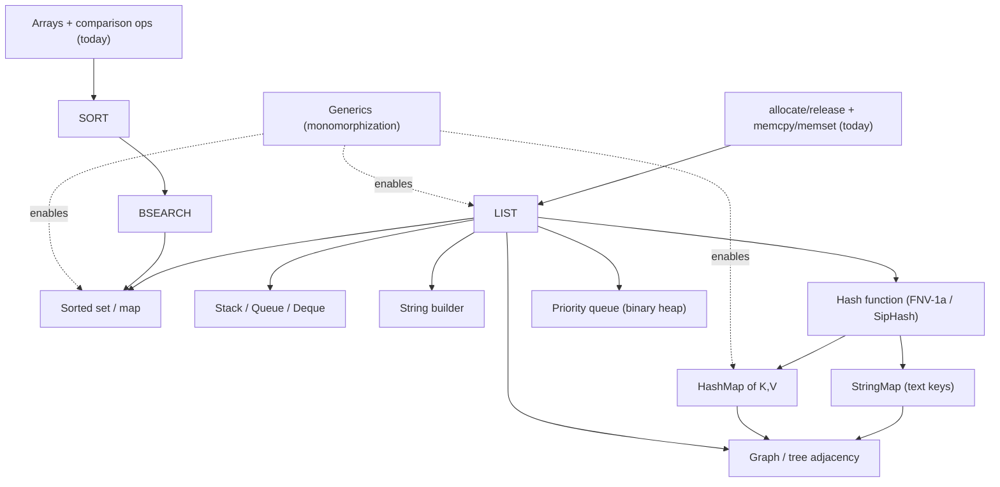

# Lale Compiler — TODO and Future Work

Each work item carries a stable `[T-###]` identifier. IDs are assigned once and
never reused or renumbered when neighboring items are added or removed — reference
an item from `roadmap.md` (or any other document) by its `[T-###]` ID rather than
by its position in this list. The numbered prefixes and section ordering are
convenience only and may change.

## Recommended resolution order — dependencies first (a prerequisite always precedes its dependent), then effort (easiest first within each tier)

1. ✅ ~~LSP keyword list update~~ — Trivial (<2 h)
2. ✅ ~~Comment representation decision~~ — Small (~0.5 d)
3. ✅ ~~Euclidean remainder for negative operands~~ — Small (~0.5 d)
4. `abs` of a signed minimum — Small (~0.5–1 d)
5. Symbol table oddities (FK fix) — Small (~0.5–1 d)
6. Multiple trailing comments — Small (~0.5–1 d) — _after #2_
7. Compile-time `allocate`/`release` pairing lint — Small (~1 d)
8. LSP code actions — Small (~1–2 d)
9. `pointer to` behind `unsafe` — Small–Medium (~1–2 d)
10. Integer power (integer fast path) — Small–Medium (~1–2 d)
11. User-specified numeric formatting — Medium (~2–4 d)
12. Compile-time `#when` / `#match` / `#switch` — Medium (~2–4 d)
13. Named arguments for type constructors — Medium (~2–4 d)
14. LSP go-to-definition (cross-file) — Medium (~2–4 d)
15. LSP go-to-references — Medium (~2–4 d)
16. LSP rename symbol — Medium (~2–3 d) — _after #15_
17. LSP formatting — Medium (~2–4 d)
18. Additional stdlib functions — Medium (~3–5 d)
19. Arena/region-based allocation — Medium–Large (~3–7 d)
20. ✅ ~~Runtime-error formatting in the IR (AOT/self-hosting consistency)~~ — Medium–Large (~3–7 d)
21. Remaining constant-propagation extensions — Medium–Large (~3–7 d) — _after #10, #12_
22. Narrow integer widths — Large (~1–2 w)
23. `v3_store`/`v3_load` bridge — Large (~1–2 w)
24. Review error reporting pipeline — Large (~1–2 w)
25. Resource types with destructors — Large (~1–2 w)
26. Little-endian ABI enforcement — Small (~0.5–1 d) — _blocked on #23_
27. Repeat deep silent-errors audit — Medium (~2–3 d) — _after #24 (soft)_

Notes on the non-obvious placements:

- **#6 after #2** — the trailing-comments change should follow the comment-representation decision to avoid rework.
- **#16 after #15** — rename is built on go-to-references (hard dependency).
- **#21 after #10 and #12** — `pow` folding must match integer-power semantics, and `eval_const_value` consolidation assumes `#switch` exists.
- **#26 after #23** — Little-endian enforcement is trivial _but_ it can't be done until the `v3_store`/`v3_load` bridge lands (hard dependency). It jumps the Large items only because its prerequisite is also Large.
- **#27 after #24** — the audit is a _soft_ "ideally after" the error-pipeline refactor; if you'd rather run it at the next release boundary regardless, it can move up to the Medium tier.

## Next Priority Features (ranked by impact)

### 🟠 High Priority: Features

1. **[T-001] Additional stdlib functions**

   #### Status

   🔴 Not started

   - Includes: math functions, string manipulation, parse functions (`parse_float`, `parse_int`,
     `parse_uint`) to complement the `read` statement redesign.

   #### Effort

   Medium (~3–5 days) — many functions, but mostly thin FFI wrappers or small pure-Lale utilities; the parse functions already exist.

   #### Depends on

   None — the stdlib FFI infrastructure already exists. `abs` [T-006] is a math function that could be folded in here.

2. **[T-002] User-specified numeric formatting**

   #### Status

   🔴 Not started — syntax deferred, design discussion open

   #### Background

   The default float formatting follows the mainstream convention: shortest round-trip (Ryu, via the `ryu` crate), plain decimal for human magnitudes, scientific notation for extremes, and trailing zeros stripped (implemented in `src/interpreter.rs`, `call_extern`). Users still need explicit control over precision, padding, and notation for reporting and data export.

   #### Design question

   Lale already uses `{expr}` for string embedding. Candidates for the formatting syntax:

   - `printf`-style suffix: `{E_k:2f}`, `{E_k:e}`
   - Named specifier: `{E_k to 2 places}`, `{E_k as scientific}`
   - A `format` function: `format(E_k, "0.00")`

   The choice must respect Lale's "almost no punctuation" stance and the "built-in, not bolted-on" principle.

   #### Requirements
   - Fixed decimal places, significant digits, scientific/plain notation, padding
   - Works in string embedding and standalone conversion
   - Consistent between interpreter and future AOT backends

   #### Effort

   Medium (~2–4 days) — a design decision plus a format-spec parser and stdlib functions.

   #### Depends on

   None directly. Builds on the shortest round-trip float formatting in `src/interpreter.rs` (`call_extern`); a `format`-function approach overlaps Additional stdlib functions [T-001].

3. **[T-003] Narrow integer widths are not enforced in the main memory model**

#### Status

🔴 Not started — pre-existing correctness gap

#### Problem

The interpreter's SSA registers hold integers as `Value::Int(i64)` /
`Value::Uint(u64)` regardless of declared width. The main `Store`/`Load`
instructions use the field-based `MemoryManager`, which does not truncate
to `i8`/`i16`/`i32`. Width-aware truncation only exists in the FFI
`v3_store`/`v3_load` path.

Result: under `--unchecked-overflow`, `127 as i8 + 1` prints `128` instead
of wrapping to `-128`. The addition wraps at 64 bits in the register and is
never truncated at the declared width.

#### Fix

Make the main data path width-aware. Either route `Store`/`Load` through
`v3_store`/`v3_load` (raw bytes) or teach `MemoryManager::store`/`load` to
truncate/sign-extend using the value's declared `IrType`. This touches the
core memory representation and should be a dedicated pass.

#### Tests

- `i8`/`i16`/`i32` wrap boundaries under `--unchecked-overflow`.
- Global and function-local narrow variables.
- Struct fields and array elements of narrow integer type.

#### Effort

Large (~1–2 weeks) — touches the core `Store`/`Load` memory representation and needs a dedicated pass.

#### Depends on

None required — standalone via teaching `MemoryManager` to truncate. The alternative raw-bytes route reuses the `v3_store`/`v3_load` bridge [T-010]: direct on that bridge, indirect on its metadata system.

4. **[T-004] Euclidean remainder for negative operands** ✅ Resolved

   #### Status

   ✅ Resolved — `%` now returns the Euclidean remainder (always non-negative), matching mathematical convention.

   #### Done
   - Interpreter `Rem` handler uses `rem_euclid` for signed operands (`src/interpreter.rs`).
   - Const-eval `fold_signed_binary` uses `rem_euclid` (`src/semantic_analysis/const_eval.rs`).
   - Documented in `doc/lale.md` (Operators) and `doc/ARCHITECTURE.md` (§4.5.7a).
   - Tests: const-eval unit test `signed_rem_is_euclidean` and integration test `test_remainder_is_euclidean` cover `-5 % 3 == 1`, `5 % -3 == 2`, `5 % 3 == 2`, `-5 % -3 == 1`.

5. **[T-005] Integer power returns integer and traps on negative exponent**

#### Status

🔴 Not started

#### Problem

`^` is already exponentiation (not XOR), but `Pow` always produces an
`f64`, so `2 ^ 3` yields `8.0`. A mathematically oriented language should
return an integer for an integer base and non-negative integer exponent, and
trap on a negative exponent for integer bases (which would otherwise be a
fraction).

#### Fix

Add integer fast-path semantics to `Pow` (or a distinct integer-power path in
IR gen), and reject/trap negative exponents on integer operands.

#### Tests

- `2 ^ 3` has integer type and value `8`.
- `2 ^ -1` traps for integer base.

#### Effort

Small–Medium (~1–2 days) — integer fast path for `Pow` plus a negative-exponent trap across IR, interpreter, and const-eval.

#### Depends on

None required. Should stay consistent with `pow` folding in [T-019].

6. **[T-006] `abs` of a signed minimum must trap or widen**

#### Status

🔴 Not started — correctness

#### Problem

In two's complement, `abs(i8::MIN)`/`abs(i64::MIN)` cannot be represented in
the same type (max is one less than `-MIN`). Returning a negative value is a
mathematical disaster.

#### Fix

Trap on `abs` of a signed minimum, or return a wider type. Never return a
negative value.

#### Tests

- `abs(i8::MIN)` and `abs(i64::MIN)` trap (or widen correctly).

#### Effort

Small (~0.5–1 day) — add an `abs` builtin that traps (or widens) on a signed minimum.

#### Depends on

None. Overlaps Additional stdlib functions [T-001].

7. **[T-007] Function overloading — full-signature identity and mangling**

   #### Status

   🔴 Not started — tracked in `roadmap.md` §3.2 item 2

   #### Problem

   Lale intends overloads via C-style name mangling, but the feature is not wired
   end-to-end and today silently misbehaves: the mangling omits units and module
   qualification, resolution is by simple name (not signature), the arg-type
   resolver is dead code, the schema UNIQUE constraint contradicts the mangling
   scheme, and redefining a function name reports nothing.

   #### Fix
   - Make function identity a full signature (name + parameter types + units).
   - Upgrade the mangling to encode the full signature.
   - Keep `import fn` externs unmangled (plain C names, no overloading).
   - Reconcile the `functions` UNIQUE constraint.
   - Key `fn_info_cache` and every `lookup_function*` query by signature.
   - Wire `find_qualified_function_by_args` into the main call path.
   - Emit an explicit "duplicate function name" error so no definition is silently dropped.

   #### Effort

   To estimate.

   #### Depends on

   `roadmap.md` §3.2 item 1 (language semantics cleanup).

8. **[T-008] Derived SI units (scale-1 aliasing)**

   #### Status

   🔴 Not started — tracked in `roadmap.md` §3.2 item 10

   #### Problem

   Named SI derived units (`J`, `N`, `Hz`, …) should normalize to their base-unit
   decomposition so the analyzer treats `J`, `kg⋅m²/s²`, and `N⋅m` as the same
   quantity. Display stays canonical (no auto-shortening), and `rad` remains a
   distinct angle dimension.

   #### Fix
   - Add a `DERIVED_UNITS` lookup (name → base-vector) in `src/types/mod.rs`.
   - Expand recognized named units during `NormalizedUnit::parse`.
   - Keep `format_unit` canonical.
   - Keep `rad` distinct and alias `sr → rad²`.
   - Test `J ≡ kg⋅m²/s² ≡ N⋅m`, `W ≡ V⋅A`, `Hz ≡ s⁻¹`, `sr ≡ rad²`, and that `L`,
     `°C`, `eV`, `deg`, `arcmin` are NOT aliased.

   #### Effort

   To estimate.

   #### Depends on

   `roadmap.md` §3.2 item 1 (language semantics cleanup).

9. **[T-009] Matrix types (nested `vecN of vecM of T`)**

   #### Status

   🔴 Not started — tracked in `roadmap.md` §3.2 item 11

   #### Problem

   The grammar already accepts recursive `vecN of vecM of T`, but
   `TypeName.inner_type` stores only one level of nesting, so nested
   vectors/matrices are not yet real.

   #### Fix
   - Change `inner_type` to `Option<Box<TypeName>>` (recursive).
   - Update type-string formatting.
   - Update `parse_vec_type()`.
   - Update IR lowering.

   #### Effort

   To estimate.

   #### Depends on

   None.

### 🟡 Medium Priority: Blocking Future Work

1. **[T-010] Interpreter-only handlers bypass IR — block AOT consistency**

   #### Status

   🟡 In progress — 7 of 9 handlers resolved (see Resolution below). V3 memory migration: complete. All allocations on real heap via `AllocLog`. `MemoryManager` serves as typed‑value cache with regions at every address. No dual‑mode reads, no `unsafe` fallbacks. FFI reads raw bytes directly. `v3_store`/`v3_load` raw‑bytes bridge deferred (requires metadata system).

   #### Source

   `src/interpreter.rs` — `FuncRef::External` handlers in `execute_instruction_with_memory`

   #### Audit date

   August 2026

   #### Resolution (Aug 2026)

   | Handler                           | Status                 | Resolution                                                                                                                                           |
   | --------------------------------- | ---------------------- | ---------------------------------------------------------------------------------------------------------------------------------------------------- |
   | `text` constructor                | ✅ Removed             | Dead code — `generate_fn_call_expr` short-circuits to `BuildStruct` IR instruction                                                                   |
   | `ptr_difference`                  | ✅ Moved to IR         | New `Instruction::PtrDiff` + `IrBuilder::ptr_diff()` replaces `call_named`                                                                           |
   | `__lale_pow_f64_f64`              | ✅ Replaced            | Removed handler; added `pow` extern (thin f64::powf wrapper)                                                                                         |
   | `__lale_write_stdout_pointer_i64` | ✅ Merged into `write` | All 4 I/O handlers removed — calls now go through `write(fd, ptr, len)` extern (fd=1 stdout, fd=2 stderr). `lale_put_str_impl` (~110 lines) deleted. |
   | `__lale_write_stderr_pointer_i64` | ✅ Merged into `write` | (same)                                                                                                                                               |
   | `__lale_error_pointer_i64`        | ✅ Merged into `write` | Error output now calls `write(2, ptr, len)`                                                                                                          |
   | `__lale_alert_pointer_i64`        | ✅ Merged into `write` | Alert output now calls `write(2, ptr, len)`                                                                                                          |

   ##### Remaining

   (3 items):

   | Item                                  | Description                                                                                                                                                                                                                                                                       |
   | ------------------------------------- | --------------------------------------------------------------------------------------------------------------------------------------------------------------------------------------------------------------------------------------------------------------------------------- |
   | `v3_store`/`v3_load` raw‑bytes bridge | Store/Load serialise `Value` ↔ bytes. Helpers written but integration blocked — needs a metadata system that distinguishes raw‑byte addresses from `Value`‑enum addresses.                                                                                                        |
   | `__lale_read_line`                    | ✅ Deferred (same as strto\*). `TODO(AOT)` comment added. Stdin fd=0 support in `read` extern is done. Full stdlib implementation would require byte‑by‑byte reads + dynamic buffer growth — not practical in pure Lale today. When AOT exists, call libc getline/fgets directly. |
   | `strtod` / `strtol` / `strtoul`       | ✅ Deferred. `TODO(AOT)` comment added. Thin FFI wrappers — AOT would call libc directly.                                                                                                                                                                                         |

   #### Already Resolved

   (moved to builtins.lale IR):

   | Handler                                               | Resolution                                                                                                                                     |
   | ----------------------------------------------------- | ---------------------------------------------------------------------------------------------------------------------------------------------- |
   | `__lale_f64_to_str_f64`                               | Re-added Sept 2026 — shortest round-trip (Ryu) needs 128-bit arithmetic Lale cannot express; implemented in `src/interpreter.rs` `call_extern` |
   | `__lale_i32_to_str` / `i64` / `u64` / `bool` / `char` | Removed July 2026 — moved to builtins.lale                                                                                                     |

   #### Platform Abstractions

   (same semantics in interpreter and AOT):
   `puts`, `__lale_exit`, `__lale_malloc_u64`/`malloc`, `__lale_free_pointer`/`free`,
   `open`, `read`, `write`, `close`. These wrap libc/POSIX with identical behavior across backends.
   The interpreter emulates the POSIX interface; AOT links against real libc — same result.

   ##### Will Crash

   (unimplemented):
   void-call catch-all (line 2896).

   `fread` is no longer part of the boundary — the buffered stdio family
   (`fopen`/`fread`/`fwrite`/`fclose`/`fseek`) is dropped by the single low-level
   FFI decision; buffered I/O is built in Lale. See `doc/ABI_SPECIFICATION.md` §4.

   ##### Impact

   The 3 remaining items are deferred until AOT: `v3_store`/`v3_load` (needs metadata system),
   `__lale_read_line` (complex to implement in pure Lale — byte‑by‑byte reads, dynamic buffer
   growth), and `strtod`/`strtol`/`strtoul` (thin FFI wrappers). All have `TODO(AOT)` comments.
   The `read` extern already supports fd=0 (stdin) — enough groundwork for AOT.

   ##### Resolution Order

   No further action for interpreter. When AOT exists: link all three against libc (getline, strto\*).

   #### Effort

   Large (~1–2 weeks) for the `v3_store`/`v3_load` bridge (needs a metadata system); `__lale_read_line` and `strtod`/`strtol`/`strtoul` are deferred to AOT.

   #### Depends on

   None — foundational. Little-endian ABI [T-014] depends on it directly; Narrow integer widths [T-003] only if the raw-bytes route is chosen.

2. **[T-011] Symbol table oddities** 🟡 Partial (reopened Aug 2026)

   #### Status

   🟡 Partial — 4 issues resolved; 1 new issue found during UTF-8 Phase 1.

   #### Issues Resolved
   1. `text` now shows as `TypeDef` instead of `Function` with `→ __lale_type_def` sentinel. Added `SymbolKind::TypeDef` variant to properly separate type definitions from functions. Removed the `__lale_type_def` sentinel hack.
   2. Parameters already correctly distinguished from variables (confirmed as pre-existing fix — `is_parameter` column and `SymbolKind::Parameter` are used).
   3. `lookup_type()` now properly queries and returns `start_pos`/`end_pos` from the `type_defs` table instead of hardcoding zeros. Added `start_pos`/`end_pos` columns to the `type_defs` CREATE TABLE.
   4. Schema normalization reviewed — the `variables` table's denormalization (storing globals, locals, and parameters together) is acceptable technical debt for query simplicity.

   #### Remaining
   - **`define_type_with_fields` `INSERT OR REPLACE` breaks the `type_defs` → `type_def_fields` foreign key.** Re-registering a type (e.g. `text`, pre-registered in Rust and again in `builtins.lale`) deletes the `type_defs` row while `type_def_fields` still references it, causing `lookup_type("text")` to intermittently return `None`. Worked around during UTF-8 Phase 1 with `text` special-cases in type/unit resolution; a proper fix (delete child rows first, or `ON DELETE CASCADE`) would let those special-cases be removed.

   #### Effort

   Small (~0.5–1 day) — delete child rows first (or `ON DELETE CASCADE`) and remove the `text` special-cases.

   #### Depends on

   None — a self-contained SQLite fix. The LSP cross-file features [T-013] build on the same symbol table, but aren't blocked by this FK fix.

3. **[T-012] Runtime-error formatting is interpreter-only (not in the IR) — AOT/self-hosting consistency** ✅ Resolved

   #### Status

   ✅ Resolved — the trap message now lives in the IR as a color-free render spec; color is applied at the output boundary and controlled by `--color`.

   #### Done
   - Trap instructions (`BoundsCheck`, `ZeroCheck`, `CheckedAdd`/`CheckedSub`/`CheckedMul`/`CheckedNeg`, `UnwrapOptional`) carry an ordered `Vec<RenderPart>` of literal-text and value operands, concatenated with "operands render as decimal" (`src/ir/instructions.rs`, `src/ir/builder.rs`).
   - The IR spec is color-free. The interpreter renders it and wraps it in ANSI color plus a trailing newline at the output boundary (`render_parts_and_abort` / `reject_non_finite` in `src/interpreter.rs`).
   - Added `--color=auto|always|never` (default `auto`, TTY-detected); the legacy `--no-color` flag is preserved and forces `never` (`src/main.rs`, `src/config/mod.rs`).
   - Golden tests assert byte-identical output for bounds, checked-overflow, `NaN`, and infinity traps (`tests/runtime_error_format_tests.rs`).

### 🟡 Control Flow Simplification (from proposal.md) — ✅ Implemented August 2026

Based on `doc/proposal.md` (2026-08-04). All phases implemented. Only tests remain.

#### Phase A — New Statements

- [x] **A1. Grammar**: `when_stmt`, `move_on_stmt`, `missing_code_stmt` rules in `lale.pest`
- [x] **A2. AST Builder**: `build_when`, `build_move_on`, `build_missing_code` in `builder.rs`
- [x] **A3. AST Definitions**: `WhenStmt`, `MoveOnStmt`, `MissingCodeStmt` in `definitions.rs`
- [x] **A4. Semantic Analysis**: `visit_when`, `visit_move_on`, `visit_missing_code` in `analyzer.rs`.
      `missing code` emits compile error in release mode.
- [x] **A5. IR Generation**: `generate_when` (condbr), `MoveOnStmt` (no-op),
      `generate_missing_code_warning` (runtime warning in debug) in `ir_gen.rs`
- [x] **A6. Interpreter**: Uses existing condbr/move-on/missing-code as no-ops.
- [x] **A7. Tests**: `when` with true/false, `move on` in `if`/`else` branches,
      `missing code` debug vs release.

#### Phase B — Rename and Upgrade

- [x] **B1. Grammar**: `match_stmt` with `when` arms + `else`, `switch_stmt` with
      `case` + `default`, `SwitchPattern` enum in `lale.pest`
- [x] **B2. AST Builder**: `build_match`, `build_switch`, `build_switch_case`,
      `build_switch_pattern`, `build_match_arm` in `builder.rs`
- [x] **B3. AST Definitions**: `MatchStmt` (+`MatchArm`), `SwitchStmt` (+`SwitchCase`,
      `SwitchPattern`) in `definitions.rs`. Old `BranchStmt` removed.
- [x] **B4. Semantic Analysis**: `visit_switch` with exhaustiveness checking for
      enums, `visit_match` in `analyzer.rs`
- [x] **B5. IR Generation**: `generate_switch` (discriminant + IfElse chain),
      `generate_match` (ordered condbr chain) in `ir_gen.rs`
- [x] **B6. Tests**: `match` with 3+ `when` arms, `switch` on enum (all variants
      covered), `switch` on string with `default`, exhaustiveness errors.

#### Documentation

- [x] Proposal (`doc/proposal.md`)
- [x] User guide (`doc/lale.md` § Control Flow)
- [x] Architecture (`doc/ARCHITECTURE.md` § 4.3, § 5.24)
- [x] Editor syntax (Zed + VS Code + LSP)

#### Compile-Time Counterparts — ⚠️ Not Yet Implemented

The runtime-only constructs were renamed/added but their compile-time (`#`-prefixed)
counterparts were not. Currently only `#if` / `#else if` / `#else` / `#end if`
exist (`CtIfStmt`). Missing:

- [ ] `#when` — compile-time one-sided guard
- [ ] `#match` / `#when` — compile-time ordered condition chain
- [ ] `#switch` / `#case` — compile-time value dispatch

#### Effort

Medium (~2–4 days) — three new compile-time statements spanning grammar, AST, semantic analysis, and IR.

#### Depends on

None — the runtime counterparts already exist. Overlaps the `#switch` evaluator consolidation in [T-019].

### 🟡 Programmer Silent Errors — from `doc/Lale Programmer Silent Errors.md`

The following are potential solutions for silent errors a Lale programmer can
write that compile and run without complaint but produce wrong results.
See [Lale Programmer Silent Errors](Lale%20Programmer%20Silent%20Errors.md) for the full analysis.

- [ ] **Consider named arguments for type constructors** — same-typed field swaps could be prevented by allowing `Rect(width = w, height = h)` syntax. This would make order irrelevant when names are provided, while still allowing positional syntax for brevity when order is obvious. — Effort: Medium (~2–4 days). — Depends on: none.
- [x] **Implement integer overflow detection** — ✅ Resolved. Constant `+`/`-`/`*`/`⋅` overflow/underflow (signed and unsigned) is rejected at compile time via `check_integer_overflow`; non-constant operands trap at runtime via `CheckedAdd`/`CheckedSub`/`CheckedMul`/`CheckedNeg`. `--unchecked-overflow` disables both.
- [ ] **Consider `pointer to` behind `unsafe`** — pointer arithmetic out of bounds is currently a footgun. Making `pointer to` require `unsafe` would be a language-level acknowledgment of the risk, but would also make legitimate pointer usage more verbose. — Effort: Small–Medium (~1–2 days). — Depends on: none.
- [x] **Implement memory management** — ✅ Resolved (August 2026). `allocate`/`release` keywords and `on exit` provide explicit heap control. The compiler manages `text` allocations automatically.

  #### Problem 1: `text` — Language-Created Allocations

  ✅ Resolved (August 2026)

  String embedding (`"x = {x}"`), type-to-string conversions, and concatenation all allocate behind the scenes. The compiler manages `text` allocations automatically — the user never writes `release` for a string.

  - [x] **`text` auto-free at scope exit** — compiler tracks `text`-typed locals and frees heap data at scope exit. Parameters, returned values, and globals are skipped (ownership transfers).
  - [x] **Inline `text` free in output statements** — `write`/`warn`/`debug`/`alert` free string data after output. `heap_dealloc` is idempotent — double-free from auto-free is harmless.
  - [x] **Builtins allocate exact-size buffers** — `u64_to_str`, `i64_to_str`, `char_to_str`, `f64_to_str` return `text` directly without double allocation.
  - [x] **Leak detector with source tracking** — `MemoryManager` tracks `heap_alloc`/`heap_dealloc` and reports leaked allocations with file/line/column at program exit in debug builds. Every test run is a leak test.
  - [x] **Static global string data** — global `text` data is allocated via `alloc_static_string` (static address pool, not `AllocLog`) and lives for the program's lifetime, matching an AOT backend's `.rodata`/`.data`. It is intentionally never reported as a leak.
  - [x] **Enum helper `Ptr(text)` return leaks** — ✅ Fixed. Enum display/name helpers now return `text` by value (not `Ptr(text)`), and nested `text` fields (including enum variant payloads) are reclaimed via value-based recursion in `collect_str_allocas`.

  #### Problem 2: Raw Pointers — User-Initiated Allocations

  ✅ Resolved (August 2026)

  `allocate` and `release` are now first-class language keywords. `on exit` provides Zig-style deferred cleanup at scope exit. The programmer controls all raw pointer allocations — the compiler provides the tools.

  - [x] **`allocate`/`release` keywords** — first-class language constructs for heap memory allocation and deallocation (`var buf as pointer = allocate 1024; release buf`).
  - [x] **`on exit` statement** — `on exit release buf` defers execution to scope exit. Compile-time expansion (like Zig's `defer`), zero runtime overhead.
  - [ ] **Consider compile-time `allocate`/`release` pairing lint** — warn when `allocate` has no visible `release`/`on exit` in the same function. — Effort: Small (~1 day). — Depends on: none (allocate/release already exist).
  - [ ] **Consider arena/region-based allocation** — `arena` blocks for batch-allocate/batch-free patterns. Follow-up optimization. — Effort: Medium–Large (~3–7 days). — Depends on: none; alternative follow-up to the existing allocate/release + on exit model.
  - [ ] **Consider resource types with destructors** — `type ... drop`. Only revisit if `on exit` boilerplate or future heap-allocating types justify it. — Effort: Large (~1–2 weeks). — Depends on: none; alternative to `on exit` and the arena idea above.

### 🟢 Low Priority

1. **[T-013] LSP server — remaining features**

   #### Status

   🟡 Partial

   #### Source

   `lale-lsp/src/server.rs`

   #### Done

   diagnostics, completion, hover, semantic tokens, document symbols, go-to-definition (same-file), syntax highlighting for Zed and VS Code, keyword list (test suite, test case)

   #### Effort

   Mixed, by remaining feature:
   - go-to-definition (cross-file) — Medium (~2–4 days)
   - go-to-references — Medium (~2–4 days)
   - rename symbol — Medium (~2–3 days)
   - code actions — Small (~1–2 days)
   - formatting — Medium (~2–4 days)

   #### Depends on

   None outside the LSP. Internally: go-to-definition (cross-file) and go-to-references both need cross-file symbol-table integration; rename depends directly on go-to-references; code actions and formatting are independent.

   #### Go to Definition — Cross-File

Same-file works (AST walk of var/fn/type/enum/loop vars). Cross-file (e.g., jumping to stdlib definitions) needs symbol table integration.

#### Go to References

Not registered — needs full symbol usage tracking across files

#### Rename Symbol

Not registered — depends on references implementation

#### Code Actions

Not registered

- could suggest `as` conversions for type mismatches
- could help entering sub and superscript characters with some sort of escape sequenses

#### Formatting

Not registered — basic indentation and spacing rules

1. **[T-014] Little-endian canonical ABI documented but not enforced in interpreter**

   #### Status

   🟢 Not started

   #### Source

   `doc/ABI_SPECIFICATION.md` §2 / §5 and `src/interpreter.rs` `v3_store` / `v3_load`

   #### Severity

   Low — documentation/implementation discrepancy; latent on big-endian hosts only.

   #### Problem

   The ABI documentation says Lale is little-endian canonical, but
   `v3_store`/`v3_load` use host-native `write_unaligned`/`read_unaligned`
   instead of `to_le_bytes`/`from_le_bytes`. On little-endian hosts (x86/ARM)
   this is correct by accident; on a big-endian host it would silently produce
   the host's byte order.

   #### Fix

   Route raw-byte serialization through `to_le_bytes`/`from_le_bytes` (or add
   an explicit canonical-endianness path) once the `v3_store`/`v3_load` bridge
   is integrated. Add an ABI conformance test asserting little-endian byte order.

   #### Effort

   Small (~0.5–1 day), but blocked on the `v3_store`/`v3_load` bridge.

   #### Depends on

   Direct: the `v3_store`/`v3_load` bridge [T-010]. Indirect: the metadata system that bridge needs.

### 📐 Code Quality

1. **[T-015] Review error reporting pipeline — AST build errors block semantic analysis**

   #### Source

   `src/main.rs:compile_and_execute`, `src/ast/expr_parser.rs:build_number_literal`

   #### Severity

   Medium — affects developer experience but not correctness

   #### Problem

   The compilation pipeline has three sequential error stages: (1) grammar parsing, (2) AST construction, (3) semantic analysis. Grammar errors accumulate (pest continues past errors). Semantic errors accumulate (analyzer collects all). But AST construction fails on the first error and exits immediately, preventing semantic analysis from ever running. For example, a literal-overflow error in an AST node blocks detection of a duplicate-variable error on an earlier line.

   #### Root Cause

   `build_program()` returns `Result<Program, String>` — a single error string, not a collection. The pipeline uses `?` which short-circuits. Unlike grammar errors (which pest continues past) and semantic errors (which the analyzer accumulates in a `Vec`), AST build errors cause an immediate pipeline abort.

   #### Proposed fix

   Refactor `build_program` (and all `build_*` functions) to collect errors into a `Vec<String>` while building as much of the AST as possible. Return a partial `Program` along with errors. Then `compile_and_execute` can report all AST errors AND continue to semantic analysis. This is a significant refactor (~50+ build functions).

   #### Interim Mitigation

   Keep the `build_number_literal` error format (file:line:col) consistent with grammar/semantic error formats for visual consistency. The error is displayed in black via Rust's default `Error` display — not ideal but functional.

   #### Effort

   Large (~1–2 weeks) — refactor ~50+ `build_*` functions to accumulate errors.

   #### Depends on

   None.

2. **[T-016] Support multiple trailing comments** (`AttachedComments.trailing` `Option` → `Vec`)

   #### Status

   🟡 Scheduled (August 2026) — follow-up to the statement/comment relationship work

   #### Problem

   `AttachedComments.trailing` is a single `Option<AttachedComment>`. That is
   enough for one inline trailing comment per statement, but it cannot represent
   multiple trailing comments. Standalone comments are already preserved as
   first-class nodes; multiple _trailing_ comments are the remaining gap.

   #### Proposed fix

   Change `trailing: Option<AttachedComment>` to `Vec<AttachedComment>`, update
   `extract_comments` to collect all trailing comments in source order, and
   update every `print_attached_comments` / consumer call site.

   #### Effort

   Small (~0.5–1 day) — mechanical type change plus call-site updates.

   #### Depends on

   None strictly, but should follow the comment-representation decision [T-017] to avoid rework.

3. **[T-017] Decide on one comment representation (attached vs. first-class)** ✅ Resolved

   #### Status

   ✅ Resolved — keep both representations; "adjacent" is now precisely defined and enforced.

   #### Decision

   Keep both (Option 1): attached metadata for adjacent comments, first-class nodes for standalone comments. "Adjacent" means:

   - `leading` = comment/doc lines directly above the statement (no blank line).
   - `trailing` = a comment on the same line, after the statement.
   - A comment on a new line _after_ the statement (after its line feed / semicolon) is standalone, even with no blank line.

   #### Done
   - Documented the model and the exact "adjacent" rule in `doc/ARCHITECTURE.md` §4.3.
   - Fixed the grammar so a leading comment before the _first_ top-level statement attaches as `leading` (the `program` rule's leading `os_ln` no longer swallows it) — `src/grammar/lale.pest`.
   - Added `tests/comment_attachment_tests.rs` covering leading, trailing, and standalone placement (including multiple leading comments and `///` docs).

4. **[T-018] Repeat the deep silent-errors audit (stale)**

   #### Status

   🟡 Deferred — repeat at the next release boundary

   #### Source

   `doc/silent_errors_audit.md` (audit date 2026-08-05) vs. `Cargo.toml`
   (`version = "0.1.0"`)

   #### Problem

   The text-scanner in `lale-validate` (currently **0 HIGH / 11 MEDIUM / 157 LOW**)
   catches syntactic patterns, but the _manual_ deep audit in
   `doc/silent_errors_audit.md` catches what the scanner misses: empty `catch`
   blocks, `unwrap_or_default`, bare `return` without `add_error()`, and semantic
   match-arm fall-through. That audit is now stale — it was written against an
   earlier version and the header carries no version string to compare against
   the current `0.1.0`.

   #### When to do it

   Per `AGENTS.md` §"Deep Audit Reminder on Version Change", a version bump is the
   right cadence — not every commit. At the next release boundary, re-run the
   full manual audit, update `doc/silent_errors_audit.md`, and (ideally) record
   the audited version in its header so future drift is detectable automatically.

   #### Cross-reference
   - `AGENTS.md` — "Silent Error Tracking" § Rule 2
   - `src/bin/validate.rs` — the text-scanner whose blind spots the audit covers
   - `doc/silent_errors_audit.md` — the audit report to refresh

   #### Effort

   Medium (~2–3 days) — a manual review pass over the fallback patterns, then update the audit doc.

   #### Depends on

   None. Ideally run after the error-reporting pipeline change [T-015] if that alters error paths.

5. **[T-019] Remaining constant-propagation extensions (deferred)**

   #### Status

   🟡 Deferred — additive follow-ups to the typed constant-propagation infrastructure

   Each is a scoped extension to the constant-propagation work (§4.5.7a). None is
   required for correctness today; they are tracked here so they are not lost.

   - **Deeper chain folding** — dead-branch elimination folds only the _leading_
     condition of `if`/`when`/`match`/`loop`. A later `match` arm is not eliminated
     once an earlier guard is proven `true`/`false`. (`src/ir_gen.rs`.)
   - **Aggregate constants** — the `variables` store tracks only scalars
     (`Bool`/`Int`/`Uint`/`Float`/`Text`). Structs, enums, arrays, optionals, and
     vectors are not tracked; adding them needs a recursive `ConstValue` and a
     JSON-style encoding.
   - **`f16` precision** — the fold core and interpreter treat `f16` as `f64`
     (no half-precision rounding). Proper half-precision semantics are deferred.
   - **`pow` folding** — `numeric_fold_op` covers `+ - * / % dot` and comparisons,
     but not `^`; a constant `base ^ exp` is not folded at compile time.
   - **`eval_const_value` consolidation** — the `#switch` compile-time evaluator
     (duplicated in `SemanticAnalyzer` and `OwnedAnalyzer`) overlaps with
     `expr_const_value` and has not been merged.

   #### Cross-reference
   - `doc/ARCHITECTURE.md` §4.5.7a (typed folding, "Type coverage", "Still to be wired up")
   - `src/semantic_analysis/const_eval.rs` — the fold core
   - `src/semantic_analysis/analyzer.rs` — `eval_const_value`, `expr_const_value`
   - `src/ir_gen.rs` — dead-branch elimination

   #### Effort

   Medium–Large (~3–7 days) — aggregate constants (recursive `ConstValue` + encoding) is the bulk; the other four are small.

   #### Depends on

   None required. `pow` folding should match integer-power semantics [T-005]; `eval_const_value` consolidation overlaps the `#switch` evaluator (Control Flow compile-time counterparts).

6. **[T-020] Fix the dangling `doc/security/` reference**

   #### Status

   ✅ Resolved — audit written to `doc/security/README.md` (2026-09-22)

   #### Problem

   `src/lib.rs` documents "Security audits: Regular audits per
   [doc/security/](doc/security/)", but `doc/security/` did not exist in the
   repository. `AGENTS.md` ("Project Structure") also listed `doc/security/` as if
   it were present.

   #### Done

   Created `doc/security/README.md` with the initial security audit, and pointed
   the `src/lib.rs` reference at it.

   #### Effort

   Done — initial audit written; re-run at each release boundary.

7. **[T-021] Trailing comments after `add error` / `alert error messages` are not parsed**

   #### Status

   🔴 Not started — grammar gap

   #### Problem

   Every other statement rule ends with `(info)?` (`info = { os ~ (doc | comment) }`) to
   consume an optional trailing `//` or `///` comment on the same line. Two rules in
   `src/grammar/lale.pest` omit it: `error_push_stmt` (`add error "…"`) and
   `error_alert_stmt` (`alert error messages`). A trailing comment on those lines —
   for example `add error "x" // note` — therefore fails to parse: after the expression
   the parser expects the statement to continue and hits the `//`.

   #### Workaround

   Put the comment on its own line above the statement.

   #### Effort

   Small — append `(info)?` to both rules to match the other statements.

8. **[T-022] `write` / embedded-value serialization of enum values crashes the interpreter**

   #### Status

   🔴 Not started — runtime ICE, pre-existing (unrelated to the `.` member-access unification)

   #### Problem

   Writing an enum value to output crashes the interpreter with an internal
   compiler error instead of serializing it. Minimal repro:

   ```lale
   enum Color Red Green end enum
   var c as Color = Red
   write c
   ```

   produces:

   ```text
   internal compiler error: GetFieldPtr: field index 1 out of bounds for struct with 1 fields
     (Rust: src/interpreter.rs:2905)
   ```

   `debug c` works (the debug formatter reads the discriminant via
   `enum_variants`), but `write`/`stderr`/`log` and string embedded values
   (`"{c}"`) take the composite-serialization path and crash.

   #### Root Cause

   `src/interpreter.rs:2905` — the `GetFieldPtr` handler. When the base value is
   an in-register `Value::Struct`, the handler walks the IR `struct_def` fields
   accumulating byte offsets and then indexes into the runtime `Value::Struct` by
   field index. For an enum, the IR struct layout and the runtime struct value
   disagree on field count for a zero-field variant: the layout exposes a field at
   index 1 (the payload slot), but the value stores only the discriminant at index
   0, so `fields.get(1)` returns `None` and hits the `ice!`.

   #### Evidence it is pre-existing

   The same crash reproduces with the bare variant name (`var c as Color = Red`),
   which produces a plain `Expr::Identifier` and never touches the `.`-unification
   `MemberAccess` path. It therefore predates the member-access change.

   #### Proposed fix

   Teach the composite-serialization path to handle enum values the way `debug`
   already does: read the discriminant, map it to the variant name (and payload
   fields, if any), and format `VariantName` / `VariantName(jsonFields)`. Do not
   treat the enum's struct as a plain field list. Fix the `GetFieldPtr`/layout
   mismatch for enums (either by aligning the runtime value's field count with the
   layout, or by special-casing enums) so the ICE cannot be reached.

   #### Effort

   Small–Medium (~0.5–1 d) — localize the enum serialization path and mirror the
   existing `debug` formatting logic; add a regression test for `write` on both a
   zero-field and a field-carrying variant.

   #### Depends on

   None.

9. **[T-036] Interpreter struct/optional layout does not match the AAPCS64 ABI**

   #### Status

   🔴 Not started — ABI conformance gap

   #### Source

   `doc/ABI_SPECIFICATION.md` §2 / §5 and `src/interpreter.rs` (struct/optional allocation)

   #### Problem

   The ABI specification documents precise AAPCS64 layout for structs (natural
   alignment and padding in declaration order) and optionals (`{ is_present: bool,
value: T }`). The interpreter still allocates structs conservatively (a fixed
   64 bytes) and optionals as a fixed 16 bytes, regardless of the declared fields.
   This is consistent for Lale-to-Lale code, but it does not match the documented
   ABI, so a struct or optional crossing the FFI boundary would not have the
   layout the spec promises.

   #### Fix
   - Implement precise AAPCS64 struct/optional layout in the interpreter's memory
     model (natural alignment, declaration-order padding).
   - Add ABI conformance tests asserting that the on-heap layout of representative
     structs and optionals matches the §2 tables (sizes, offsets, padding).

   #### Effort

   To estimate.

   #### Depends on

   None directly. Related to the `v3_store`/`v3_load` bridge [T-010] and
   little-endian enforcement [T-014], the other two ABI-conformance gaps.

---

## Design Proposals and Decisions

> Moved from `doc/roadmap.md`. These are the detailed design proposals, audits,
> deferred candidates, and open decisions that previously lived alongside the
> versioned plan. Each carries a stable `[T-###]` id; reference them by id, not
> by position.

### [T-023] Function pointers and indirect `call` — Design Proposal

#### 2.1 Goals

- Take the address (`pointer to`) of a **named top-level Lale function** or an **`import fn` extern**.
- Store that address in a variable, field, or parameter, and call through it.
- Pass a Lale function as a callback to C APIs that take function pointers.
- Do all of the above **without closures or capture semantics**, preserving the
  existing two-scope model and the "no hidden control flow" principle.

#### 2.2 Non-goals (permanent)

- **Closures** — functions that capture their enclosing local scope. Permanently rejected:
  they conflict with the two-scope model (global + function-local) and "no hidden control
  flow".
- **Lambdas** — anonymous inline function literals. Permanently rejected: `pointer to`
  requires a named top-level function, so there is no anonymous-function syntax.
- **Partial application** — capturing some but not all arguments.
- First-class _values_ that are function _bodies_; only **addresses of named functions**.
- Overloading the existing raw `pointer` type to mean "function pointer".

A **typed, non-capturing function pointer** (`fn (...)`) remains first-class: it can be
stored in a variable, passed as a parameter, returned, and called indirectly. Closures and
lambdas are **permanent non-goals**: Version 1.0.0 already covers every use case they would
serve — a named top-level function plus `pointer to`, or the `event`/`handle` model ([T-024]).
There are no open design questions for a feature that is rejected.

#### 2.3 Current state (verified)

There is no function-pointer capability at any layer of the pipeline today:

| Layer       | Finding                                                                                                       |
| ----------- | ------------------------------------------------------------------------------------------------------------- |
| Grammar     | No `call` keyword; `fn_call` target is always a static `qualified_identifier` path                            |
| Grammar     | `type_name` has no function type; `pointer` is the only pointer type (raw, `void*`-like)                      |
| AST         | `FnCall.target` is `Spanned<Vec<String>>` — a name path, not an expression                                    |
| IR type     | `IrType` has `Ptr`, but no function type                                                                      |
| IR call     | `FuncRef` has only `Id` and `External`; `Call`/`CallVoid` take a `FuncRef`, never a value                     |
| Interpreter | `Value` has `Pointer(usize)` but no function-pointer value; dispatch is `Id` vs `External`                    |
| Docs        | `doc/lale.md` FFI limitation: "Function pointers — Callbacks and function pointers require wrapper functions" |

**Implication:** "wrapper functions" is not a workaround for callbacks — it only means
"call a known function statically." There is currently no way to call any C API that
takes a function pointer.

#### 2.4 Language surface

> **Proposed syntax.** All code in this section is a design proposal — none of it exists in the
> current compiler, so these examples will not parse today.

A **function type** is written `fn (params) returns ret` and is usable wherever
`type_name` is allowed (variable, parameter, return type, type field). It is a type
annotation, not a statement — it appears after `as` or in a parameter/return list. It is
the type-level form of what `fn signature` declares at the definition level: both share
the same `fn` + parameter list + `returns` shape, so `pointer to` accepts a Lale `fn`, a
forward `fn signature`, or an `import fn signature` extern interchangeably.

```lale
// 1. Define a function, take its address, and call through a pointer.
fn compare(a as i32, b as i32) returns i32
    return a - b
end fn

var a as i32 = 10
var b as i32 = 20

// Explicit type — the compiler checks that `compare`'s signature matches.
var cb as fn (i32, i32) returns i32 = pointer to compare

// The type can also be inferred: `pointer to compare` has a well-defined type.
var cb2 = pointer to compare                // cb2 : fn (i32, i32) returns i32

var result as i32 = call cb(a, b)           // same result as compare(a, b)

// 2. A `fn signature` declares a function's name and type, not an addressable object.
//    `pointer to <name>` takes the *function's* address:
//    - `import fn signature` declares an external (C) function — address is the C symbol;
//    - a forward `fn signature` declares a function defined later — a forward reference.
import fn signature compare_extern(a as i32, b as i32) returns i32
fn signature compare_later(a as i32, b as i32) returns i32

var extern_cb as fn (i32, i32) returns i32 = pointer to compare_extern   // C symbol, link time
var forward_cb as fn (i32, i32) returns i32 = pointer to compare_later   // forward ref, at definition

// 3. Pass a function pointer as a parameter (the type appears in the parameter list).
fn apply(op as fn (i32, i32) returns i32, x as i32, y as i32) returns i32
    return call op(x, y)
end fn

var r2 as i32 = apply(pointer to compare, 30, 40)   // passes `compare` as the callback
```

Because `pointer to compare` has a well-defined type, `var cb2 = pointer to compare` infers
`fn (i32, i32) returns i32` — consistent with Lale's existing `var b = 5 as u32`. The explicit
`as` clause is needed only where inference cannot apply: parameter declarations, or a variable
assigned conditionally.

A `fn signature` itself has no address — it _declares_ a function's name and type. `pointer to
<name>` takes the address of the declared function: a C linker symbol for an extern, or a
forward reference (resolved when the body is defined) for a forward declaration. At the IR
level both lower to the same `FnAddr` instruction, differing only in whether the `FuncRef` is
`External(name)` or `Id(...)`.

The change is two new constructs plus one extension:

1. **Function type** — `fn (<params>) returns <ret>` in `type_name`; the type-level mirror
   of the existing `fn signature` declaration form.
2. **`pointer to` on functions** — the existing `pointer to <lvalue>` operator is extended
   to also accept a Lale `fn`, a forward `fn signature`, or an `import fn signature`
   extern, yielding the `fn (...)` type instead of the raw `pointer` type. No new keyword.
3. **Indirect call** — `call <expr>(<args>)`, where `<expr>` evaluates to a function
   pointer. `call` is a statement/expression keyword, not a function.

**Why a type, not a symbol-table hint.** This is the central design question, and it
deserves the same care here that was given to data pointers when Lale was designed. The
reasoning must be re-applied, not assumed. The status quo is no function pointers at all
(§2.3) — callbacks are statically-called wrappers — so this is genuinely new territory.

##### The data-pointer precedent

Lale's data pointers are deliberately untyped in the grammar:

```lale
var x as i32 = 42
var p as pointer = pointer to x        // p's type is `pointer` — no pointee type
```

What `p` points to is _not_ in the grammar. The compiler records it in the symbol table
(`pointer_to_type = "i32"`), but the one operation that needs that type — the dereference —
does **not** take it from there as its primary source. The dereference's result type comes
from the **use-site context** (the declared type of whatever receives the result):

```lale
var y as i32 = unsafe value at p                // the `i32` comes from `var y as i32`
```

The `unsafe` keyword marks the operation as unchecked — the pointer may be dangling,
misaligned, or point to a different type — but it does **not** re-assert a type; the context
supplies it. (`unsafe bitcast` is a _separate_ bit-reinterpretation operator: it loads the
pointer's actual pointee type and reinterprets the bits as a different type — e.g. reading
`f64` memory as `i64`. It is not what supplies the dereference type, and it is only needed
when the memory type differs from the context type.) The database `pointer_to_type` is only
a **fallback** for the rare dereference that has no contextual type, and it is absent, by
design, in many cases:

```lale
var q as pointer = 0 as pointer                 // raw: no known pointee
var r as pointer = p + (4 as u64)               // pointer arithmetic: pointee lost
var s as pointer = get_pointer()                // inter-procedural: pointee lost
```

All three still dereference fine, because the result type comes from the context, not from
the database. This is the load-bearing fact: **a data dereference needs only an _output_
type, and the context supplies it; the database hint is a fallback, never the sole source.**

This also keeps the design consistent with the single-source-of-truth principle. That
principle governs _durable_ facts declared in the source — a variable's type, name, linkage,
scope. `pointer_to_type` is a _flow-sensitive_ fact: valid at the point of `pointer to x`,
and liable to become stale within the same function after reassignment or a `ref` pass. It
is recorded in the database for convenience, but it is a hint, not an invariant — which is
precisely why the dereference reads the context, not it.

##### The question, restated

A function pointer is the same shape: an opaque address plus a _signature_ the compiler
needs at exactly one operation — `call`. So: can the signature live in the symbol table
(like `pointer_to_type`) and `pointer` be reused, with no function type in the grammar?

The answer depends on a single fact: **a dereference needs only an _output_ type (which the
context supplies), while a call needs an _input_ contract — the parameter types — that no
context supplies.** The proof below makes this precise; the designs that follow enumerate
where the signature can then live. All are worked through against one scenario:

```lale
fn compare(a as i32, b as i32) returns i32
    return a - b
end fn

fn apply(f as ???, x as i32) returns i32   // `???` is what changes per design
    return call f(x)                       // `f`'s signature is needed here
end fn

var result as i32 = apply(pointer to compare, 5)
```

##### The proof: why the signature must be in the type

The data-pointer precedent works because a dereference has **no typed inputs** — it needs
only an _output_ type, which the context supplies. A call is different, and that difference
is what the proof turns on.

**Step 1 — what each operation needs.**

```text
unsafe value at p unsafe bitcast     needs: the result type only        (no typed inputs)
call f(x)                         needs: f's parameter type(s)  AND  f's return type
```

**Step 2 — the return type is not the problem.** It can come from the use-site context,
exactly like a dereference's result type: inside a `returns i32` function, the expression
`call f(x)` has contextual type `i32`. So the return type alone does not force a function
type into the grammar.

**Step 3 — the parameter type(s) are the problem.** They are `f`'s _contract_, and they must
be checked **against** the arguments, not derived **from** them:

```lale
fn apply(f as ???, x as i32) returns i32
    return call f(x)        // is `x as i32` acceptable to `f`?
end fn
```

Whether `x as i32` is acceptable depends on whether `f` expects an `i32`, a `text`, or
something else. No use-site context can answer that: the context says what the call
_produces_, not what `f` _accepts_. This information is a property of `f`, not of the call
site.

**Step 4 — the database only records what the source declares.** It is the single source of
truth for what is in the source. For a local variable, the source declares the origin, so the
database can record it:

```lale
var cb as pointer = pointer to compare    // DB records cb.pointer_to_type = "fn(i32,i32)->i32"
```

But for a parameter, the source declares no signature at the definition site:

```lale
fn apply(f as pointer, x as i32) returns i32    // f's type is `pointer`; nothing more
```

`f.pointer_to_type` is therefore empty. The signature exists only at the call site
(`apply(pointer to compare, 5)`), and recovering it inside `apply` would require
inter-procedural propagation — analysis Lale deliberately does not perform, and which breaks
under separate compilation and FFI, where `apply` has no single caller.

**Step 5 — the asymmetry, stated precisely.** A dereference needs an _output_ type, which the
context supplies, so the database's per-symbol tracking is optional. A call needs an _input_
contract — the parameter types — which no context supplies, and the database cannot supply it
for a parameter because the source never declared it. Under the two constraints (the database
is the single source of truth, and there is no re-assertion), the signature has exactly one
place to live: **the declared type.**

**Consequence.** Handling function pointers "the same way as value pointers concerning
`unsafe`" cannot mean "opaque `pointer` + a context-supplied type", because the call's input
contract has no contextual source. The signature must be in the grammar so the database can
record it from the source — after which `unsafe` marks the unchecked operation symmetrically,
without ever re-asserting a type. Stated in the database's own terms: a pointer's pointee is
_flow-sensitive_ (valid only at its own scope), whereas a function's signature must be
_durable_ (it must survive value flow into parameters, returns, and fields). A flow-sensitive
hint cannot carry durability; only a declared type can.

##### Design A — safe `call`, signature in the type (structural)

```lale
fn apply(f as fn (i32) returns i32, x as i32) returns i32
    return call f(x)            // safe: `f`'s type carries the signature
end fn
```

The signature is a **type invariant**: it travels with the value through parameters,
returns, struct fields, and reassignment, and `call` is fully checked. This is the standard
systems-language design (C `int (*)(int)`, Rust `fn(i32) -> i32`, Zig `*const fn (i32) i32`).
It requires the `fn (...)` type in the grammar — the one addition this proposal makes.

##### Design B — `unsafe call`, signature re-supplied at the call site

The tempting analogue of the data-pointer decision — but the proof rules it out:

```lale
fn apply(f as pointer, x as i32) returns i32
    return unsafe call (f as fn (i32) returns i32)(x)   // signature supplied at the call
end fn
```

`f` stays an opaque `pointer`; the signature is written down at the `unsafe call` site. This
is the one design that looks _fully_ consistent with data pointers on the surface. But it
violates the single-source-of-truth principle: the signature is asserted at the point of use
rather than recorded from the source, and nothing stops it from disagreeing with the actual
function. Step 4 of the proof shows why there is no alternative — for a parameter declared
`as pointer`, the database genuinely has no signature to record. So this design **is not
viable under the constraint**; it is listed only to make the failure explicit.

##### Design C — flow-sensitive safe `call` (signature in the database only)

Keep `pointer` and track the signature in the database, but make `call` safe wherever the
origin is visible:

```lale
var cb as pointer = pointer to compare
var r as i32 = call cb(1, 2)          // safe: `cb`'s origin is visible
```

This is the design the database-as-single-source-of-truth suggests. It works for a named
local whose `pointer to f` origin is statically traceable — exactly the case Step 4 of the
proof says the database _can_ cover. It fails where callbacks are actually used: when the
pointer crosses a function boundary, the parameter's `pointer_to_type` is empty (Step 4), so
those sites fall back to re-supplying the signature (Design B) or go uncheckable. The primary
callback pattern (passing `f` into `apply`) is therefore the uncovered case. It is not a
coherent design on its own — it is the local fragment of a tracking scheme that the proof
shows cannot extend across a function boundary.

Storing the signature in the same `pointer_to_type` column as a data pointee type changes
nothing. A _local_ has exactly one definition site (`pointer to compare`), so the column can
be filled there. A _parameter_ has many call sites and no single definition site for its
pointee, so the column is empty at the declaration; filling it would require propagating from
call sites (inter-procedural analysis) or inferring the contract from the body's own `call`
(backwards — it would make every argument "correct" by definition).

##### Design D — a named function type (reuse `fn signature`)

Lale already stores signatures in the database via `fn signature`. That name could be used
as a _type_:

```lale
fn signature Comparator(a as i32, b as i32) returns i32   // named signature, in the DB

fn apply(f as Comparator, x as i32) returns i32
    return call f(x)            // safe: `Comparator`'s signature is looked up
end fn
```

The signature is stored in the database (the `fn signature` declaration) and referenced by
a name in the grammar. The first question is whether `Comparator` is _nominal_ or
_structural_:

- **Nominal** — a distinct type; only functions declared _as_ `Comparator` are assignable.
  This breaks the property callbacks rely on ("any function with the matching signature
  works"), so it does not fit the use case.
- **Structural** — `Comparator` is just a name for the shape `fn (i32, i32) returns i32`;
  any matching function is assignable. This is exactly what Design A spells inline, so
  `Comparator` is a _type alias_ for `fn (i32, i32) returns i32`.

**Can a normal function's name serve as the type instead?** A function definition already
records both the name and the signature in the database, so the name _could_ be used in type
position:

```lale
fn compare(a as i32, b as i32) returns i32
    return a - b
end fn

fn apply(f as compare, x as i32) returns i32   // `compare` as a type = its signature
    return call f(x)
end fn
```

This makes the point explicit. A function type is **inherently structural** — two functions
with the same signature are interchangeable at the ABI level — so `f as compare` means "any
function with `compare`'s signature", i.e. `fn (i32, i32) returns i32`. Using a function's
name as a type is therefore a _type alias_ (and it conflates the function _value_ with its
_type_), and it still cannot express a callback type for an FFI function with no Lale
definition — you would need a `fn signature` for that regardless.

So Design D is not an independent option: it is **Design A plus a naming mechanism**, and
that mechanism is a type alias — the one thing Lale's "no type aliases" decision
(`doc/ARCHITECTURE.md` §5.3) deliberately excludes. The alias-free spelling of "a function
with signature `(i32, i32) -> i32`" is exactly Design A.

**A compiler-synthesized name does not rescue it.** One might hope the compiler could mint a
unique name in the database for a `fn` definition that lacks a `fn signature` (e.g.
`timestamp - function name`) and store that as the pointer's type. This fails on three counts:

1. **It makes the type nominal.** A name unique to `compare` and a name unique to `compare2`
   are different types even though both are `(i32, i32) -> i32` — but callbacks require "any
   function with this signature is interchangeable." Unique-per-function names forbid that.
2. **It cannot name an FFI callback.** The primary use case is C interop (`qsort`, `signal`,
   `atexit`), whose callback types have no Lale function definition to synthesize a name from;
   the type must be written structurally regardless.
3. **The name adds no safety, and a timestamp breaks determinism.** What makes `call` safe is
   the signature — already in the database for every function — not a unique handle. A
   timestamp is non-deterministic (breaking reproducible and incremental builds); a _stable_
   name would have to be derived from the signature, which is just the structural type again.

The signature is already the database's single source of truth. Design A does not move it out
of the database; it gives the signature a _type-position spelling_ (`fn (...)`), which the
proof showed is necessary. The type you write is literally the signature the database already
stores — so Design A and "the database is the single source of truth" are not in tension.

##### Design E — runtime-checked (fat) function pointer

Carry the signature with the value and check it at `call` time:

```lale
var cb as pointer = pointer to compare
call cb(1, 2)          // runtime checks cb's stored signature against (i32,i32)->i32
```

This avoids both the grammar type and the database by moving the signature into the _runtime
value_ (a fat pointer: address + signature). But that is not the database as the single source
of truth — it is a runtime value, and `call` becomes a runtime check rather than a compile
check: overhead, a non-64-bit `pointer` representation, and type errors surfacing as runtime
traps — against Lale's compile-time-checking and "no hidden control flow" principles. The
proof does not forbid it; the language's own principles do.

##### Comparison

| Design                    | Function type in grammar | `call`          | Signature survives value flow | Mismatch caught at |
| ------------------------- | ------------------------ | --------------- | ----------------------------- | ------------------ |
| A — structural `fn (...)` | yes                      | safe            | yes (in the type)             | compile time       |
| B — opaque `pointer`      | no                       | unsafe          | no (re-supplied)              | runtime            |
| C — DB-tracked local      | no                       | both            | no (falls back to B)          | mixed              |
| D — named `fn signature`  | yes (a name)             | safe            | yes (via the name)            | compile time       |
| E — fat/tagged pointer    | no                       | runtime-checked | yes (in the value)            | runtime            |

##### Conclusion

The proof narrows the field. Under the two constraints — the database is the single source
of truth, and there is no re-assertion — the signature must be a type invariant reachable
from the variable's declared type. That means it appears in the grammar:

- **Design A (structural)** — `fn (i32) returns i32` as a type. The signature is declared in
  the source, recorded faithfully by the database, and `call` is safe and type-checked. No
  naming, no aliasing — the shape _is_ the type.
- **Design D (named)** — a `fn signature` (or a normal function's name) used as a type. As
  shown above, this is Design A plus a type alias, which Lale's "no type aliases" excludes,
  so it is not a distinct option.

The other three fail outright: **B** needs re-supply, **C** needs inter-procedural database
tracking, and **E** moves the signature into the runtime value.

This proposal uses **Design A** — the standard, alias-free spelling — which keeps `call`
safe and needs only one small addition (`fn (...)`). Design D does not replace it: D
presupposes A's structural type and merely adds a name, which is a type-alias question
(`doc/ARCHITECTURE.md` §5.3) orthogonal to the function-pointer feature and decidable
separately. (A fourth direction — typed data pointers `ptr<i32>` so `pointer to` is
uniformly "typed pointer to the operand" — is orthogonal and is tracked in §2.12 (pointer typing).)

##### Design A everywhere

One might ask whether Design A should apply only at function boundaries, with the
database-tracking form (Design C) kept for the local case. The recommendation is **Design A
everywhere**, for three reasons:

1. **The local case is either degenerate or harder, not easier.** A function pointer assigned
   and called in the same scope without crossing a boundary is almost always better written
   as a direct call (`compare(1, 2)`). The genuinely local use — dynamic dispatch, where the
   pointer is reassigned across branches — is the one place Design C's flow tracking gets
   _harder_, because the database must merge the signatures of every branch and verify they
   agree. Design A handles both with one annotation.
2. **Two forms make `call` context-dependent — a safety footgun.** With Design C alongside
   Design A, `call cb(x)` is safe when `cb` is a local with a traceable origin and an error
   when `cb` is a parameter. The safety of the same expression would depend on where the
   pointer came from, which is the opposite of Lale's explicitness.
3. **The typed form is self-describing.** Design A's `fn (...)` is the standard,
   self-describing function-pointer type every systems language uses (`fn(i32) -> i32`,
   `func(int) int`, `int (*)(int)`). Design C's opaque-`pointer`-plus-database-tracking is
   not a type at all, which makes `call` context-dependent. Closures and lambdas are a
   non-goal (§2.2), so there is no later migration to design around — the typed form is
   simply the correct, complete representation.

So v1.0.0 ships Design A — the typed, non-capturing function pointer. Closures and lambdas are
**permanent non-goals**, not a later version (§2.2). `fn (...)` is therefore the
complete function-value type: a non-capturing function pointer that can be stored, passed,
returned, and called indirectly. There is no closure to layer on top, and none is planned.

#### 2.5 Grammar changes (sketch)

`src/grammar/lale.pest`:

```pest
// New keyword — statement-starting token registry gains:
kw_call = _{ "call" }

// Function type, first alternative in type_name:
fn_type = {
  kw_fn ~ os_ln ~ "(" ~ os_ln ~ (type_name ~ (os_ln ~ "," ~ os_ln ~ type_name)*)? ~ os_ln ~ ")" ~
  ms_ln ~ kw_returns ~ ms_ln ~ return_type
}
```

Placement notes to resolve during implementation:

- `kw_fn` is a silent rule (`_{ "fn" }`); reusing it inside the named `fn_type` rule is
  consistent with `fn_def`, which already does this.
- `pointer to` needs **no grammar change**: the existing `ptr_op` rule already parses an
  identifier operand (`UnaryOp::PointerTo`). Whether that operand is a function or an
  lvalue is resolved in semantic analysis and IR generation, not in the parser.

#### 2.6 AST changes

`src/ast/definitions.rs`:

- Reuse `Expr::Unary { op: UnaryOp::PointerTo, operand }` — no new AST node. Semantic
  analysis distinguishes a function operand (→ function pointer) from an lvalue operand
  (→ data pointer).
- Extend `FnCall` (or add a sibling `Expr::IndirectCall`) so the target may be an
  `Expr` rather than `Spanned<Vec<String>>`. A sibling is preferred to avoid weakening
  the existing `FnCall` invariant that a direct call is always name-resolved.
- Extend `TypeName` to represent the function type (params + return type).

#### 2.7 IR changes

`src/ir/types.rs`, `src/ir/instructions.rs`:

1. **New IR type** — a first-class function-pointer type, distinct from `IrType::Ptr`:

   ```rust
   IrType::Fn { params: Vec<IrType>, ret: Box<IrType> }
   ```

   It is pointer-sized (64-bit under the AAPCS64 internal ABI, `doc/ABI_SPECIFICATION.md`
   §2), but semantically a _code_ pointer, not a _data_ pointer. It must not unify with
   `IrType::Ptr`, and must not be dereferenceable via `value at`.

2. **New instruction — materialize a function address:**

   ```rust
   Instruction::FnAddr { dst: ValueId, func: FuncRef }
   ```

   `func` is `FuncRef::Id` (a Lale function) or `FuncRef::External(name)` (an import fn).
   The result is a `ValueId` of `IrType::Fn { .. }`. This is the exact analogue of
   `GlobalAddr` for functions — `pointer to <fn>` lowers to this instruction.

3. **New instruction — indirect call:**

   ```rust
   Instruction::CallIndirect { dst: ValueId, func_ptr: ValueId, args: Vec<ValueId>, source_* }
   ```

   `func_ptr` is a `ValueId` of `IrType::Fn { .. }`. `FuncRef` is left unchanged; the
   direct-call path continues to use `FuncRef` and the indirect path uses this new
   instruction, keeping both code paths simple.

#### 2.8 Interpreter changes

`src/interpreter.rs`:

- Add `Value::FnPtr` carrying the function identity. Two sub-forms:
  - internal — a `FuncId`;
  - external — the extern `String` name plus its signature (for callback dispatch).
- Maintain a **function-pointer registry** so `FnAddr` → `Value::FnPtr` and
  `CallIndirect` can resolve `Value::FnPtr` back to the function to execute. This is the
  interpreter analogue of a native code address; the AOT backend skips the registry and
  uses real addresses.
- `CallIndirect` dispatch: resolve `func_ptr`, check the signature against the call
  site's expected `IrType::Fn`, then execute as today's `Call` path does.

#### 2.9 AOT lowering

- `FnAddr` lowers to the function's symbol address (or the extern's C symbol).
- `CallIndirect` lowers to an indirect call through the pointer.
- No relooper changes required; both are leaf instructions in the existing block CFG.

#### 2.10 FFI interaction — the callback ABI boundary

This is the one genuinely hard part of the feature, and it must be solved explicitly.

- **Internal Lale→Lale** calls use the private AAPCS64-based ABI (`doc/ABI_SPECIFICATION.md`
  §2).
- **The FFI boundary** uses the platform C ABI (`doc/ABI_SPECIFICATION.md` §4).

A Lale function whose address is passed to C will be _invoked by C_, so a C-ABI thunk must
be generated around it. **Decision: use the thunk model.** A Lale function is always
compiled to the private Lale ABI; when its address is taken for C, the AOT backend emits a
C-ABI trampoline that adapts between the two ABIs. This keeps the Lale ABI independent of C
and avoids making a function's ABI depend on how it happens to be used. It also generalizes
to other ABIs later. This means:

1. The AOT backend emits C-ABI trampolines for address-taken functions (the Lale body is
   never recompiled to a different ABI).
2. The interpreter can only emulate this for a **fixed allowlist** of callback-taking
   externs (the same `call_extern` single-dispatch pattern in `doc/ABI_SPECIFICATION.md`
   §4). Candidate first externs: `qsort`, `signal`/`sigaction` (POSIX), `atexit`. Full
   generality is an AOT-only capability. This closed-allowlist problem applies to the OS
   boundary as a whole — see `roadmap.md` §3.8 (the 2.0.0 freestanding tier).
3. `import fn` parameter types gain the `fn (...)` type so an extern can be _declared_ as
   taking a callback. The interpreter rejects any callback-taking extern it does not
   explicitly emulate (per the "fail explicitly, no silent fallback" rule in `AGENTS.md`).

#### 2.11 Memory safety / escape rule

No new hazard. A function address does not point at a stack frame, so:

- The existing per-function escape rule ("pointer to a local must not escape") is
  unaffected — it governs data pointers to locals, not code pointers.
- Because there are **no closures**, a `pointer to <fn>` value is always safe to store
  globally and pass anywhere. This is the key reason the proposal forbids capture.

#### 2.12 Decisions and open questions

Three points are **decided for 1.0.0**:

1. **`call` keyword.** Indirect calls use the explicit `call cb(args)` form. The bare
   `cb(args)` spelling is rejected — it risks ambiguity with a method call and hides the
   indirect call behind syntax that reads like a direct call.
2. **Units in the function type.** `fn (f64 in <m>) returns f64 in <s>` **does** encode
   units, exactly as a parameter or return type would anywhere else. A function pointer
   must not become a hole in the unit system. This is consistent with the **unit
   inference** Lale already performs through functions: a body written with no unit
   annotation (`fn square(x as f64) returns f64`) already accepts any unit and infers
   the parameter and return unit from context — `square(5.0 <m>)` yields `<m²>`. What
   remains deferred is **numeric-type generics** (writing one body that serves `f32`,
   `f64`, and `i32` alike) and explicit type/unit parameters, see [T-025].
3. **Function pointers are the only typed pointer.** `pointer to f` yields the typed
   `fn (...)` _code_ pointer — `call` needs the signature to type-check, and the opaque
   `pointer` type carries none. Data pointers remain the raw `pointer` type; the typed
   data pointer (`ptr<i32>`) is **not** adopted. This is the one deliberate exception to
   ARCHITECTURE §5.14 "raw pointers only", documented there and in `doc/lale.md`.

Two points remain **open**:

1. **Extern parameter types** — how a `fn (...)` parameter is declared in `import fn
signature` and validated against the fixed interpreter allowlist.
2. **Overload interaction** — `pointer to f` when `f` is overloaded (see [T-007], function
   overloading); overload resolution must also resolve the pointer-to target by signature.

---

### [T-024] `event` / `handle` audit and recommendation

#### 5.1 What `event` / `handle` is today

`event`/`handle` is a **declarative, top-level software-event** model. Lale deliberately
does **not** grow a family of `on …` keywords (`on error`, `on signal`, `on event`), for two
reasons:

- **`on` blurs the meaning of `when`.** `when` answers "is this condition true now?",
  whereas a reaction to something happening is a different, more implicit concept.
- **`on …` handlers would want to live inside functions**, which forces closure/capture/
  scope semantics that conflict with Lale's two-scope rule (global + function-local).

Instead, event handling uses a dedicated **noun** (the event declaration) and **verb** (the
handler), both **top-level only** — never inside a function:

```lale
event ButtonClicked          // declaration (shape)
    button as Button
end event

handle ButtonClicked         // reaction (top-level only)
    write "clicked"
end handle
```

An event can carry parameters, and the handler dispatches on them — here, which mouse
button was clicked, and where:

```lale
enum MouseButton Left Right Middle end enum

event MouseClick
    button as MouseButton     // Left, Right, or Middle
    x as i32
    y as i32
end event

handle MouseClick as click    // `click` names the received event (access syntax: sketch)
    switch click.button
        case Left:
            write "left click at ({click.x}, {click.y})"
        case Right:
            write "right click at ({click.x}, {click.y})"
        case Middle:
            write "middle click at ({click.x}, {click.y})"
        default:
            write "other click"
    end switch
end handle
```

(`handle … as click` and the field access are a sketch — how a top-level handler receives
its event value is one of the open design questions below.)

- `event` declares a typed event shape; `handle` registers a top-level, void-returning
  reaction.
- Handlers are **top-level only**, so there is no closure over a local scope — they behave
  like ordinary entry points.
- Candidate extensions include `handle <signal>` (OS signal), `handle <error>`, and
  `emit <Event>` (the future signal source that triggers `handle` blocks).
- The existing `on exit` statement is unchanged and is **not** part of this vocabulary — it
  remains a minimal single-statement deferral.

##### Open design questions (blockers)

- **Runtime model.** A signal/message source implies a scheduler or OS hook — a major
  runtime addition at odds with the current pure-interpreter + no-std hook model.
- **Top-level handler invocation.** How and when top-level `handle` blocks are registered
  and invoked must be defined.
- **Portability/no-std.** POSIX signals differ on Windows and are unavailable in no-std.
- **`emit` data.** Whether events carry payloads, and how they are typed and validated, is
  unresolved.

#### 5.2 Three distinct concepts (do not conflate)

| Concept             | Source                            | Mechanism                      | What it needs                                  |
| ------------------- | --------------------------------- | ------------------------------ | ---------------------------------------------- |
| Software events     | Declared in Lale, emitted by Lale | Runtime registry + dispatch    | A scheduler/message source (runtime model)     |
| OS signals          | POSIX `signal` / Windows CRT      | OS callback + function pointer | 1.0.0 function pointers + 1.0.0 signal library |
| Hardware interrupts | Peripheral / vector table         | ISR ABI + linkage              | 1.0.0 AOT + 6.0.0 ISR declaration              |

The TODO already separates hardware interrupts from `handle`. This document extends the
same separation to OS signals: **signals are an FFI/function-pointer concern, not an
`event`/`handle` concern.**

#### 5.3 Interaction with function pointers

Function pointers do **not** obsolete `event`/`handle`, but they change its economics:

- **Before 1.0.0 function pointers** — `handle` was the _only_ way to talk about "register a
  reaction," so the temptation was to overload it with signals and errors.
- **After 1.0.0 function pointers** — "register a reaction to an OS signal" is just "pass
  `pointer to my_handler` to `signal(...)`." It no longer needs a new `handle <signal>`
  syntax, and it no longer needs the scheduler/runtime-model blocker, because the OS is the
  scheduler.

The `handle <signal>` candidate extension should be **re-expressed as a stdlib function
built on 1.0.0 function pointers + the open extern model**, e.g.:

```lale
import fn signature signal(sig as i32, handler as fn (i32) returns nothing) returns pointer

fn on_sigint(sig as i32) returns nothing
    // handler body
end fn

// register the callback
signal(2, pointer to on_sigint)   // 2 == SIGINT on POSIX
```

This resolves the two hard blockers described above — the runtime model and the
portability/no-std question — by delegating both to the platform, the same way the
existing FFI boundary already delegates `open`/`read`/`write` to POSIX/Windows.

#### 5.4 Recommendation

1. **Keep `event`/`handle`** as the declarative surface for _Lale-emitted_ software
   events. Do not expand it to OS signals or hardware interrupts.
2. **Drop `handle <signal>`** as a language construct; deliver OS signals as a 1.0.0
   stdlib layer over 1.0.0 function pointers (with `#if #posix` / `#if #windows` gating,
   mirroring `stdlib/src/file_io_posix.lale` and `file_io_windows.lale`).
3. **Keep `interrupt`/`isr`** as a distinct language declaration (6.0.0), per the existing
   TODO direction — it is a calling-convention/linkage concern, not an event.
4. **Defer `handle <error>`** until the error-stack model (`doc/ARCHITECTURE.md` §5.18)
   is finalised; it is orthogonal to this document.

The net effect: three concepts, three mechanisms, no overloaded `handle`.

#### 5.5 Hardware interrupts — direction and constraints

GPIO/timer/UART interrupts on microcontrollers are **not** folded into the `event`/`handle`
model. Software events and hardware interrupts differ enough that unifying them would
overload `handle` with two conflicting contracts:

|                        | `event` / `handle` (software)       | Hardware interrupt                        |
| ---------------------- | ----------------------------------- | ----------------------------------------- |
| **Source**             | Declared in Lale, emitted by Lale   | Hardware peripheral / CPU vector table    |
| **Data**               | Lale-typed payload                  | CPU registers, volatile MMIO, no heap     |
| **Calling convention** | Ordinary void-returning entry point | Special ABI (save/restore, `reti`/`iret`) |
| **Constraints**        | May call functions, allocate, block | Must not allocate, block, or call FFI     |
| **Portability**        | Language-level, portable            | CPU + SDK specific                        |

Mainstream systems languages treat ISRs as a _calling-convention / linkage_ concern (Rust's
`#[interrupt]`, Zig's `interrupt` callconv, C's `__attribute__((interrupt))`), not as an
event abstraction.

**Direction.** Introduce a distinct `interrupt` (or `isr`) declaration, constrained to
ISR-safe operations and tied to the AOT backend + a platform/SDK layer (`roadmap.md` §3.7):

```lale
interrupt gpio_pin_5
    // ISR-safe body only
end interrupt
```

**Dependencies:** the freestanding/no-libc and layout tiers (2.0.0) plus the AOT backend
(1.0.0). Landed in 6.0.0 (`roadmap.md` §3.7).

---

### [T-025] Generics — open design questions

**Promoted to Version 3.0.0 (`roadmap.md` §3.4).** Generics is now a 3.0.0 commitment, not a
deferred candidate; the deliverable and exit criteria are in `roadmap.md` §3.4. The open
design questions below remain.

Lale has no generic types or functions. A routine must be written for a specific numeric
type, so `sqrt`-style code is duplicated for `f32`, `f64`. Function-name overloading (as in
C++) is only a mitigation, not a fix: call sites can share one name, but each type still
needs its own implementation — only generics let the body be written once. For a scientific
language this is the most visible expressiveness gap. It is also the linchpin for the
standard-library data-structure layer (see [T-029]): every general-purpose
container (`List<T>`, `HashMap<K,V>`, `Set<T>`) is gated on this feature.

**Open design questions**

- **Syntax.** Angle brackets (`T`) versus Lale's existing `as` / `in` vocabulary.
- **Unit polymorphism.** How a type parameter constrains the unit of its value
  (`f64 in <m>` vs. `f64 in <s>`).
- **Monomorphization vs. runtime dispatch**, and interaction with the SQLite symbol table
  and AOT backend.

### [T-026] Refinement types

Refinement types would let a type carry a value-range constraint (e.g. `i32<0..99>`), moving
safety from "it is an integer" to "it is a value that makes sense for this logic". An
out-of-range assignment or arithmetic result would trap (or be rejected at compile time when
statically known).

**Open design questions**

- **Syntax.** `int<0..99>` vs. Lale's existing `as` / `in` vocabulary.
- **Static vs. runtime checking**, and how a range interacts with overflow trapping and unit
  analysis.
- **Interaction with arrays and indexing** (e.g. a range-typed index).

### [T-027] Multilingual frontends (Mehrsprachigkeit)

Englisch als Zugangshürde und Mehrsprachigkeit in Lale:

Englisch ist beim Programmieren nicht für alle Nutzer gleichermaßen eine Hürde, kann aber insbesondere für Anfänger und Menschen mit geringeren Englischkenntnissen zusätzliche kognitive Belastung erzeugen. Eine Studie von Guo mit 840 Antworten aus 86 Ländern und 74 Muttersprachen zeigte Barrieren beim Lesen von Lernmaterialien, bei technischer Kommunikation sowie beim Lesen und Schreiben von Code. ([DBLP][1]) Eine neuere Studie von Mason und Seton mit 27 Programmieranfängern fand zudem eine höhere intrinsische kognitive Belastung bei Teilnehmern mit Englisch als zusätzlicher Sprache und Hinweise auf anhaltende Schwierigkeiten bei der Erkennung englischer Programmierschlüsselwörter. ([MDPI][2])

Auch Untersuchungen mit bilingualem Programmieren weisen in diese Richtung. Eine Studie von Tshukudu et al. mit 285 Schülerinnen und Schülern an 18 Schulen in Botswana verglich eine englischsprachige mit einer bilingualen Version von Hedy in Setswana und Englisch und untersuchte dabei unter anderem Programmierverhalten, Motivation, Selbstvertrauen und Zugehörigkeitsgefühl. Die bilinguale Gruppe bearbeitete mehr Übungen und berichtete einen höheren Komfort; in den Gesamteinstellungen zeigten sich dagegen keine signifikanten Unterschiede. ([Vrije Universiteit Amsterdam][3])

Mehrsprachigkeit betrifft dabei weit mehr als die Übersetzung einzelner Schlüsselwörter. Swidan und Hermans beschreiben zwölf verschiedene Aspekte, die bei der Lokalisierung einer Programmiersprache berücksichtigt werden können – von Schlüsselwörtern über Zahlen bis hin zur Wortstellung. ([Open Universiteit research portal][4])

Lale bietet hierfür bereits eine interessante technische Grundlage. Bezeichner können Unicode verwenden, sodass beispielsweise deutsche technische Begriffe direkt im Quelltext verwendet werden können. Die mathematisch-technische Notation ist weitgehend sprachunabhängig. Entscheidend ist jedoch die Architektur: Der semantische AST beschreibt die Bedeutung eines Programms unabhängig von den verwendeten Schlüsselwörtern. Lale speichert außerdem Kommentare, Inline-Dokumentation, Gruppierungen und genaue Quellpositionen. Zusammen mit den vorhandenen Tokeninformationen bietet dies eine gute Grundlage, verschiedene sprachliche Oberflächen auf denselben semantischen Compiler-Kern abzubilden.

Damit wäre beispielsweise ein englischer und ein deutscher Quelltext möglich, die zu derselben AST- und IR-Repräsentation führen. Für Schlüsselwörter und Oberflächensyntax wäre eine solche Übersetzung **semantisch verlustfrei**; eine darüber hinausgehende textgetreue Rekonstruktion erfordert zusätzlich Kommentare und Tokeninformationen. Tiefer greifende Aspekte, etwa Zahlenschreibweisen, Wortstellung oder Fehlermeldungen, verlangen dagegen sprachspezifische Arbeit und ergeben sich nicht allein aus der Architektur.

Mehrsprachigkeit ist damit weniger eine Frage, mehrere Compiler zu entwickeln, sondern eine mögliche Erweiterung einer bereits sprachunabhängig aufgebauten Compilerarchitektur.

[1]: https://dblp.org/rec/conf/chi/Guo18 "Philip J. Guo, Non-Native English Speakers Learning Computer Programming: Barriers, Desires, and Design Opportunities. CHI 2018. doi:10.1145/3173574.3173970"
[2]: https://www.mdpi.com/2227-7102/16/4/657 "Raina Mason, Carolyn Seton, The Hidden Burden of Keywords: Cognitive Load and Language Differences in Novice Python Programming. Education Sciences 16(4):657, 2026. doi:10.3390/educsci16040657"
[3]: https://research.vu.nl/en/publications/bilingual-programming-a-study-of-student-attitudes-and-experience/ "Ethel Tshukudu, Emma Dodoo, Felienne Hermans, Monkgogi Mudongo, Bilingual Programming: A Study of Student Attitudes and Experiences in the African context. Koli Calling 2024. doi:10.1145/3699538.3699561"
[4]: https://research.ou.nl/en/publications/a-framework-for-the-localization-of-programming-languages/ "Alaaeddin Swidan, Felienne Hermans, A Framework for the Localization of Programming Languages. SPLASH-E 2023. doi:10.1145/3622780.3623645"

### [T-028] Project manifest / build configuration

The module design keeps a single source file runnable without a manifest
(`doc/ARCHITECTURE.md` §4.6): dependencies are declared in `use` statements, and
`hub` (planned for version 2.0.0) pins versions in source, so no lockfile is required for reproducibility. A future
_optional_ manifest/project file would add project-level build configuration — entry points,
targets, feature flags, dev-dependencies, and dependency overrides — once larger projects and
`hub` dependencies make it worthwhile. **Tentative target: 3.0.0.** Not on any feature's
critical path.

---

### [T-029] Standard library data structures

A dependency-ordered outlook of the data-structure layer. None of these are 1.0.0 commitments;
the list exists to plan ordering of post-1.0.0 work. The order is by **leverage** — how much
downstream work a feature unblocks relative to what it itself requires — which also tracks the
dependency graph.

The single highest-leverage item is generics (`roadmap.md` §3.4, version 3.0.0): it decides whether the post-1.0.0 stdlib
ships a handful of generic containers or a combinatorial set of hand-specialized ones. Every
_general_ container below is gated on it; the _concrete_ (`text`-keyed) forms are not.



Solid edges are hard dependencies; dotted edges are "generalizes into a generic type".

| #   | Feature                                         | Depends on                                            | Unlocks                                                                                        | Needs generics?            |
| --- | ----------------------------------------------- | ----------------------------------------------------- | ---------------------------------------------------------------------------------------------- | -------------------------- |
| 0   | **Generics (monomorphization)**                 | symbol table + AOT lowering ([T-025])                 | all generic containers below; removes the specialization blow-up                               | — (it _is_ the enabler)    |
| 1   | **Sort** (comparison sort on arrays)            | arrays + existing comparison ops                      | binary search, dedup, quantiles/statistics, ordered collections                                | No                         |
| 2   | **Binary search** (`lower_bound`/`upper_bound`) | sort                                                  | ordered-key lookup, range queries, sorted set/map                                              | No                         |
| 3   | **Growable array** (`List<T>` / dynamic buffer) | `allocate`/`release` + `memcpy`/`memset`              | stack, queue, deque, string builder, hash buckets, adjacency lists, buffers                    | General: yes; POD-only: no |
| 4   | **Stack / Queue / Deque**                       | growable array                                        | BFS/DFS, parsing, expression evaluation, worklist/scheduling                                   | General: yes               |
| 5   | **String builder** (mutable `text` assembly)    | growable array + `text` copy/release                  | efficient serialization, formatting, code generation                                           | No (`text` is concrete)    |
| 6   | **Hash function** (FNV-1a / SipHash)            | nothing (pure function)                               | hash set/map                                                                                   | No                         |
| 7   | **`StringMap` / `StringSet`** (text-keyed)      | growable array + hash fn + `text` deep-copy on insert | runtime config, word counts, symbol tables, interning — the highest-value _concrete_ container | No                         |
| 8   | **`HashMap<K,V>` / `HashSet<K>`** (general)     | growable array + hash fn + equality                   | arbitrary-key caches, memoization, dedup, graph adjacency                                      | **Yes**                    |
| 9   | **Sorted set / sorted map**                     | sort + binary search + growable array                 | deterministic iteration, range queries, ordered keys                                           | General: yes               |
| 10  | **Priority queue** (binary heap)                | growable array + comparison                           | Dijkstra, event-driven simulation, scheduling                                                  | General: yes               |
| 11  | **Graph / tree adjacency**                      | growable array + map                                  | mesh/graph algorithms, dependency resolution, reachability                                     | General: yes               |

**Why the order.** Sort and binary search (1–2) are pure functions needing no new type and no
generics, yet they unlock the most for the scientific audience. The growable array (3) is the
fork: a general `List<T>` needs generics, while a POD-only byte buffer does not. `StringMap`
(7) ships before general `HashMap` (8) because `text` is a known, concrete type. General
`HashMap<K,V>` (8) is the last high-value generic — it is a symptom of generics, not an
independent feature.

**Lale-specific caveat.** Even `StringMap` is non-trivial: keys must be _owned_ deep copies on
insert/resize and freed correctly on erase/clear — the discipline the compiler currently
performs silently for named `text` variables. A type-erased container (raw byte buffer + element
size) can only safely hold fixed-size POD types, because it cannot know how to deep-copy a
`text` or a struct. This is why generics (monomorphization) — which generates per-type copy
logic — matters more in Lale than in languages with trivial copy semantics.

**Open design questions**

- **Where the layer lives.** Data structures are pure data transformation and belong in the
  stdlib, not the grammar (per the "Language over Library" principle). Whether they form a
  `collections` module or fold into `core`/`std` is unresolved.
- **Explicit lifetime.** How `allocate`/`release` pairing surfaces to users of a dynamic
  container (`on exit release`, a `release`-on-scope-exit convention, or a `T?`-based
  ownership return) without reintroducing hidden allocation.
- **Copy semantics.** Whether generic containers require monomorphization to generate correct
  deep-copy logic, or ship first in a POD-only form with generic support deferred.
- **Ordered vs. hashed.** Whether sorted collections (deterministic, range queries) should
  outrank hashed ones for Lale's numerical/engineering audience.

---

### [T-030] Roadmap feasibility / design-decision map

This section checks each roadmap deliverable against the design decisions already
documented in `doc/ARCHITECTURE.md` and `doc/lale.md`, and records where those decisions
help, hinder, or must be amended for the roadmap to be feasible.

#### Consistency of individual items

| Roadmap item                                 | ARCHITECTURE decision                  | Verdict                                  | Feasibility impact                                                                        |
| -------------------------------------------- | -------------------------------------- | ---------------------------------------- | ----------------------------------------------------------------------------------------- |
| `roadmap.md` §2 row 15 `const`/immutability  | §5.2 (no `const`, SSA infers)          | ✅ Fixed (relabelled "rejected")         | Docs-only; but masks a real 5.0.0 risk — no static data-race protection.                  |
| `roadmap.md` §3.3 item 8 read-only reference | §5.2 + §5.14d                          | ✅ Consistent                            | Enabler — inference fits SSA; §5.14d's warning already concedes the "ref is mutable" gap. |
| `roadmap.md` §2 row 13 type aliases          | §5.3 ("will never change")             | ✅ Fixed (relabelled "rejected")         | Ergonomic tax on 3.0.0 + 4.0.0; not a blocker.                                            |
| `roadmap.md` §3.3 item 5 `volatile`          | §5.4 (via import/export, already done) | ✅ Fixed (retitled "fixed-address MMIO") | Net enabler — real 2.0.0 work shrinks to fixed-address placement.                         |
| `roadmap.md` §2 row 14 slices                | §5.14 (raw pointers only)              | ✅ Consistent                            | Neutral — deferral is correct while raw pointers are the only pointer.                    |
| [T-023] §2.12 typed-vs-raw pointer           | §5.14 (single pointer primitive)       | ✅ Decided — §5.14 amended               | The typed `fn (...)` code-pointer exception is now documented in §5.14.                   |

#### Full design-decision → feasibility map

| Design decision (ARCHITECTURE)     | Affects             | Impact                   | Why                                                                                                                |
| ---------------------------------- | ------------------- | ------------------------ | ------------------------------------------------------------------------------------------------------------------ |
| §5.14 single `pointer` primitive   | 1.0.0               | Decided (§5.14 amended)  | `fn (...)` is a typed code pointer — the exception is now documented in §5.14.                                     |
| §5.14 "8 bytes on all platforms"   | 2.0.0, 6.0.0        | Requires amendment       | False on 32-bit MCUs (4-byte pointers); `usize`/`isize` (2.0.0) is the first step.                                 |
| §5.14 raw-pointer opacity          | 3.0.0               | Enabler                  | The compiler cannot deep-copy an unknown pointee, so generics must monomorphize — already the plan.                |
| §5.14 raw pointers + manual memory | 4.0.0               | Major unstated risk      | The compiler's AST/symbol tables would be manually managed, with no borrow checker.                                |
| §5.14 no aliasing model            | 5.0.0               | Major unresolved         | No general static aliasing/ownership system capable of proving data-race freedom.                                  |
| §5.2 no `const`/mutability         | 2.0.0, 4.0.0, 5.0.0 | Mixed                    | Read-only ref fits; self-hosting neutral; concurrency loses race protection.                                       |
| §5.3 no type aliases               | 3.0.0, 4.0.0        | Ergonomic cost           | Structural types everywhere; verbose for generic instantiation and compiler code.                                  |
| §5.4 volatile via import/export    | 2.0.0, 6.0.0        | Enabler                  | Volatile already implemented; only fixed-address placement remains.                                                |
| §5.14d copy/`ref` by value         | 2.0.0, 4.0.0        | Minor                    | Read-only ref builds on it; deep-copy aggregate params are a perf hazard in hot paths.                             |
| §5.14a/b/c `text` compiler-managed | 3.0.0, 4.0.0        | Enabler                  | Managed strings remove a large chunk of manual memory work from a self-hosted compiler.                            |
| §5.11/§5.17/§5.18 no exceptions    | 4.0.0, 6.0.0        | Mixed                    | Verbose for 4.0.0; deterministic (no unwinding) is an enabler for 6.0.0 embedded.                                  |
| §5.25 overflow traps by default    | 6.0.0               | Minor                    | Checked arithmetic in ISRs is a concern; `--unchecked-overflow` is the escape hatch.                               |
| §4.5.2 `ThreadLocal` storage class | 5.0.0               | Enabler                  | The type system already reserves it; concurrency just fills it in.                                                 |
| §4.5.8 SQLite-backed symbol table  | 4.0.0               | Decided — link to SQLite | The self-hosted compiler links to the SQLite C library via FFI, as the Rust crate does — no in-memory replacement. |

#### Synthesis

**Versions 1.0.0–3.0.0 — feasible, with two settled decisions to amend:**

- **1.0.0** (function pointers) — the typed `fn (...)` exception to §5.14's "single pointer
  primitive" is now decided and documented (§5.14, [T-023] §2.12).
- **2.0.0** (`usize`) and **6.0.0** (embedded) — still open: revise §5.14's "8 bytes on all
  platforms".

These are revisions to documentation/scope, not blockers — but the second must still be
made deliberately, not implicitly.

**Version 4.0.0 (self-hosting) — higher risk than the roadmap states.** Two unaddressed
feasibility costs:

1. The Lale compiler's own data structures would be raw-pointer + manual-memory, with no
   borrow checker (§5.14). The `text` type (§5.14b/c) helps strings, but AST/symbol-table
   memory is manual.
2. The SQLite symbol-table dependency is decided: the self-hosted compiler links to the
   SQLite C library via FFI (as the Rust crate does), rather than reimplementing it in Lale.

**Version 5.0.0 (concurrency) — the highest-risk item, and a genuine design fork.** §5.2
(no `const`/`mut`) + §5.14 (no aliasing model) together mean Lale cannot prevent data
races the way Rust does. The roadmap's exit criterion ("atomics with defined ordering")
implicitly commits to C-style unsafe concurrency, but it never states that as a decision.
Safe concurrency would require revisiting §5.2/§5.14 (a breaking philosophy change);
unsafe concurrency is consistent with them but must be declared as such.

**Net assessment.** The roadmap is broadly feasible against the existing design
principles, with three genuine pressure points — the 1.0.0 function-pointer exception is now
decided and documented, 2.0.0/6.0.0 still need the pointer-width amendment, 4.0.0 understates the
manual-memory-safety cost of self-hosting, and 5.0.0 has an unresolved safe-vs-unsafe
concurrency decision that the design principles currently force toward "unsafe."
Everything else is either neutral or a net enabler (notably §5.4's volatile and §5.14b's
managed `text`).

---

### [T-031] Open roadmap decisions

The following decisions are open and gate parts of the roadmap. Each records the question
it answers and the trade-off involved.

1. **Typed function pointers vs. §5.14 "raw pointers only" (Version 1.0.0) — ✅ Decided.**
   The function-pointer design ([T-023]) introduces a typed `fn (...)` code pointer, an exception
   to ARCHITECTURE §5.14's "single `pointer` primitive". **Accepted**: a code pointer is not
   a data pointer, and [T-023] §2.7 already keeps `IrType::Fn` distinct from `IrType::Ptr`. The
   exception is documented in ARCHITECTURE §5.14, `doc/lale.md` (Pointers), and [T-023] §2.12.

2. **Pointer width: "8 bytes on all platforms" vs. 32-bit targets (Versions 2.0.0, 6.0.0).**
   ARCHITECTURE §5.14 states pointers are "fixed at 8 bytes on all platforms", which is
   false for the 32-bit reference MCU (6.0.0). `usize`/`isize` (2.0.0) is the first step. Decide
   whether to revise §5.14 to target-width pointers. Recommended: yes.

3. **Concurrency safety model (Version 5.0.0).** §5.2 (no `const`/mutability) and §5.14 (no
   aliasing model) mean Lale cannot statically prevent data races. Decide between (a)
   C-style "unsafe by default" concurrency — consistent with the existing decisions, or (b)
   a static race-safety model — which requires revisiting §5.2/§5.14 and is a breaking
   philosophy change.

4. **Self-hosting memory model and symbol table (Version 4.0.0).** A Lale-written compiler
   must manage AST/symbol-table memory with raw pointers and manual `allocate`/`release`
   (no borrow checker). **(b) Symbol table — ✅ Decided**: the self-hosted compiler links to
   the SQLite C library through a Lale FFI binding, exactly as the Rust crate does — no
   in-memory replacement. **(a) Memory model — open**: whether to accept manual memory
   management for the self-hosted compiler (C-style).

5. **`use` (source) vs `import fn` (FFI) (Version 1.0.0).** The `use … from …` syntax imports
   Lale source modules, while `import fn` declares C foreign-function-interface symbols.
   Decide whether `import fn` stays a separate, versionless mechanism or is unified with the
   origin syntax.

6. **`std` on-disk layout (Version 1.0.0).** Decide how `std.<path>` maps onto the installed
   standard library, reconciled with the existing stdlib import mechanism.

7. **Re-export semantics.** Decide whether `use all` pulls re-exported symbols, and whether
   re-export exists at all.

---

### [T-032] Language-surface clarity (grammar review)

A grammar review from the language user's perspective surfaced a set of behaviors that are
implemented and work, but whose _contract_ is not yet clear enough to freeze for 1.0.0. Each
is a named 1.0.0 clarification — not a missing feature, but a decision or a documentation
obligation that must be resolved so a user's mental model matches the compiler's behavior:

| #   | Open point                                                                                                                                                                                                                                                                       | Kind        | What's needed before 1.0.0                                                                                                                            |
| --- | -------------------------------------------------------------------------------------------------------------------------------------------------------------------------------------------------------------------------------------------------------------------------------- | ----------- | ----------------------------------------------------------------------------------------------------------------------------------------------------- |
| 1   | `not a and b` means `not (a and b)` in a condition but `(not a) and b` in an expression                                                                                                                                                                                          | semantic    | Unify the two `not` mechanisms or document the difference                                                                                             |
| 2   | `->` (paths/enum variants) vs `.` (fields) — the boundary is undocumented                                                                                                                                                                                                        | syntax/docs | ✅ Resolved: `.` is now the single separator (see ARCHITECTURE.md §5.28)                                                                              |
| 3   | `[i32]` parses but is undocumented; `i32[]` is rejected                                                                                                                                                                                                                          | syntax/docs | Document `[i32]`, or align the bracket syntax with `T[n]`                                                                                             |
| 4   | `x[i].field` can be read but not assigned                                                                                                                                                                                                                                        | syntax      | Extend assignment targets to match expression postfix                                                                                                 |
| 5   | Eight branching constructs; `when` has three meanings                                                                                                                                                                                                                            | docs        | Decision flowchart / naming review                                                                                                                    |
| 6   | No reserved keywords ⇒ soft-reserved statement-initial words                                                                                                                                                                                                                     | docs        | Document the soft-reserved contract                                                                                                                   |
| 7   | `invert` vs `bitwise and`/`or`/`xor`                                                                                                                                                                                                                                             | naming      | Rename to `bitwise not` or document the asymmetry                                                                                                     |
| 8   | `pointer` type vs `pointer to` operator                                                                                                                                                                                                                                          | syntax      | Review the negative-lookahead disambiguation                                                                                                          |
| 9   | `return x` and `read x` must be single-line                                                                                                                                                                                                                                      | syntax      | Decide whether multi-line is allowed                                                                                                                  |
| 10  | `use` import lists lack a trailing comma                                                                                                                                                                                                                                         | syntax      | Add trailing-comma support (matches arrays/args/params)                                                                                               |
| 11  | `rewind` name is opaque                                                                                                                                                                                                                                                          | docs        | Document as "continue to next iteration"                                                                                                              |
| 12  | `#` is overloaded (compile-time vs introspection vs constants); constant naming mixed (`#main` vs `#source_file`)                                                                                                                                                                | naming/docs | Document; pick one constant convention                                                                                                                |
| 13  | Comment-attachment rules (blank line detaches, indentation tolerated) are invisible                                                                                                                                                                                              | docs        | Prominent documentation section                                                                                                                       |
| 14  | Cosmetic: `kw_bitcast` alignment, keyword-as-literal vs `kw_*`, `to` vs `from`/`over`/`step`, `\u+XXXXXX` escapes, signed `exit program` code, `ms` vs `ms_ln`                                                                                                                   | cleanup     | Batch cleanup                                                                                                                                         |
| 15  | Alphabetic infix operators (`or`, `and`, `xor`, `dot`, `cross`) match without a word boundary and sit between optional spaces, so an identifier beginning with one is split — `a oranges` parses as `a or anges`                                                                 | syntax      | Add a word-boundary lookahead (reject a following identifier character) after each alphabetic infix operator, mirroring `pointer`'s `!(ms_ln ~ "to")` |
| 16  | Array element types are a flat list (primitives + `pointer` + `single_identifier`) and `type_name` does not recurse, so `[vec3 of f32]` and `[[i32]]` are rejected                                                                                                               | syntax      | Make the array element type recursive over `type_name` (include `vector_type`), or document the restriction                                           |
| 17  | `a.b.c()` parses as one `fn_call`; `a[0].b()` / `get_a().b()` parse as `member_access` wrapping a `fn_call`, and the `member_access` builder keeps only the member name and drops call arguments                                                                                 | AST/syntax  | Unify qualified-call and postfix member-call into one AST shape that preserves arguments                                                              |
| 18  | Runtime `when` parses a mock `else` for a clear error; `#when` (`ct_when`) has no mock `#else`, so a mistaken `#else` yields a cryptic parse error                                                                                                                               | syntax/UX   | Mirror `when_stmt`'s mock-`else` branch in `ct_when`                                                                                                  |
| 19  | Grammar splits integer literals into `int` (`sign?`) and `u_int` (`"+"?`), but `build_number_literal` ignores which rule matched and re-derives `IntLiteral` vs `UintLiteral` from value and magnitude — grammar and builder disagree on what makes a literal signed vs unsigned | semantic    | Decide grammar-driven vs value-driven literal signedness, then align the grammar and builder                                                          |
| 20  | Loop-header variables cannot carry a unit — the `range` rule (`loop var i as i32 …`) omits the `in <unit>` clause that `var` supports, so `loop var i as i32 in <s> from 1 to 40` is a parse error                                                                               | syntax/docs | Add `(kw_in ~ unit)?` to the `range` rule and thread the unit through the loop variable, or document that loop counters are always dimensionless      |
| 21  | `read <target> as text` auto-defines its target without `var`; the target is now a single `single_identifier`, but the implicit definition (vs `loop var`) is still open                                                                                                         | syntax/docs | Keep the implicit definition, or require an explicit declaration (`read var x as text` / `var x as text = read line`)                                 |
| 22  | `import`/`export`/`use` module boundary and name mangling diverge from the documented design (mangled Lale↔Lale, plain-C FFI), and no construct selects the pure-C name space                                                                                                    | syntax/docs | Decide an `import C`/`export C` marker (vs the `__lale_` prefix); align `import`/`export` (linker) with `use` (source); complete the mangling scheme  |

**Open point 19 — numeric-literal signedness, in detail.** The grammar expresses a
two-way split: `int = @{ sign? ~ digit+ ~ !"." }` and `u_int = @{ "+"? ~ digit+ ~ !"." }`,
with `n_literal = { (float | u_int | int) … }`. Because `u_int` is tried first, it
captures every non-negative integer (including an explicit `+`), leaving `int` to fire
only for a leading `-`. At the grammar level the implied contract is "`u_int` ⇒ unsigned
literal, `int` ⇒ signed literal."

The builder does not honour that contract. `build_number_literal`
(`src/ast/expr_parser.rs`) walks the inner pairs, reads the matched value string, and
re-decides by content: a `.`/`e`/`E` makes it a `FloatLiteral`; a leading `-` makes it an
`IntLiteral`; otherwise it tries `parse::<i64>()` → `IntLiteral`, falling back to
`UintLiteral` only when the value does not fit in `i64`. Consequently a `u_int` match
like `5` becomes an `IntLiteral`, while `9223372036854775808` becomes a `UintLiteral`
only because it overflows `i64` — the grammar's `int` vs `u_int` distinction has no
effect on the emitted AST node.

**Question to resolve:** should a literal's signedness be determined by the grammar rule
that matched (`u_int` ⇒ unsigned, `int` ⇒ signed), or by the value and its magnitude
(the builder's current behavior)? This matters for the "no implicit default type —
literals infer from context" rule. If value-driven is correct, the `int`/`u_int` split is
dead weight and should collapse into a single rule, with the builder remaining the sole
authority on `IntLiteral` vs `UintLiteral`.

**Open point 20 — loop-variable units, in detail.** `var` accepts an optional
`in <unit>` clause (`var_symbol` in `src/grammar/lale.pest`), but the loop
header's `range` rule omits it. The `loop over` → `loop var` rename made the
gap visible: `loop var i as i32` now reads like a `var` declaration, yet
`loop var i as i32 in <s> from 1 to 40` is a parse error. For a dimensionless
counter the restriction is fine, but a floating-point loop over a dimensional
range (`loop var t as f64 in <s> from 0.0 to 2.0 step 0.05`) is a legitimate
pattern. Resolve by adding `(kw_in ~ unit)?` to `range` (and threading the unit
through the loop variable) or by documenting that loop counters are always
dimensionless.

**Open point 21 — `read` target definition, in detail.** The `stdin` rule
(`read <target> as text` in `src/grammar/lale.pest`) accepts a single
`single_identifier` and the AST builder synthesizes an implicit
`var <target> as text` definition (`build_statement` in `src/ast/builder.rs`).
This is the only place in the language where a variable is created without the
`var` keyword: `loop var i as i32` and every ordinary declaration introduce
their variables explicitly. The member-access cleanup (rejecting dotted targets
such as `read obj.field as text`) is done, but the implicit-definition question
is still open — should `read` keep auto-defining its target, or should the
variable be declared explicitly like everywhere else?

Three options:

1. **Keep the implicit definition** — minimal change; `read userInput as text`
   stays valid, but the `var`-less introduction remains an inconsistency.
2. **`read var userInput as text`** — most symmetric with `loop var`, but reads
   awkwardly ("read [a] var [named] …") and stacks `var` on top of an
   already-explicit `as text`.
3. **`var userInput as text = read line`** — makes `read` an expression and
   reuses the normal `var x as T = expr` shape. The most consistent with the
   rest of Lale, but a larger change spanning grammar → AST → semantic → IR →
   interpreter.

**Open point 22 — module boundary and name mangling, in detail.** The three
ways to cross a module boundary are documented one way and implemented another.
`doc/ARCHITECTURE.md` §4.6 describes two mechanisms — `use … from …` loads
symbols from a Lale module's source (symbols must be `export`ed), while
`import fn signature …` declares an external symbol for the linker — and two
name spaces: internal Lale→Lale calls mangle (`name + "_" + types`, C++-style,
overloadable), while `import fn` FFI uses the plain C symbol name. So the
documented design is: `use` = source-level import; `import`/`export` =
linker-level matching; internal Lale functions mangle like C++, while pure C
functions keep their plain name.

The implementation only partly matches:

1. `use … from …` **matches** the docs: it reads the source, checks `export`,
   and rejects circular `use`.
2. `import fn signature …` only **partly** matches. `src/ir_gen.rs`
   `generate_fn_call_expr` has a hard-coded exception: a function is treated
   as plain-C **unless** its name starts with `__lale_`. So "pure C" is
   defined by a name prefix, not by a language construct; `__lale_malloc`
   mangles to `__lale_malloc_u64`, which is what makes it collide with the
   `allocate` keyword's extern hook of the same name.
3. The mangling is `simple_name + "_" + param_types.join("_")` in
   `src/semantic_analysis/sqlite_symbol_management.rs` `define_function` —
   no return type, no unit, no module qualification, matching the doc's own
   "incomplete" caveat.
4. `import fn signature` registers the symbol but emits no body (`FnSignature`
   is skipped in `src/ir_gen.rs` `try_generate_stmt`), so a Lale `export fn`
   and an `import fn signature` that share a mangled name coexist as two IR
   entries rather than one declaration plus one definition.

Proposed design (for sign-off, not implemented):

- `import`/`export` = linker matching, with **Lale** symbols mangled
  (C++-style) so a signature mismatch is a loud link error.
- `use … from …` = source-level import (unchanged).
- A new `C` marker on `import`/`export` selects the pure-C, unmangled name
  space, replacing the `__lale_` prefix convention:

  ```lale
  import C malloc(size as u64) returns pointer
  export C my_callback(x as i32) returns i32
  ```

Completing the mangling scheme (module qualification + full type encoding +
units) is the "Function overloading" work above ([T-007]).

Items already resolved during the review (documented, not open): numeric-literal
form (`.5`/`1.` rejected — write `0.5`/`1.0.0`; see ARCHITECTURE §5.27) and the
subscript-identifier distinction (`x₂` vs `x2` are different names; see `lale.md`
"Subscript Digits").

---

### [T-033] Derived SI units — full aliasing table

Two decisions, both fixed:

1. **Semantic aliasing — YES, scale-1 SI derived units only.** Teach the unit normalizer a
   curated table of named SI derived units and expand each to its base-unit decomposition, so
   the analyzer treats `J`, `kg⋅m²/s²`, and `N⋅m` as the same quantity. This is a pure
   name→base-vector lookup; the `NormalizedUnit` representation (`BTreeMap<String, Rational>`)
   does not change.
2. **Display shortening — NO.** Keep the canonical base-unit output (`kg⋅m²/s²`), which is
   deterministic, unambiguous, and lossless. Do not auto-rewrite a unit into a shorter name.

The scale-1 aliasing table:

| Name             | Expands to       |
| ---------------- | ---------------- |
| `N` (newton)     | `kg⋅m⋅s⁻²`       |
| `J` (joule)      | `kg⋅m²⋅s⁻²`      |
| `W` (watt)       | `kg⋅m²⋅s⁻³`      |
| `Pa` (pascal)    | `kg⋅m⁻¹⋅s⁻²`     |
| `Hz` (hertz)     | `s⁻¹`            |
| `V` (volt)       | `kg⋅m²⋅s⁻³⋅A⁻¹`  |
| `Ω` (ohm)        | `kg⋅m²⋅s⁻³⋅A⁻²`  |
| `C` (coulomb)    | `A⋅s`            |
| `F` (farad)      | `kg⁻¹⋅m⁻²⋅s⁴⋅A²` |
| `S` (siemens)    | `kg⁻¹⋅m⁻²⋅s³⋅A²` |
| `Wb` (weber)     | `kg⋅m²⋅s⁻²⋅A⁻¹`  |
| `T` (tesla)      | `kg⋅s⁻²⋅A⁻¹`     |
| `H` (henry)      | `kg⋅m²⋅s⁻²⋅A⁻²`  |
| `lm` (lumen)     | `cd`             |
| `lx` (lux)       | `cd⋅m⁻²`         |
| `Bq` (becquerel) | `s⁻¹`            |
| `Gy` (gray)      | `m²⋅s⁻²`         |
| `Sv` (sievert)   | `m²⋅s⁻²`         |
| `kat` (katal)    | `mol⋅s⁻¹`        |
| `sr` (steradian) | `rad²`           |

Angle is a **distinct dimension**, not unitless. `rad` is kept as an opaque base-like angle
unit (an 8th base dimension beyond the seven SI base units) and is deliberately **not**
aliased to `1`. `sr` is the scale-1 square of that dimension (`sr ≡ rad²`); the implementation must not special-case `sr` as dimensionless, as some mathematical treatments do. This preserves
strict correctness: an angle can no longer be silently mixed with a plain number (`sin(5)` is
rejected; `sin(5 <rad>)` is required).

Combinations like `N⋅m`, `W⋅s`, `V⋅A`, and `J/m³` need **no** table entry — they normalize
automatically once their constituent named units are recognized (`N⋅m` → `kg⋅m²⋅s⁻²` ≡ `J`).

**Explicitly excluded** (require a magnitude/offset-aware model — post 1.0.0): `L`, `Å`, `eV`,
`bar`, `atm`, `cal`, `min`, `hr`, `°C`, `°F`, `deg`, `grad`, `arcmin`, `arcsec`, … — these
have non-1 scale factors or offsets. The current `NormalizedUnit` is dimension-only
(exponents), so equating them with base units would be silently wrong (e.g. `L` ≠ `m³`; it is
`10⁻³·m³`). The angle units `deg`, `grad`, `arcmin`, `arcsec` share the `rad` dimension but at
a scale factor (e.g. `deg` = π/180 · `rad`), so they too are deferred.

**Why no auto-shortening** — a dimension can have several valid names with different physical
meaning, so auto-picking "the shortest" would silently rewrite intent:

| Dimension    | Could display as | But they mean different things                                        |
| ------------ | ---------------- | --------------------------------------------------------------------- |
| `s⁻¹`        | `Hz`             | frequency — but also `Bq` (radioactivity), `rad/s` (angular velocity) |
| `kg⋅m²⋅s⁻²`  | `J`              | energy — but also `N⋅m` (torque), `W⋅s`                               |
| `kg⋅m⁻¹⋅s⁻²` | `Pa`             | pressure — but also `N/m²`, `J/m³`                                    |

See also [T-008] for the tracked work item.

---

### [T-034] Specification-stability audit

Executed as a table of every implemented behavior, asking whether it is specified and
tested well enough to freeze for 1.0.0:

| Existing behavior   | Implemented | Specified | Tested | Freeze for 1.0.0? |
| ------------------- | ----------- | --------- | ------ | ----------------- |
| integer overflow    | ✓           | ?         | ?      | ?                 |
| float behavior      | ✓           | ?         | ?      | ?                 |
| units               | ✓           | ?         | ?      | ?                 |
| pointer arithmetic  | ✓           | ?         | ?      | ?                 |
| `unsafe`            | ✓           | ?         | ?      | ?                 |
| `ref`               | ✓           | ?         | ?      | ?                 |
| strings             | ✓           | ?         | ?      | ?                 |
| enums               | ✓           | ?         | ?      | ?                 |
| structs             | ✓           | ?         | ?      | ?                 |
| evaluation order    | ✓           | ?         | ?      | ?                 |
| module resolution   | ✓           | ?         | ?      | ?                 |
| overload resolution | incomplete  | —         | —      | blocker           |

Any row that is not both specified and tested is a named 1.0.0 blocker.

---

### [T-035] Systems-foundation (2.0.0) detail

Detailed notes on selected 2.0.0 deliverables (`roadmap.md` §3.3).

**Fixed-address MMIO (item 5).** Accessing a hardware register needs only a
fixed address plus volatile semantics — the latter already provided by import/export
(ARCHITECTURE §5.4). Layout control (item 6) is a _separate_ dependency, needed only to map
a whole C `struct` (e.g. a `GPIO` register block) onto a region, not to access a single
register.

**Debugging support (item 7).** A runtime error already prints a Lale-level call
stack (thread-local `CALL_STACK` in `src/interpreter.rs`). The remaining work is source-level:
breakpoints, single-stepping, and watch expressions, consistent between interpreter and AOT.

**Read-only reference (item 8).** Lale's by-value default leaves a gap: `ref`
parameters are mutable, with no way to promise read-only access. Rather than a `const ref`
keyword (rejected — Lale infers constness from SSA), a read-only reference is
**compiler-inferred**: a `ref` parameter that is never written (directly or through a
field/element) is treated as read-only, for optimization and possibly a lint. Open questions:
detection (given nested writes and aliasing), enforcement (reject writes vs. only use the
fact), and surfacing (how the inferred property is shown, and how it composes with `copy` and
`ref`).

**Package hub (item 9).** The `hub` origin and the `version` clause land in
2.0.0, not 1.0.0: 1.0.0 ships `std` and `local` only, both versionless and file-based (a dotted
path maps to a file relative to the importing source; bare directories are illegal). The
`lale-hub` crate is already scaffolded as a placeholder. Open questions for 2.0.0:
package-name scope (multi-segment names), the package entry-file convention, transitive
version conflict resolution, and re-export semantics. See `doc/ARCHITECTURE.md` §4.6.

---

### [T-037] Complex numbers (`c16`/`c32`/`c64`) — design and implementation

Full design record for the 2.0.0 complex-number feature. Overview and version placement in
`roadmap.md` §1 and §3.3; the ABI layout is reserved in 1.0.0 (`roadmap.md` §3.2).

#### Grammar and literals

Every token sequence a complex literal can produce (`4i`, `3+4i`, `3e-5+1.4i`, `-4i`) is
currently a parse error, so recognizing them later is an additive change that cannot alter
the meaning of any existing program. `i` stays a plain identifier: it marks the imaginary
component only inside a complex literal, never a bare identifier.

- Types `c16`, `c32`, `c64` mirror `f16`/`f32`/`f64` with **component-width** semantics:
  `cN` is two `fN` components, `2N` bits total.
- `4i` is a valid standalone **imaginary literal** (real part `0`); `3+4i` (also `3 + 4i`,
  `3-4i`, `3e-5+1.4i`) is a **single complex literal** — one AST node, not a `+`/`-`
  expression — that allows optional spaces around the sign.
- A physical unit on a complex value applies to the whole number.

The `i` is a **tight suffix** — the number and `i` form one atomic token, so `4i` is a
literal but `4 i` is not (this is what keeps `i` usable as an ordinary identifier
elsewhere). The complex literal is a **single construct** — one AST node, not a `+`/`-`
expression — that allows optional spaces around its sign, so `3+4i` and `3 + 4i` are the
same literal. It is tried before the bare number in `n_literal`, and it is distinguished
from a `+`/`-` expression by the trailing `i` on the second operand: `3 + 4` and `a + b`
are arithmetic, while `3 + 4i` is a literal.

```text
imaginary_literal = @{ (float | u_int | int) ~ "i" }          // atomic: "4i", never "4 i"
complex_literal   = { (float | u_int | int) ~ os ~ sign ~ os ~ (float | u_int | int) ~ "i" }
// both are alternatives of n_literal, tried before the bare-number alternative
```

This keeps type inference trivial — the literal is one node whose component width is
assigned from context — and avoids making whitespace significant. Lale otherwise treats
spacing as meaningful only for the unary minus (`-5` is a negative literal, `- 5` is
negation), so the whitespace-sensitive single token would be the murkier route; allowing
optional spaces around the sign is the cleaner one.

#### Embedding and extraction (literal-only widening)

A real value is widened to complex (`r as c64`, real part `r`, imaginary part `0`) only by
an explicit cast — the same rule Lale already applies to integer widening (`i32 → i64`),
because `f64 → c64` doubles the footprint (8 → 16 bytes). A complex value is never narrowed
to real implicitly; extracting the real or imaginary component is always explicit. Literals
are unaffected: a complex literal is one value whose component width is assigned by context,
so `3 + 4i` under a `c64` context is typed directly as `c64` with no conversion, while a bare
`3 + 4i` with no type guidance is an error. (Julia embeds a real variable into a complex one
via implicit promotion; Lale
deliberately does not, for systems-language explicitness.)

#### Extraction operators

Five operators read a complex value's parts, using Lale's existing `… of` form (`value of`,
`#unit of`). Each real-valued result has the component width `fN` that matches the operand's
`cN`:

- `real of z` — the real component, carrying `z`'s unit.
- `imaginary of z` — the imaginary **coefficient** (a real `fN`, not `4i`), carrying `z`'s
  unit.
- `length of z` — the modulus (the distance from the origin, `√(re² + im²)`), a real `fN`
  carrying `z`'s unit.
- `angle of z` — the phase angle, a real `fN in <rad>`. This is the one result that does
  **not** inherit `z`'s unit: it is an angle, not a length.
- `conjugate of z` — the complex conjugate (the mirror image across the real axis), same type
  and unit as `z`.

`real of z` and `imaginary of z` are **assignable**: they name a place in memory that can sit
on the left of `=` — an _lvalue_, like `samples[i]` or `value at p`. `real of z = 5 <m>`
rewrites only the real component. The operand must itself be an lvalue, so
`real of (a + b) = 5` is an error (`a + b` is a computed _value_ — an _rvalue_ — not a place
to write into). `length of`, `angle of`, and `conjugate of` are read-only rvalues:
`length of z = 5` is an error.

This is the first assignable `of`-operator. Every existing `of`-operator (`value of`,
`#type of`, `#unit of`, `#size of`, `#count of`) is a read-only query, and the existing
assignable operators (`value at`, the array index `samples[i]`) use `at` or brackets. The
`of` spelling therefore does not by itself promise read-only; `real of` and `imaginary of`
are the deliberate exceptions because they name a mutable component.

`length of` is the one extraction operator that also applies to vectors. For a vector it is
the straight-line distance from the origin to the point (the Euclidean norm),
`√(x² + y² + z²)`, the same meaning it has for a complex number. It returns the element
width (`length of (vec3 of f64)` → `f64`) and carries the element unit, and it composes
with the dot product: `length of v = √(v ⋅ v)`. The operand must be a floating-point vector
or a complex number; an integer vector is rejected until it is cast (`v as vec3 of f32`).
Applying `length of` to an array is a semantic error whose message states that `length of`
is reserved for vector and complex types, and that arrays use `#count of` (how many
elements) and `#size of` (bytes). Vector `length of` lands at the same milestone as complex
types.

#### Construction

Literals cover literal values — `var z as c32 in <m> = 3.23 + 46.789i` works, and the `i`
is a tight suffix (no space), which is what keeps `i` a usable identifier elsewhere. To
combine two _computed_ reals there is a constructor mirroring the vector constructor
`vec3(x, y, z)`: `c64(re, im)` builds a complex from two real components of the same width
and unit, yielding `cN in <unit>`. This is distinct from the cast `re as c64`, which widens
a single real to a complex with a zero imaginary part.

#### ABI layout (reserved in 1.0.0)

The 1.0.0 ABI freeze is the single thing that is breaking to change later, so the layout of
`c16`/`c32`/`c64` is specified now (`roadmap.md` §3.2) even though the source-level type
does not yet exist.

#### Square root and domain errors (`sqrt` returns `f64?`)

The real square root returns an optional floating-point value: `sqrt(x) returns f64?`,
yielding `nothing` when `x < 0` and `√x` otherwise. Returning a complex number is rejected
for two reasons — complex types do not exist until 2.0.0, and a result whose type changes
with the sign of the input would be a hidden type change of the kind Lale forbids. Returning
`NaN` is also rejected, because Lale traps on non-finite values. An optional result instead
matches the existing `openFile`/`parse_float` idiom and lets the caller handle a negative
input with `has value` or `has no value`, where the current stdlib `safe_sqrt` would `alert`
and `exit program 1`.

The complex square root is a separate operation that lands with complex numbers:
`sqrt(c64) → c64` returns the principal value and is always defined.

**Open enhancement — compile-time constant detection.** Mirroring the existing constant
overflow/underflow checks, a _constant_ negative argument (`sqrt(-4.0)`) could be a
compile-time error, while a _variable_ argument (`sqrt(x)`) returns `f64?`. This requires
`sqrt` to become constant-foldable and is not a prerequisite for the optional return.

**Related open question — `^`/`pow`.** Fractional powers of a negative base
(`(-1.0) ^ 0.5`) currently trap on `NaN`. Unlike `sqrt`, whose domain is one well-known
case (a negative input), `^` has a domain that depends on both operands, so it is left as a
trap-on-`NaN` operation pending a separate decision.

#### Implementation approach

Complex numbers are represented as a **first-class** type — `IrType::Complex` in the
intermediate representation and `Value::Complex` in the interpreter — rather than desugared
early into a pair of reals. This matches the reserved two-`fN` HFA layout (`roadmap.md`
§3.2) and keeps the assignable projections `real of z = …` and `imaginary of z = …`
straightforward. The transcendental functions they need are added as **externs** (thin
`call_extern` arms plus `add_stdlib_externs` registration), not reimplemented in Lale:
`atan2` is required for `angle of`, while `sqrt` and `hypot` can be derived from the existing
`pow(x, 0.5)` if dedicated externs are not added.

#### Effort estimate

A focused, full-time solo estimate, split by phase:

| #   | Phase                                                                             | Person-days |
| --- | --------------------------------------------------------------------------------- | ----------- |
| 1   | Grammar + tokenizer (imaginary literal, types, operators, constructor)            | 2–3         |
| 2   | AST + type system (`IrType::Complex`, `Value::Complex`)                           | 2–3         |
| 3   | Semantic analysis (literal typing, widening/narrowing, units, lvalue, rejections) | 5–8         |
| 4   | IR generation (arithmetic, extraction, constructor, `length`/`angle`/`conjugate`) | 3–5         |
| 5   | Interpreter (`Value::Complex` arithmetic, transcendentals, extraction/lvalue)     | 3–5         |
| 6   | Externs (`atan2`, `sqrt`, `hypot`) + WASM/demo availability                       | 1–2         |
| 7   | Tests (grammar, semantic, IR, interpreter)                                        | 5–8         |
| 8   | Docs (`lale.md`, `ARCHITECTURE.md`, `ABI_SPECIFICATION.md`)                       | 2–3         |
| 9   | `sqrt` optional (stdlib) + vector `length of`                                     | 1–2         |
|     | **Subtotal (interpreter/reference)**                                              | **24–39**   |
| 10  | AOT conformance                                                                   | 4–8         |
|     | **Total (with AOT)**                                                              | **28–47**   |

Central estimate: roughly **30 person-days (≈ 6 weeks)** for the interpreter/reference
implementation and **≈ 36 person-days (≈ 7–9 weeks)** including AOT conformance; part-time
work stretches this proportionally. The two largest risks are literal context-typing
(`3 + 4i` under a `c64` context) and the lvalue analysis for `real of`/`imaginary of`; the
AOT figure depends on the maturity of the still-future 1.0.0 AOT backend.
