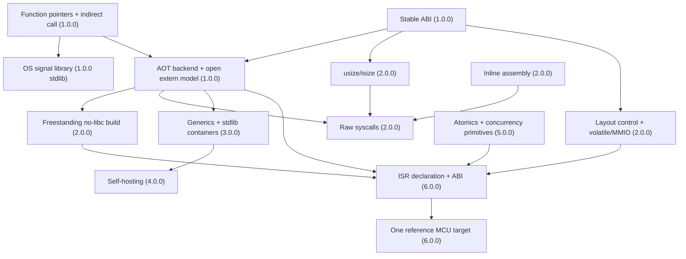

# Lale Roadmap — Versions 1.0.0 through 6.0.0

**Status:** Adopted as the versioned roadmap. This document is the strategic
overview — what Lale has achieved, the theory milestones, and the six-version
plan. `doc/TODO.md` holds the detailed work items, design proposals, and open
decisions (each with a stable `[T-###]` id).

**Scope:** Lale's ambitions are restructured into six sequential versions.
Version 1.0.0 is a **stable language contract + native execution + C ABI**;
version 2.0.0 delivers the **systems foundation** (freestanding/no-libc, layout
control, volatile/MMIO); version 3.0.0 adds **generics + the stdlib container
layer**; version 4.0.0 achieves **self-hosting**; version 5.0.0 adds the
**concurrency + memory model**; version 6.0.0 delivers **one reference
microcontroller target**. Each version is a complete, non-breaking foundation
for the next.

---

## Status and Milestones

### Language Design Milestones — Achieved

| Milestone                                        | Description                                                                                                                                                                                                                                   |
| ------------------------------------------------ | --------------------------------------------------------------------------------------------------------------------------------------------------------------------------------------------------------------------------------------------- |
| **First-class physical units**                   | Units are grammar-level, not library-level. Dimensional analysis at compile time, runtime assertions for dynamic cases. Only Ada and F# have comparable built-in unit systems — neither does it at the IR level.                              |
| **No reserved keywords**                         | PEG ordered-choice disambiguation instead of lexer keyword tables. `write` is both a statement keyword and a valid identifier. Every language with this property (PL/I, Algol 68) is historically significant.                                |
| **1-based indexing + raw pointers**              | Systems language (C-compatible pointers, no GC) with 1-based indexing (Fortran/Julia/MATLAB convention). These two traditions rarely coexist in one language.                                                                                 |
| **Pragmatic memory safety**                      | Per-function escape rule ("pointers to locals must not escape") catches the most common dangling-pointer bug, plus compiler-managed `text`. Not a substitute for a borrow checker; raw pointers and FFI stay the programmer's responsibility. |
| **No exceptions — optional types + error stack** | `T?` for recoverable errors, error stack for diagnostics. No hidden control flow. The `?` operator gives exception-like propagation without stack unwinding.                                                                                  |
| **Unicode identifier system**                    | Subscript digits (`x₁`, `v₂`), combining marks, CJK, Cyrillic, Arabic — 20+ Unicode ranges. Reduces transcription errors in scientific code.                                                                                                  |

### Compiler Engineering Milestones — Achieved

| Milestone                                 | Description                                                                                                                                                                                                                                                                                                                                                                                                                                                                                                                                                                                                                                                                       |
| ----------------------------------------- | --------------------------------------------------------------------------------------------------------------------------------------------------------------------------------------------------------------------------------------------------------------------------------------------------------------------------------------------------------------------------------------------------------------------------------------------------------------------------------------------------------------------------------------------------------------------------------------------------------------------------------------------------------------------------------- |
| **Block-based SSA IR**                    | A control-flow graph of basic blocks, each ending in a `Br`/`CondBr`/`Ret` terminator. Lowers directly to LLVM, libgccjit, Cranelift, or C without a relooper.                                                                                                                                                                                                                                                                                                                                                                                                                                                                                                                    |
| **Line-oriented IR serialization**        | Stable, human-readable, self-contained text format (`print_module`/`parse_module`). Enables self-hosting and backend-independent development.                                                                                                                                                                                                                                                                                                                                                                                                                                                                                                                                     |
| **SQLite-backed symbol table**            | Single source of truth with `prepare_cached()` for statement reuse. Enables incremental compilation and IDE integration.                                                                                                                                                                                                                                                                                                                                                                                                                                                                                                                                                          |
| **Complete pipeline coverage**            | 255 grammar rules → 85 IR instructions → interpreter. Zero gaps. Every feature implemented end-to-end across all pipeline stages.                                                                                                                                                                                                                                                                                                                                                                                                                                                                                                                                                 |
| **Extern-based FFI boundary**             | C standard-library functions are declared as `import fn` in the stdlib and dispatched through a single `call_extern` path. The interpreter contains no per-function business logic, so interpreter and AOT share identical IR semantics.                                                                                                                                                                                                                                                                                                                                                                                                                                          |
| **Compile-time control flow parity**      | `#when`/`#match`/`#switch` mirror runtime `when`/`match`/`switch`. Unevaluable conditions/values and duplicate cases/arms are compile errors — no silent fallbacks.                                                                                                                                                                                                                                                                                                                                                                                                                                                                                                               |
| **`ZeroCheck` IR instruction**            | Division/modulo-by-zero detection with full source location, backend-independent.                                                                                                                                                                                                                                                                                                                                                                                                                                                                                                                                                                                                 |
| **Division-by-zero compile-time warning** | Path-sensitive guard tracking warns about unguarded `/`, `%`, `/=`, `%=` operations at compile time. Complements the runtime `ZeroCheck`. 32 unit tests + 32 integration tests.                                                                                                                                                                                                                                                                                                                                                                                                                                                                                                   |
| **`text` compiler-managed memory**        | The `text` type is fully managed by the compiler: auto-free at scope exit for named variables, inline free after output, Concat operand cleanup, builtins rewritten for single allocation. Leak detector runs on every test. The user never writes `__lale_free` for a string.                                                                                                                                                                                                                                                                                                                                                                                                    |
| **In-language test framework**            | `test suite` / `test case` are first-class statements with identifier names, function-like case-local scope, a suite-level scope for shared `var`/`fn` declarations, duplicate-name detection, and `#mode`-gated execution. Module globals are invisible inside suites/cases while module functions remain callable. `lale test` reports `Pass:`/`Fail:` per case, supports a repeatable `--filter <pattern>` (suite/case/`suite/case` substring selection, any-match semantics), and returns the correct exit code — including a non-zero exit when a test leaks heap memory, making `lale test` a trustworthy leak detector. 55 dedicated tests in `tests/test_suite_tests.rs`. |

### Language Theory Milestones — Achieved

| Milestone                          | Status | Notes                                                                                                                                                                   |
| ---------------------------------- | :----: | ----------------------------------------------------------------------------------------------------------------------------------------------------------------------- |
| **Turing-completeness**            |   ✅   | Conditional branching + unbounded loops + mutable variables + recursion.                                                                                                |
| **Memory safety (bounded subset)** |   ✅   | Per-function escape rule + compiler-managed `text`. Raw `allocate`/`release` pointers get a warning for obvious double-release and use-after-release — not a guarantee. |
| **Type safety**                    |   ✅   | No implicit coercions, all conversions explicit, numeric ranges validated at compile time.                                                                              |

### Language Theory Milestones — Partially Achieved

| Milestone                   | Status | Notes                                                                                                                                              |
| --------------------------- | :----: | -------------------------------------------------------------------------------------------------------------------------------------------------- |
| **Self-hosting**            |   🟡   | IR designed for it (line-oriented IR format, backend-independent). No Lale-written compiler yet. See [T-023] and §3.5.                             |
| **Formal semantics**        |   🟡   | Architecture doc specifies semantics in prose (§4.7.10). No formal operational or denotational semantics.                                          |
| **Deterministic execution** |   🟡   | Interpreter is deterministic (no undefined behaviour, unlike C). IR semantics explicitly reject "it's UB so anything can happen." No formal proof. |

### Language Theory Milestones — Not Yet Achieved

| Milestone                           | Notes                                                                                                                             |
| ----------------------------------- | --------------------------------------------------------------------------------------------------------------------------------- |
| **Type soundness proof**            | No formal proof that well-typed programs don't go wrong. Practical evidence (3,000+ tests, interpreter behaviour) but no theorem. |
| **Bootstrap proof**                 | Depends on self-hosting: a trust argument that a self-hosted compiler reproduces the reference implementation.                    |
| **Meta-circular interpreter**       | A Lale-written interpreter executing Lale IR would be meta-circular; the current interpreter is written in Rust.                  |
| **Concurrency model**               | No threads, no async. `storage_class: ThreadLocal` is reserved in the symbol table but unimplemented. See §3.6.                   |
| **Generics with unit polymorphism** | Functions polymorphic over physical dimensions (`fn sum<T in <U>>`) are not yet implemented. See [T-025] and §3.4.                |

---

## 1. Decision Record

**Agreed — restructured into a six-version roadmap, with systems ambitions and
self-hosting sequenced after a stable 1.0.0.**

The systems features this document once promoted into 1.0.0 are real, but they are
**not** a 1.0.0 criterion. Version 1.0.0 must be a stable, non-breaking foundation, so it
includes only what (1) makes Lale a coherent, correct, usable language and (2) cannot
be added later without breaking source compatibility. Multithreading and memory-layout
control are deliberately **out of 1.0.0**: they are 2.0.0/5.0.0 concerns, and omitting them
now does not foreclose them later.

Three principles govern the split:

1. **No breaking changes after 1.0.0.** Every 1.0.0 feature must remain valid source in
   2.0.0 through 6.0.0. This is why the function-pointer design ([T-023]) deliberately adopts the
   structural `fn (...)` type now — it is the complete, stable function-pointer type, not
   something to be migrated away from later.
2. **Dependency first, priority second.** Where a real dependency exists, the order
   follows it (§3.1). Where it does not, the order is a deliberate priority call,
   documented below. Only two _version-to-version_ relationships are fundamental gates —
   1.0.0 → 2.0.0 (the systems tier needs the AOT backend and the stable ABI) and 3.0.0 → 4.0.0
   (self-hosting needs generics and the stdlib container layer). The other arrows in §3.1
   are feature-level dependencies or sequencing decisions, not version gates.
3. **Language contract vs. platform library.** OS signals are **not** a language
   feature. Once function pointers + the open extern model exist, registering a signal
   handler is just `signal(SIGINT, pointer to my_handler)` — an ordinary stdlib call.
   Signals land in 1.0.0 as a _library_, not a keyword.

**Sequencing rationale — complete the systems foundation first, then self-host at the
earliest safe point.** The six-version order is priority-sequenced wherever no
dependency forces it, and the governing priorities are:

1. **Complete the systems _foundation_ first (2.0.0).** Freestanding/no-libc, layout
   control, raw syscalls, and inline assembly are what make Lale a _systems_ language
   rather than a hosted scientific one. Establishing that claim outranks self-hosting.
2. **Self-host at the earliest safe point (4.0.0), not last.** Beyond the 1.0.0/2.0.0
   foundation it inherits, self-hosting has two _additional_ major prerequisites — a frozen
   language (1.0.0) and generic data structures (3.0.0). It does not need concurrency (5.0.0) or
   embedded (6.0.0), which contribute nothing to writing a compiler. Placing self-hosting at
   4.0.0 — immediately after generics — means the extended systems tiers (concurrency,
   embedded) are then built _in Lale_ rather than implemented in Rust first and
   re-implemented later.

**The trade-off, stated honestly.** Sequencing self-hosting _last_ (after embedded)
would let it be written once against a completely finished language, with zero risk of
mid-port churn — at the cost of implementing concurrency and embedded in Rust first and
then again in Lale. Sequencing it at 4.0.0 front-loads the bootstrap and lets the hard
systems tiers double as the proof that the self-hosted compiler works — at the cost of
still extending the (now Lale-written) compiler through 5.0.0 and 6.0.0. This roadmap
chooses 4.0.0: the "double implementation" cost of deferring self-hosting is judged
larger than the "extend the Lale compiler while the additive tiers land" cost of doing
it early. 1.0.0 already froze the core, so those additive tiers do not invalidate the
self-hosted compiler.

The resulting order: 1.0.0 language + native + C ABI → 2.0.0 systems foundation →
3.0.0 generics + stdlib → 4.0.0 self-hosting → 5.0.0 concurrency + memory model → 6.0.0
embedded.

**`usize`/`isize` (pointer-sized integers) land in 2.0.0, not 1.0.0.** On the 64-bit hosts
that define 1.0.0, `u64`/`i64` are already exactly C's `size_t`/`ssize_t`/`uintptr_t`/
`intptr_t` (all 8 bytes), so the current ABI spec and extern signatures are C-compatible
as-is. The type earns its keep on a 32-bit target, where `size_t` is 4 bytes — and Lale's
only 32-bit ambition is the 6.0.0 microcontroller target. Introducing it in 2.0.0 is additive
and non-breaking: 1.0.0 source declaring FFI with `u64`/`i64` keeps compiling. See §2 and
§3.3.

**Complex numbers (`c16`/`c32`/`c64`) — grammar is additive; the feature is 2.0.0, the
ABI layout is reserved in 1.0.0.**

Complex numbers are a 2.0.0 feature. Types `c16`/`c32`/`c64` mirror `f16`/`f32`/`f64` with
component-width semantics (`cN` is two `fN`); the imaginary literal `4i` (tight `i` suffix)
and the forms `3+4i`, `3e-5+1.4i`, `-4i` are an additive grammar change — each is currently
a parse error, so `i` stays a plain identifier. Embedding a real into a complex value is
explicit (`r as c64`); extraction is via the `… of` operators `real of`, `imaginary of`,
`length of`, `angle of`, and `conjugate of` (`length of` also applies to vectors). The real
`sqrt` returns `f64?`. The 1.0.0 ABI freeze reserves the two-`fN` layout (§3.2). Full
design, decisions, and the implementation effort estimate: [T-037].

---

## 2. Prerequisite gaps — where each lands

The systems features Lale lacks are real, but they do not all belong in the same
version. This section catalogues them and assigns each to the version where it becomes
necessary, so the roadmap in §3 can sequence them by dependency rather than by a flat
"all systems features are 1.0.0" list.

| #   | Feature                                         | Why it matters                                                                                                       | Version     |
| --- | ----------------------------------------------- | -------------------------------------------------------------------------------------------------------------------- | ----------- |
| 1   | Function pointers + indirect `call`             | The gate for callbacks, signals, and any API that takes a function pointer. See [T-023].                             | 1.0.0       |
| 2   | `usize` / `isize` (pointer-sized integers)      | Target-width pointer arithmetic and FFI signatures; needed for 32-bit targets (6.0.0), introduced in 2.0.0.          | 2.0.0       |
| 3   | Open `extern` model                             | Arbitrary `import fn` resolved at link time, not a compiler allowlist.                                               | 1.0.0       |
| 4   | Concurrency — threads, atomics, mutexes         | No threads/async today; `ThreadLocal` is a placeholder enum variant only.                                            | 5.0.0       |
| 5   | Fixed-address MMIO (volatile via import/export) | Volatile is already implicit in import/export (ARCHITECTURE §5.4); the gap is placing a `var` at a fixed address.    | 2.0.0       |
| 6   | Struct layout control (packed/align/offset)     | Compiler-chosen layout only; needed for FFI + register maps.                                                         | 2.0.0       |
| 7   | Unions / untagged layout types                  | No `union`; Lale `enum` is a tagged sum, not a C union.                                                              | 2.0.0       |
| 8   | Inline assembly / intrinsics                    | Needed for syscalls, ISR prologue/epilogue, critical sections.                                                       | 2.0.0       |
| 9   | Bitfields                                       | Ubiquitous in register maps and protocol headers.                                                                    | 2.0.0       |
| 10  | Linkage attributes (weak/alias/naked/section)   | Only `Internal`/`Import`/`Export` today; weak/alias are linker concerns, `naked`/sections are vector-table concerns. | 2.0.0–6.0.0 |
| 11  | `u128`/`i128` (and `f128`)                      | Integer list stops at `u64`/`i64`.                                                                                   | 2.0.0       |
| 12  | `alignof` / `offsetof`                          | No field-offset/alignment query; necessary once layout control (item 6) exists.                                      | 2.0.0       |
| 13  | Type aliases (`typedef`)                        | Deliberately rejected — a permanent non-goal (ARCHITECTURE §5.3), not future work.                                   | rejected    |
| 14  | Slices / fat pointers for arrays                | Only `text` is fat; arrays are fixed-size with no `[]T`.                                                             | deferred    |
| 15  | `const` / `mutability` keywords                 | Rejected — SSA already encodes immutability (ARCHITECTURE §5.2); a permanent non-goal, not future work.              | rejected    |
| 16  | ISR declaration + ISR-safe analysis             | Distinct calling convention; must not allocate/block/FFI.                                                            | 6.0.0       |
| 17  | Stack allocation / `alloca`                     | Heap-only `allocate`; ISRs must not heap-allocate.                                                                   | 6.0.0       |
| 18  | `no_std` / embedded hooks                       | Partially present (replaceable runtime hooks); completed by the 2.0.0 freestanding tier.                             | 2.0.0       |

Items marked **rejected** (type aliases, `const`/`mutability` keywords) are deliberate
non-goals per ARCHITECTURE §5.2/§5.3 — they are not future work, so no version delivers
them. Items marked **deferred** (slices) are independently assessed and not pinned to any
version; they do not gate the six-version sequence. Slices were previously listed as a
systems-language prerequisite but are not required by every systems use case.

### 2.1 Cross-cutting observation

Items 4–12 (concurrency, layout, volatile/MMIO, unions, bitfields, linkage) are really
**two** underlying capabilities, and their placement in 2.0.0 and 5.0.0 reflects that:

1. **Control over memory representation and placement** — layout, unions, bitfields,
   alignment, fixed-address MMIO. This is a coherent "layout tier" that 1.0.0
   deliberately omits and 2.0.0 delivers.
2. **Concurrency primitives** — atomics, memory ordering, and (as a stdlib)
   threads/mutexes/condition variables. Delivered in 5.0.0, after self-hosting.

Both are _additive_: they extend the 1.0.0 language without changing it, so they can
land in 2.0.0 and 5.0.0 respectively with no breaking changes to 1.0.0 source.

---

## 3. Versioned Roadmap

Each version is a complete, non-breaking foundation for the next. The dependency graph
(§3.1) shows how the six versions chain; §3.2–§3.7 give the deliverables and exit
criteria per version; §3.8 records the OS-boundary decision that spans 1.0.0 and 2.0.0.

### 3.1 Dependency graph

The graph mixes three kinds of edges:

- **Hard architectural dependency** (e.g. function pointers → C callbacks): the latter
  cannot be implemented without the former.
- **Capability dependency** (e.g. AOT → freestanding): the latter needs native compilation.
- **Deliberate sequencing** (e.g. 3.0.0 generics → 4.0.0 self-hosting): not a hard
  language-theoretic dependency, but a chosen order.

### 3.2 Version 1.0.0 — a stable language contract, native execution, C ABI

| #   | Deliverable                                          | Depends on | Exit criterion                                                                                                                                                                                                                                                                                                                                                                                                                                 |
| --- | ---------------------------------------------------- | ---------- | ---------------------------------------------------------------------------------------------------------------------------------------------------------------------------------------------------------------------------------------------------------------------------------------------------------------------------------------------------------------------------------------------------------------------------------------------- |
| 1   | Language semantics cleanup                           | —          | `lale-validate` silent-error HIGH = 0; open correctness items in `doc/TODO.md` closed; no known silent correctness bug.                                                                                                                                                                                                                                                                                                                        |
| 2   | Function overloading                                 | 1          | Overloads resolve by full signature (name + types + units); duplicate/ambiguous overloads are compile-time errors, never silently dropped. See [T-007].                                                                                                                                                                                                                                                                                        |
| 3   | Typed function pointers + indirect `call` (Design A) | 1          | `pointer to` + `call` round-trip; a signature mismatch is a compile-time error; the [T-023] proof holds.                                                                                                                                                                                                                                                                                                                                       |
| 4   | C callback ABI (both directions)                     | 3          | A `qsort`-style callback works under AOT; POSIX signal handling on POSIX hosts and the corresponding platform-specific signal/control-handler facilities on Windows register a Lale handler.                                                                                                                                                                                                                                                   |
| 5   | AOT backend (one reference host)                     | 3          | A non-trivial program produces equivalent _observable behavior_ under interpreter and AOT — successful results, errors/traps, exit status, and defined I/O — across the test suite; `lale build`/`lale exec` work.                                                                                                                                                                                                                             |
| 6   | Open `extern` model                                  | 5          | An arbitrary `import fn` links against libc without a compiler patch.                                                                                                                                                                                                                                                                                                                                                                          |
| 7   | Stable ABI (documented, not emergent)                | 5          | `doc/ABI_SPECIFICATION.md` specifies integer/float representation, struct layout, calling convention, function pointers, externs, endianness, and the C-boundary ownership rules (what may cross and who frees it).                                                                                                                                                                                                                            |
| 8   | Units in function signatures (decision)              | 3          | `fn (f64 in <m>) returns f64 in <s>` carries units; no function-pointer hole in the unit system ([T-023] §2.12).                                                                                                                                                                                                                                                                                                                               |
| 9   | Interpreter/AOT conformance suite                    | 5          | A Lale program is tested identically in both modes; a divergence reports the exact failing case.                                                                                                                                                                                                                                                                                                                                               |
| 10  | Derived SI units (aliasing)                          | 1          | Scale-1 SI derived units (`J`, `N`, `Hz`, …) normalize to base units; no auto-shortening; `rad` stays a distinct angle dimension. See [T-008] and [T-033].                                                                                                                                                                                                                                                                                     |
| 11  | Matrix types (nested `vecN of vecM of T`)            | —          | `vecN of vecM of T` is a first-class matrix with correct type nesting and IR lowering; completes the vector/matrix story. See [T-009].                                                                                                                                                                                                                                                                                                         |
| 12  | C ABI interoperability scope (documented)            | 7          | `doc/ABI_SPECIFICATION.md` states the **supported** 1.0.0 surface — scalar types, pointers, `text` as specified, ordinary structs with the defined ABI layout, ordinary `import fn` externs, function-pointer callbacks, and the C calling convention on the documented host platforms — and states explicitly that unions, packed/bitfield structs, explicit alignment/offsets, `volatile`/MMIO, and linkage attributes are 2.0.0, not 1.0.0. |
| 13  | Module / import semantics                            | 1          | The module system is fully specified and stable: the `std` and `local` origins (versionless, file-based), module identity, `use` (source) vs `import` (FFI) resolution, `export` visibility, compilation-unit boundaries, separately-compilable units, name-collision rules, and module search paths. The `hub` origin and `version` are explicitly deferred to 2.0.0.                                                                         |
| 14  | Specification-stability audit                        | 1          | Every implemented feature is explicitly reviewed against "are we willing to freeze this behavior forever?": numeric conversions, overflow, floating-point, units, pointer/`unsafe`, scoping, `use`/`import`, overload resolution, `text` representation, error and formatting behavior, equality, enum/struct representation, and evaluation order. Any behavior not yet freeze-worthy is listed as a named 1.0.0 blocker. See [T-034].        |
| 15  | Language-surface clarity (grammar review)            | 1          | The user-facing grammar behaviors listed in the "Language-surface clarity" work item ([T-032]) are each either changed or explicitly documented; no construct parses with a meaning a user cannot predict from its spelling.                                                                                                                                                                                                                   |

**C interoperability is two promises, split across versions.**

1. **1.0.0 — C ABI interoperability.** Scalar types, pointers, `text` per the ABI spec,
   ordinary structs with the defined layout, ordinary `import fn` externs,
   function-pointer callbacks, and the C calling convention on the documented hosts.
2. **2.0.0 — systems-level C interoperability.** Unions, packed/bitfield structs, explicit
   alignment and offsets, `volatile`/MMIO, linkage attributes, and inline assembly — the
   "layout tier" that §2.1 assigns to 2.0.0.

This lets 1.0.0 promise "C ABI compatibility for the types Lale explicitly supports"
rather than "bind any arbitrary C header," which the 1.0.0 scope cannot honor.

**Complex-number ABI layout (reserved in 1.0.0).** Complex numbers as a _language_
feature are 2.0.0 (§3.3), but their ABI layout is settled here because the 1.0.0 ABI
freeze is the one thing that is breaking to change later. `doc/ABI_SPECIFICATION.md`
documents `c16`/`c32`/`c64` as two `fN` components — real first, then imaginary, contiguous
with no padding, aligned to `fN` (2/4/8 bytes) — where each `fN` is the same IEEE
binary16/32/64 representation, little-endian per the internal ABI.

### 3.3 Version 2.0.0 — the systems foundation

| #   | Deliverable                                                  | Depends on             | Exit criterion                                                                                                                                                                                                                                                      |
| --- | ------------------------------------------------------------ | ---------------------- | ------------------------------------------------------------------------------------------------------------------------------------------------------------------------------------------------------------------------------------------------------------------- |
| 1   | `usize` / `isize` (pointer-sized integers)                   | 1.0.0 ABI              | Pointer arithmetic and FFI signatures use target-width integers; no hardcoded `u64`/`i64`.                                                                                                                                                                          |
| 2   | Freestanding / no-libc build                                 | 1.0.0 AOT              | A no-libc program builds and runs with user-supplied runtime hooks.                                                                                                                                                                                                 |
| 3   | Inline assembly / intrinsics                                 | 1.0.0 AOT              | `syscall`/`svc`/`int 0x80` and critical-section primitives are expressible.                                                                                                                                                                                         |
| 4   | Raw syscall escape hatch                                     | 1, 3                   | A raw `write`-via-`syscall` round-trips under AOT.                                                                                                                                                                                                                  |
| 5   | Fixed-address MMIO (volatile via import/export)              | 1, 2                   | A `var` at a fixed address supports volatile load/store; volatility is implicit in import/export (ARCHITECTURE §5.4).                                                                                                                                               |
| 6   | Memory layout control (packed/align/offset/unions/bitfields) | 1.0.0 ABI              | Predictable, user-controllable struct layout matching a C `struct` or register map.                                                                                                                                                                                 |
| 7   | Debugging support (source-level debugger)                    | 1.0.0 AOT              | Breakpoints, stepping, watch, and full stack traces work in both interpreter and AOT.                                                                                                                                                                               |
| 8   | Read-only reference (compiler-inferred)                      | —                      | A never-written `ref` parameter is detected and treated as read-only.                                                                                                                                                                                               |
| 9   | Package hub (`hub` dependency origin)                        | 1.0.0 module semantics | `use … from hub.<package> version <x.y.z>` resolves — package download, local cache, exact-version selection, integrity/checksum verification, and defined offline behavior — with the `lale-hub` crate as the implementation home. See `doc/ARCHITECTURE.md` §4.6. |

Detailed notes on selected 2.0.0 deliverables (fixed-address MMIO, debugging support, read-only references, the package hub): [T-035].

**Complex numbers (`c16`/`c32`/`c64`) — 2.0.0.** Additive grammar change (every `3+4i`-style
token is currently a parse error). `4i` is a standalone imaginary literal; `3+4i` is ordinary
`+`/`-` arithmetic over real and imaginary literals. Literals are typed by context
(`var z as c64 = 3 + 4i` infers `c64`; a bare literal is a "no type guidance" error); a real
value widens to complex only by an explicit cast; a unit applies to the whole value. Component
access is `real of z` / `imaginary of z` (assignable), `length of z`, `angle of z` (in `<rad>`),
and `conjugate of z`; a `c64(re, im)` constructor mirrors `vec3`. `length of` also applies to
vectors, landing at the same milestone as complex types. Layout follows the 1.0.0-reserved
ABI (§3.2).

### 3.4 Version 3.0.0 — generics + the stdlib container layer

| #   | Deliverable                 | Depends on | Exit criterion                                                                                                |
| --- | --------------------------- | ---------- | ------------------------------------------------------------------------------------------------------------- |
| 1   | Generics (monomorphization) | 1.0.0 AOT  | An `abs`/`min`/`max`-style routine is written once for `f32`/`f64`/`i32` and monomorphized per instantiation. |
| 2   | Generic stdlib containers   | 1          | `List<T>`, `HashMap<K,V>`, `HashSet<K>`, and the sorted containers ship without hand-specialization.          |

Generics is the single most-visible expressiveness gap for Lale's scientific audience
([T-025]): a routine must today be duplicated per numeric type. It is also the gate for the
generic stdlib container layer ([T-029]) and — through that — for self-hosting (§3.5). The open
design questions (syntax, unit polymorphism, monomorphization vs. runtime dispatch, and the
SQLite symbol-table interaction) are recorded in [T-025].

### 3.5 Version 4.0.0 — self-hosting

| #   | Deliverable                                    | Depends on     | Exit criterion                                                                                                         |
| --- | ---------------------------------------------- | -------------- | ---------------------------------------------------------------------------------------------------------------------- |
| 1   | Lale-written compiler frontend + IR generation | 3.0.0 generics | A Lale compiler parses Lale, performs semantic analysis, and emits the same IR as the Rust compiler.                   |
| 2   | Lale-written interpreter                       | 1              | The Lale interpreter executes IR with output identical to the Rust interpreter on the conformance suite (§3.2 item 9). |
| 3   | Bootstrap + self-compile                       | 2              | The Lale compiler compiles itself, and the self-built compiler produces identical output to the Rust-built compiler.   |

Self-hosting is a bootstrap/maturity milestone, not a systems capability. It is sequenced at
its earliest safe point — after 1.0.0 freezes the language and 3.0.0 makes it expressive enough
(generic data structures) — and _before_ the extended systems tiers, so that concurrency
(§3.6) and embedded (§3.7) are built in Lale rather than implemented in Rust and then
re-implemented. The trade-off is recorded in §1. Self-hosting is currently tracked in
§"Status and Milestones" as "partially achieved" (the line-oriented IR serialization was
designed for it; the compiler is still written in Rust). The SQLite-backed symbol table is
carried over unchanged: the self-hosted compiler links to the SQLite C library through a
Lale FFI binding, exactly as the Rust implementation does through its crate.

### 3.6 Version 5.0.0 — concurrency + memory model

| #   | Deliverable                                  | Depends on | Exit criterion                                                |
| --- | -------------------------------------------- | ---------- | ------------------------------------------------------------- |
| 1   | Atomics + memory-ordering model              | —          | Atomic load/store/compare-exchange with defined ordering.     |
| 2   | Concurrency stdlib (threads, mutex, condvar) | 1          | A multi-threaded program with a mutex-protected shared value. |

Concurrency is sequenced after self-hosting (§3.5) so that atomics and the thread stdlib are
implemented in Lale. It precedes embedded (§3.7) because ISR-safe analysis needs a defined
memory-ordering model for atomic shared state between an ISR and the main loop.

### 3.7 Version 6.0.0 — one reference embedded target

| #   | Deliverable                                                                     | Depends on                                      | Exit criterion                                                                                                                                                                                   |
| --- | ------------------------------------------------------------------------------- | ----------------------------------------------- | ------------------------------------------------------------------------------------------------------------------------------------------------------------------------------------------------ |
| 1   | ISR declaration + ISR ABI + ISR-safe analysis                                   | 2.0.0 freestanding, 2.0.0 layout, 5.0.0 atomics | A timer/GPIO ISR compiles to the platform vector table; ISR-unsafe operations are rejected.                                                                                                      |
| 2   | One reference MCU target (startup, linker script, vector table, MMIO, volatile) | 1                                               | A Blinky/timer/GPIO example builds and runs (simulator or hardware) with a reproducible toolchain, including an interrupt-driven path (e.g. timer ISR → state change observed by the main loop). |
| 3   | One reference SDK                                                               | 2                                               | A documented, reproducible toolchain + build, plus one complete worked example.                                                                                                                  |

### 3.8 The OS boundary: libc-default with a raw-syscall escape hatch

Lale reaches the OS today only through a **closed, compiler-hardcoded allowlist** of
C-library/POSIX externs emulated by the interpreter (`src/interpreter.rs`
`call_extern`, `doc/ABI_SPECIFICATION.md` §4). There is no way to:

- Declare and call an arbitrary OS function from Lale code — unknown names fail at
  runtime with `Undefined function`.
- Issue a raw kernel syscall (`syscall`/`svc`/`int 0x80`) — there is no inline assembly.
- Build without libc (freestanding/no_std).

**Decision.** Lale keeps **libc as the default OS boundary** — the same default as C,
Rust (hosted), and Zig — because it is the portable, debuggable, already-documented
path. **Raw syscalls are an explicit escape hatch**, not the default, for three cases:

1. **Freestanding/no_std** — when libc is unavailable (bare metal, minimal containers,
   static binaries).
2. **Syscalls libc does not expose** — `mmap` flags, `io_uring`, `clone3`, and similar.
3. **Exact ABI control** — when the user must specify the precise syscall ABI.

**Sequencing across versions:**

1. **Version 1.0.0 opens the extern model** (the hosted half): arbitrary `import fn`
   names are resolved at link time by the AOT backend rather than through the
   compiler's `call_extern` allowlist.
2. **Version 2.0.0 completes the freestanding half**: raw `syscall` via inline
   assembly/intrinsics, and a freestanding/no_std build mode with replaceable runtime
   hooks (`__lale_error`, `__lale_exit`, `malloc`/`free`, `write`/`read`).

**Interpreter role.** The interpreter can only ever emulate a finite set of OS
functions; the open extern model and raw syscalls are AOT-only. The interpreter keeps
emulating a shrinking allowlist as the golden reference for semantics, while the AOT
backend links against libc (hosted) or the kernel (freestanding).

---

## 4. Scope, Risk, and Follow-ups

| Item                     | Version | Risk / note                                                                                                                                |
| ------------------------ | ------- | ------------------------------------------------------------------------------------------------------------------------------------------ |
| Function pointers + call | 1.0.0   | Low risk, self-contained. Largest open question is the callback ABI boundary ([T-023] §2.10).                                              |
| C callback ABI           | 1.0.0   | Moderate. The interpreter can only emulate a fixed allowlist of callback-taking externs; full generality is AOT-only.                      |
| AOT backend              | 1.0.0   | **High.** The largest single effort; a full second backend with its own toolchain and test-parity burden.                                  |
| Open extern model        | 1.0.0   | Moderate. Depends on AOT link-time resolution.                                                                                             |
| `usize`/`isize`          | 2.0.0   | Low. A type-system addition; on 64-bit it aliases `u64`/`i64`, so it is only observable on 32-bit targets.                                 |
| Signals (stdlib)         | 1.0.0   | Low, once function pointers + open extern land. Windows has no POSIX signals; use CRT `signal` + `SetConsoleCtrlHandler`. No-std has none. |
| Freestanding / no-libc   | 2.0.0   | Moderate–high. Needs inline asm, `usize`/`isize`, and a defined startup/allocation/termination model.                                      |
| Layout control + MMIO    | 2.0.0   | Moderate. A "layout language" tier; must stay additive to 1.0.0 source.                                                                    |
| Generics + stdlib        | 3.0.0   | Moderate. Monomorphization and the SQLite symbol-table interaction; unlocks the entire stdlib container layer ([T-029]).                   |
| Self-hosting             | 4.0.0   | **High.** A Lale-written compiler + interpreter and a bootstrap path; mitigates the risk of an ever-larger Rust codebase to supersede.     |
| Concurrency primitives   | 5.0.0   | Moderate. Atomics + memory ordering are a language/ABI capability; the thread stdlib sits on top.                                          |
| ISR + reference MCU      | 6.0.0   | High, gated on 2.0.0 and 5.0.0. Must be scoped to **one reference target** and **one reference backend**.                                  |

**Follow-ups (require explicit approval before editing):**

1. Update `doc/lale.md` FFI "Limitations" once the function-pointer feature lands (the
   "function pointers require wrapper functions" note becomes obsolete).
2. Add the `fn (...)` type and the `FnAddr`/`CallIndirect` instructions to
   `doc/IR_SPECIFICATION.md` and `doc/ABI_SPECIFICATION.md` when implemented.
3. Document the OS-boundary decision (libc-default + raw-syscall escape hatch) in
   `doc/ABI_SPECIFICATION.md` §4 and `doc/ARCHITECTURE.md` when 2.0.0 lands.

---

## 5. References

- `doc/TODO.md` — detailed work items and design decisions (stable `[T-###]` ids).
- `doc/ABI_SPECIFICATION.md` — internal AAPCS64 ABI (§2), platform C ABI FFI boundary (§4), allowed extern set.
- `doc/ARCHITECTURE.md` — §4.7 IR (instructions, serialisation), §4.8 interpreter, §4.9 future AOT backends, §5.4 volatile semantics via import/export.
- `doc/lale.md` — FFI limitations (§ "C Foreign Function Interface"), compilation modes (interpreter vs. planned AOT).
- `src/grammar/lale.pest` — `fn_call`, `type_name`, keyword registry, `ptr_op`/`value_of_op`.
- `src/ir/instructions.rs` — `FuncRef`, `Instruction::Call`/`CallVoid`.
- `src/ir/types.rs` — `IrType`.
- `src/interpreter.rs` — `Value`, `call_extern`, `execute_instruction_with_memory`.
